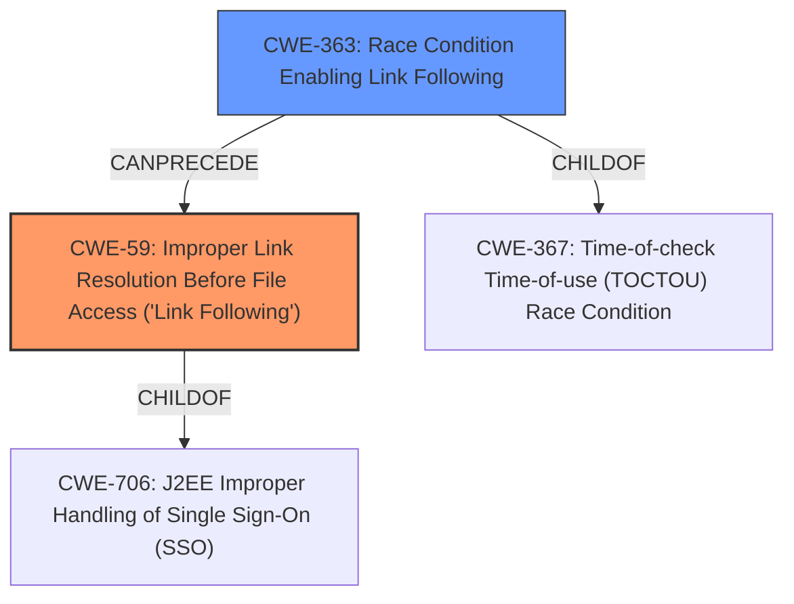

# Analysis Report for CVE-2021-42277

# Vulnerability Analysis Report: CVE-2021-42277

## Description


## Analysis (with Relationship Data)

# Summary
| CWE ID | CWE Name | Confidence | CWE Abstraction Level | CWE Vulnerability Mapping Label | CWE-Vulnerability Mapping Notes |
|---|---|---|---|---|---|
| CWE-59 | Improper Link Resolution Before File Access ('Link Following') | 1.0 | Base | Allowed | Primary CWE |
| CWE-363 | Race Condition Enabling Link Following | 0.7 | Base | Allowed | Secondary Candidate |

## Evidence and Confidence

*   **Confidence Score:** 0.9
*   **Evidence Strength:** HIGH

## Relationship Analysis
The primary relationship that impacted my decision was the parent-child relationship between CWE-367 Time-of-check Time-of-use (TOCTOU) Race Condition and CWE-363 Race Condition Enabling Link Following, where CWE-363 is a child of CWE-367. Also, the parent-child relationship between CWE-706 and CWE-59 where CWE-59 is a child of CWE-706. Additionally, CWE-363 CanPrecede CWE-59 which is relevant to the analysis.



## Vulnerability Chain
The vulnerability chain starts with the **improper handling of symbolic links** which leads to the ability for an attacker to delete an arbitrary directory. This results in an Elevation of Privilege.

## Summary of Analysis
The analysis is based on the provided evidence, primarily the "CVE Reference Links Content Summary" and the "Vulnerability Description Key Phrases". The root cause is identified as "**improper handling of symbolic links**". The "CVE Reference Links Content Summary" states: "The vulnerability exists within the Microsoft Diagnostics Hub Standard Collector Service due to **improper handling of symbolic links**." This maps directly to CWE-59 "Improper Link Resolution Before File Access ('Link Following')". The summary also mentions that "The service can be abused by creating a symbolic link, allowing an attacker to delete an arbitrary directory.", further supporting the selection of CWE-59.

CWE-269 Incorrect Privilege Assignment was suggested as the Primary CWE Match for similar CVE Descriptions, however, it is not the root cause. The root cause is the **improper handling of symbolic links**.

The graph relationships influenced the consideration of CWE-363 "Race Condition Enabling Link Following" as a secondary candidate, since it can precede CWE-59 and the description indicates a race may be possible.

CWE-59 is selected as the primary CWE because it directly represents the root cause of the vulnerability, namely the **improper handling of symbolic links**. It is at the Base level of abstraction, which is the preferred level. CWE-363 is a potential secondary issue because the vulnerability may be exploitable via a race condition.

Relevant CWE Information:

# Enhanced Context (25 CWEs)

## CWE-59: Improper Link Resolution Before File Access ('Link Following')
**Abstraction Level**: Base
**Similarity Score**: 0.81
**Source**: dense

**Description**:
The product attempts to access a file based on the filename, but it does not properly prevent that filename from identifying a link or shortcut that resolves to an unintended resource.

**Mapping Guidance**:
- Usage: Allowed
- Rationale: This CWE entry is at the Base level of abstraction, which is a preferred level of abstraction for mapping to the root causes of vulnerabilities.

## CWE-363: Race Condition Enabling Link Following
**Abstraction Level**: base
**Similarity Score**: 4.33
**Source**: graph

**Description**:
CWE-363: Race Condition Enabling Link Following

**Mapping Guidance**:
- Usage: Allowed
- Rationale: This CWE entry is at the Base level of abstraction, which is a preferred level of abstraction for mapping to the root causes of vulnerabilities.

**Relationships**:
- CANPRECEDE -> CWE-59
- CHILDOF -> CWE-367
- CANFOLLOW -> CWE-363
- PARENTOF -> CWE-363


## CWE Relationship Analysis

Current CWEs represent these abstraction levels: .


### Vulnerability Chain Analysis

**Chain starting from CWE-367:**
- 367 (Time-of-check Time-of-use (TOCTOU) Race Condition) - ROOT


**Chain starting from CWE-706:**
- 706 (Use of Incorrectly-Resolved Name or Reference) - ROOT


### CWE Relationship Diagram

```mermaid
graph TD
    classDef primary fill:#f96,stroke:#333,stroke-width:2px
    classDef secondary fill:#69f,stroke:#333
    classDef tertiary fill:#9e9,stroke:#333
```


*Report generated on 2025-04-02 03:56:18*
