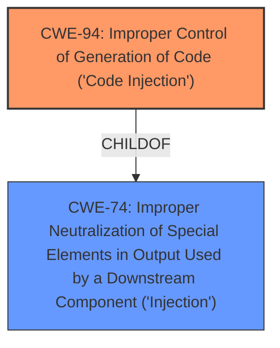

# Raw Analyzer Response for CVE-2021-42309

# Summary
| CWE ID | CWE Name | Confidence | CWE Abstraction Level | CWE Vulnerability Mapping Label | CWE-Vulnerability Mapping Notes |
|---|---|---|---|---|---|
| CWE-94 | Improper Control of Generation of Code ('Code Injection') | 0.8 | Base | Allowed-with-Review | Primary CWE |
| CWE-74 | Improper Neutralization of Special Elements in Output Used by a Downstream Component ('Injection') | 0.6 | Class | Discouraged | Secondary Candidate |

## Evidence and Confidence

*   **Confidence Score:** 0.8
*   **Evidence Strength:** MEDIUM

## Relationship Analysis
The primary relationship impacting the decision is that CWE-94 is a specific type of injection where the injected content is code, aligning with the vulnerability's root cause. CWE-74 is a more general class of injection vulnerabilities. CWE-94 has a ChildOf relationship to CWE-74, indicating that it's a more specific instance of injection. The abstraction levels are also important, with CWE-94 being a Base level and CWE-74 being a Class level, favoring the more specific Base level when applicable.

## Vulnerability Chain
The vulnerability chain starts with **improper input validation** of server-side controls. This leads to the possibility of instantiating an unsafe server-side control, resulting in **remote code execution**.

## Summary of Analysis
Initially, the primary CWE match from similar CVE descriptions was CWE-NVD-noinfo, which is not useful. The key evidence is that the **root cause** is **improper input validation**, which allows for the instantiation of an unsafe server-side control. This can be interpreted as the product constructing a code segment using externally influenced input without proper neutralization, thus leading to code injection.

The description "An unsafe server-side control can be instantiated if it is specified as a child of a permitted control" strongly suggests that the attacker can influence the code that gets executed.

CWE-94, "Improper Control of Generation of Code ('Code Injection')" is chosen as the primary CWE because it directly addresses the **root cause** of the vulnerability: **improper input validation** leading to the ability to execute arbitrary code by instantiating an unsafe server-side control. The "CVE Reference Links Content Summary" states: "Root cause of vulnerability: Improper input validation in the handling of server-side controls."

CWE-74, "Improper Neutralization of Special Elements in Output Used by a Downstream Component ('Injection')" was considered but is a more general case of injection. The MITRE guidance discourages using it when more specific CWEs are available. Therefore, CWE-94 is a better fit because it specifically describes the code injection scenario.

Relevant CWE Information:

# Enhanced Context (25 CWEs)

## CWE-74: Improper Neutralization of Special Elements in Output Used by a Downstream Component ('Injection')
**Abstraction Level**: Class
**Similarity Score**: 0.78
**Source**: dense

**Description**:
The product constructs all or part of a command, data structure, or record using externally-influenced input from an upstream component, but it does not neutralize or incorrectly neutralizes special elements that could modify how it is parsed or interpreted when it is sent to a downstream component.

**Mapping Guidance**:
- Usage: Discouraged
- Rationale: CWE-74 is high-level and often misused when lower-level weaknesses are more appropriate.

## CWE-94: Improper Control of Generation of Code ('Code Injection')
**Abstraction Level**: Base
**Similarity Score**: 3.65
**Source**: graph

**Description**:
CWE-94: Improper Control of Generation of Code ('Code Injection')

**Mapping Guidance**:
- Usage: Allowed-with-Review
- Rationale: This entry is frequently misused for vulnerabilities with a technical impact of "code execution," which does not by itself indicate a root cause weakness, since dozens of weaknesses can enable code execution.

**Relationships**:
- CANFOLLOW -> CWE-98
- PARENTOF -> CWE-96
- PARENTOF -> CWE-95
- PARENTOF -> CWE-1336
- CHILDOF -> CWE-913