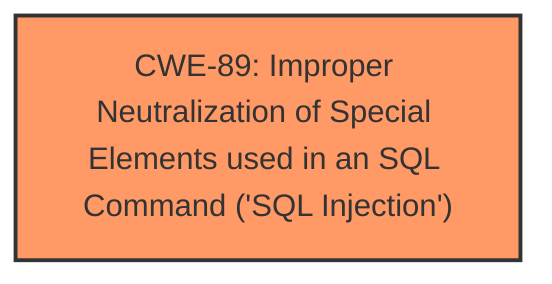

# Analysis Report for CVE-2021-42311

# Vulnerability Analysis Report: CVE-2021-42311

## Description


## Analysis (with Relationship Data)

# Summary
| CWE ID  | CWE Name                                                                   | Confidence | CWE Abstraction Level | CWE Vulnerability Mapping Label | CWE-Vulnerability Mapping Notes |
| :-------- | :------------------------------------------------------------------------- | :--------- | :---------------------- | :------------------------------ | :------------------------------ |
| CWE-89  | Improper Neutralization of Special Elements used in an SQL Command ('SQL Injection') | 1          | Base                    | Primary CWE                     | Allowed                       |

## Evidence and Confidence

*   **Confidence Score:** 1
*   **Evidence Strength:** HIGH

## Relationship Analysis
The primary CWE is CWE-89, which stands alone in this case, not being part of any longer chain.



## Vulnerability Chain
The chain of root cause and weaknesses that followed for the Vulnerability Description:
  - **Root Cause:** The vulnerability results from the **lack of proper validation** of a user-supplied string before using it to construct SQL queries.
  - **Weakness:** SQL Injection (CWE-89)
  - **Impact:** An attacker can leverage this vulnerability to bypass authentication on the system and execute arbitrary code in the context of root.

## Summary of Analysis
The analysis indicates that the vulnerability is due to **improper validation** of user-supplied input, leading to SQL injection. This allows attackers to bypass authentication and execute arbitrary code.

Evidence:
- Vulnerability Description Key Phrases:
  - **impact:** Remote Code Execution
- CVE Reference Links Content Summary:
  - **root_cause**: The vulnerability results from the lack of proper validation of a user-supplied string before using it to construct SQL queries.
  - **weaknesses**: SQL Injection
  - **impact**: An attacker can leverage this vulnerability to bypass authentication on the system and execute arbitrary code in the context of root.

The graph relationship shows that CWE-89 is the main weakness.

The selection of CWE-89 is at the optimal level of specificity because it directly addresses the root cause described in the vulnerability, which is the **lack of proper validation** allowing for **SQL injection**.

Relevant CWE Information:

# Enhanced Context (25 CWEs)
The following CWEs were identified as potentially relevant to this vulnerability:

## CWE-89: Improper Neutralization of Special Elements used in an SQL Command ('SQL Injection')
**Abstraction:** Base
**Status:** Stable

### Description
The product constructs all or part of an SQL command using externally-influenced input from an upstream component, but it does not neutralize or incorrectly neutralizes special elements that could modify the syntax or behavior of the intended SQL command.

### Extended Description
This allows an attacker to inject portions of SQL commands into the data stream, allowing the attacker to manipulate the final SQL command that is executed.

### Alternative Terms
SQL Injection
SQLi

### Relationships
ChildOf -> CWE-943
ChildOf -> CWE-943

### Mapping Guidance
**Usage:** Allowed
**Rationale:** This CWE entry is at the Base level of abstraction, which is a preferred level of abstraction for mapping to the root causes of vulnerabilities.
**Comments:** Carefully read both the name and description to ensure that this mapping is an appropriate fit. Do not try to 'force' a mapping to a lower-level Base/Variant simply to comply with this preferred level of abstraction.
**Reasons:**
- Acceptable-Use

### Additional Notes
**[Applicable Platforms]**
Language: SQL

**[References]**
- <https://owasp.org/www-community/attacks/SQL_Injection>

**[Terminology]**
The term "SQL injection" is sometimes misused to refer to other problems, such as format string bugs.

**[Relationship]**
This can be caused by failing to validate input (CWE-20) or failing to sanitize input (CWE-174).

**[Impact]**
If the injected SQL commands are successfully executed, the attacker could read, modify, and delete any of the data in the SQL server. The attacker could also execute system commands on the operating system, or use the SQL server as a platform to launch attacks on other systems.

### Observed Examples
- **CVE-2024-4735:** The product constructs all or part of an SQL command using externally-influenced input from an upstream component, but it does not neutralize or incorrectly neutralizes special elements that could modify the syntax or behavior of the intended SQL command.
- **CVE-2024-4734:** The product constructs all or part of an SQL command using externally-influenced input from an upstream component, but it does not neutralize or incorrectly neutralizes special elements that could modify the syntax or behavior of the intended SQL command.
- **CVE-2024-4733:** The product constructs all or part of an SQL command using externally-influenced input from an upstream component, but it does not neutralize or incorrectly neutralizes special elements that could modify the syntax or behavior of the intended SQL command.
- **CVE-2024-4732:** The product constructs all or part of an SQL command using externally-influenced input from an upstream component, but it does not neutralize or incorrectly neutralizes special elements that could modify the syntax or behavior of the intended SQL command.
- **CVE-2024-4731:** The product constructs all or part of an SQL command using externally-influenced input from an upstream component, but it does not neutralize or incorrectly neutralizes special elements that could modify the syntax or behavior of the intended SQL command.
- **CVE-2024-4730:** The product constructs all or part of an SQL command using externally-influenced input from an upstream component, but it does not neutralize or incorrectly neutralizes special elements that could modify the syntax or behavior of the intended SQL command.
- **CVE-2024-4729:** The product constructs all or part of an SQL command using externally-influenced input from an upstream component, but it does not neutralize or incorrectly neutralizes special elements that could modify the syntax or behavior of the intended SQL command.
- **CVE-2024-4728:** The product constructs all or part of an SQL command using externally-influenced input from an upstream component, but it does not neutralize or incorrectly neutralizes special elements that could modify the syntax or behavior of the intended SQL command.
- **CVE-2024-4727:** The product constructs all or part of an SQL command using externally-influenced input from an upstream component, but it does not neutralize or incorrectly neutralizes special elements that could modify the syntax or behavior of the intended SQL command.


## CWE Relationship Analysis

Current CWEs represent these abstraction levels: .


### Vulnerability Chain Analysis

**Chain starting from CWE-89:**
- 89 (Improper Neutralization of Special Elements used in an SQL Command ('SQL Injection')) - ROOT


**Chain starting from CWE-174:**
- 174 (Double Decoding of the Same Data) - ROOT


### CWE Relationship Diagram

```mermaid
graph TD
    classDef primary fill:#f96,stroke:#333,stroke-width:2px
    classDef secondary fill:#69f,stroke:#333
    classDef tertiary fill:#9e9,stroke:#333
```


*Report generated on 2025-04-02 04:19:28*
