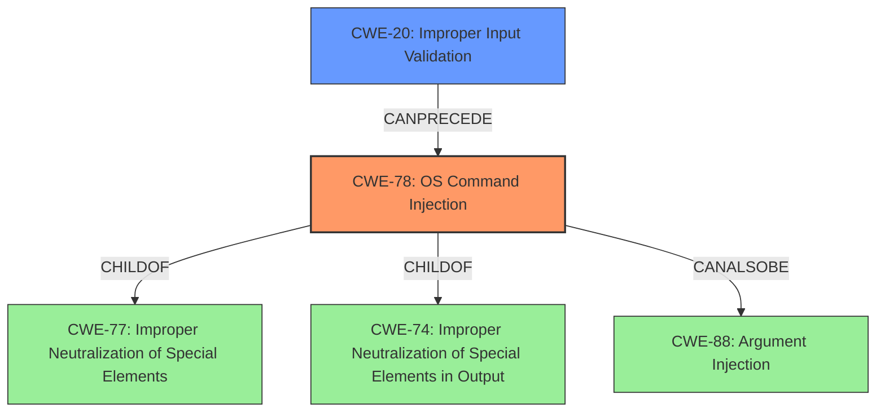

# Raw Analyzer Response for CVE-2021-42324

# Summary
| CWE ID  | CWE Name                                                                               | Confidence | CWE Abstraction Level | CWE Vulnerability Mapping Label | CWE-Vulnerability Mapping Notes |
| :-------- | :------------------------------------------------------------------------------------- | :---------- | :---------------------- | :------------------------------ | :------------------------------ |
| CWE-78  | Improper Neutralization of Special Elements used in an OS Command ('OS Command Injection') | 1         | Base                    | Primary                         | Allowed                         |
| CWE-20  | Improper Input Validation                                                              | 0.7         | Class                   | Secondary                       | Discouraged                     |

## Evidence and Confidence

*   **Confidence Score:** 0.9
*   **Evidence Strength:** HIGH

## Relationship Analysis
The primary CWE is CWE-78, which falls under the parent Class CWE-77 (Improper Neutralization of Special Elements). CWE-78 can also be a child of CWE-74 (Improper Neutralization of Special Elements in Output Used by a Downstream Component ('Injection')). CWE-78 can be related to CWE-88 (Improper Neutralization of Argument Delimiters in a Command ('Argument Injection')). CWE-20 (Improper Input Validation) is a Class level CWE that can precede CWE-78.

## Vulnerability Chain
The vulnerability chain begins with **improper parameter validation**, leading to OS Command Injection and ultimately resulting in the ability to escape the sandbox environment and execute system commands as root.

CWE-20 (Improper Input Validation) -> CWE-78 (OS Command Injection) -> Arbitrary Code Execution as Root

## Summary of Analysis
The primary weakness is CWE-78 (Improper Neutralization of Special Elements used in an OS Command ('OS Command Injection')). This is supported by the vulnerability description which states a low-privileged authenticated attacker can escape the sandbox environment and execute system commands as root via shell metacharacters in the capture command parameters. The "CVE Reference Links Content Summary" confirms the root cause is a lack of proper input validation where user supplied parameters are directly concatenated into a system command without sanitization, leading to command injection. Specifically, metacharacters can be injected to execute arbitrary commands.

CWE-20 (Improper Input Validation) is included as a secondary weakness. The "CVE Reference Links Content Summary" mentions the **lack of input validation** as a contributing factor, but the primary issue is the direct concatenation of unsanitized input into a system command, which is better captured by CWE-78. CWE-20 is a class level CWE, and the guidance discourages its use when more specific CWEs are available.

The other CWEs were considered but ultimately not selected because they did not accurately reflect the specific nature of the vulnerability, with CWE-78 capturing the specific weakness of command injection.

Relevant CWE Information:

# Enhanced Context (25 CWEs)
The following CWEs were identified as potentially relevant to this vulnerability:

## CWE-73: External Control of File Name or Path
**Abstraction Level**: Base
**Similarity Score**: 0.78
**Source**: dense

**Description**:
The product allows user input to control or influence paths or file names that are used in filesystem operations.

**Why Not Used**: This vulnerability is not about controlling file names or paths, but about executing arbitrary commands.

## CWE-23: Relative Path Traversal
**Abstraction Level**: Base
**Similarity Score**: 0.78
**Source**: dense

**Description**:
The product uses external input to construct a pathname that should be within a restricted directory, but it does not properly neutralize sequences such as ".." that can resolve to a location that is outside of that directory.

**Why Not Used**: This vulnerability is not about path traversal, but about executing arbitrary commands.

## CWE-41: Improper Resolution of Path Equivalence
**Abstraction Level**: Base
**Similarity Score**: 0.77
**Source**: dense

**Description**:
The product is vulnerable to file system contents disclosure through path equivalence. Path equivalence involves the use of special characters in file and directory names. The associated manipulations are intended to generate multiple names for the same object.

**Why Not Used**: This vulnerability is not about path equivalence, but about executing arbitrary commands.

## CWE-184: Incomplete List of Disallowed Inputs
**Abstraction Level**: Base
**Similarity Score**: 0.77
**Source**: dense

**Description**:
The product implements a protection mechanism that relies on a list of inputs (or properties of inputs) that are not allowed by policy or otherwise require other action to neutralize before additional processing takes place, but the list is incomplete.

**Why Not Used**: While there's a **lack of input validation**, it is not explicitly about an incomplete list of disallowed inputs, but rather a failure to sanitize inputs entirely.

## CWE-59: Improper Link Resolution Before File Access ('Link Following')
**Abstraction Level**: Base
**Similarity Score**: 0.77
**Source**: dense

**Description**:
The product attempts to access a file based on the filename, but it does not properly prevent that filename from identifying a link or shortcut that resolves to an unintended resource.

**Why Not Used**: This vulnerability is not about link resolution, but about executing arbitrary commands.

## CWE-74: Improper Neutralization of Special Elements in Output Used by a Downstream Component ('Injection')
**Abstraction Level**: Class
**Similarity Score**: 0.77
**Source**: dense

**Description**:
The product constructs all or part of a command, data structure, or record using externally-influenced input from an upstream component, but it does not neutralize or incorrectly neutralizes special elements that could modify how it is parsed or interpreted when it is sent to a downstream component.

**Why Not Used**: CWE-74 is a broad class. CWE-78 is a more specific base case of CWE-74 that is a better fit.

## CWE-138: Improper Neutralization of Special Elements
**Abstraction Level**: Class
**Similarity Score**: 0.76
**Source**: dense

**Description**:
The product receives input from an upstream component, but it does not neutralize or incorrectly neutralizes special elements that could be interpreted as control elements or syntactic markers when they are sent to a downstream component.

**Why Not Used**: CWE-138 is a broad class. CWE-78 is a more specific base case of CWE-138 that is a better fit.

## CWE-427: Uncontrolled Search Path Element
**Abstraction Level**: Base
**Similarity Score**: 0.76
**Source**: dense

**Description**:
The product uses a fixed or controlled search path to find resources, but one or more locations in that path can be under the control of unintended actors.

**Why Not Used**: The vulnerability is not about uncontrolled search paths, but about executing arbitrary commands.

## CWE-1289: Improper Validation of Unsafe Equivalence in Input
**Abstraction Level**: Base
**Similarity Score**: 0.76
**Source**: dense

**Description**:
The product receives an input value that is used as a resource identifier or other type of reference, but it does not validate or incorrectly validates that the input is equivalent to a potentially-unsafe value.

**Why Not Used**: This vulnerability is not about validating unsafe equivalence, but about executing arbitrary commands.

## CWE-36: Absolute Path Traversal
**Abstraction Level**: Base
**Similarity Score**: 0.76
**Source**: dense

**Description**:
The product uses external input to construct a pathname that should be within a restricted directory, but it does not properly neutralize absolute path sequences such as "/abs/path" that can resolve to a location that is outside of that directory.

**Why Not Used**: This vulnerability is not about path traversal, but about executing arbitrary commands.

## CWE-116: Improper Encoding or Escaping of Output
**Abstraction Level**: Class
**Similarity Score**: 9288.40
**Source**: sparse

**Description**:
The product prepares a structured message for communication with another component, but encoding or escaping of the data is either missing or done incorrectly. As a result, the intended structure of the message is not preserved.

**Why Not Used**: While improper encoding or escaping could be related, the core issue is the ability to inject arbitrary commands, not the structure of a