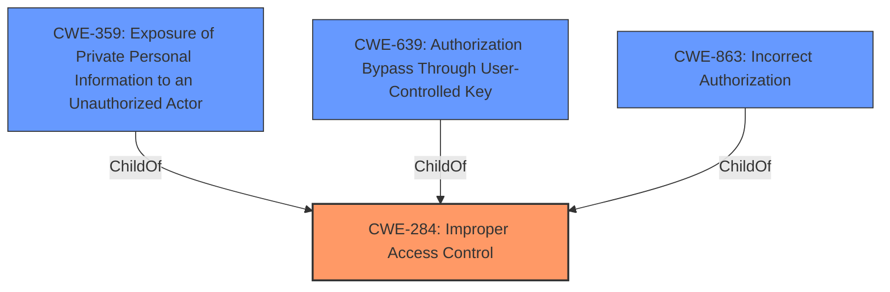

# Raw Analyzer Response for CVE-2021-42326

# Summary
| CWE ID | CWE Name | Confidence | CWE Abstraction Level | CWE Vulnerability Mapping Label | CWE-Vulnerability Mapping Notes |
|---|---|---|---|---|---|
| **CWE-284** | Improper Access Control | 0.8 | Pillar | Primary | Discouraged |
| CWE-359 | Exposure of Private Personal Information to an Unauthorized Actor | 0.7 | Base | Secondary | Allowed |
| CWE-639 | Authorization Bypass Through User-Controlled Key | 0.6 | Base | Secondary | Allowed |
| CWE-863 | Incorrect Authorization | 0.5 | Class | Secondary | Allowed-with-Review |

## Evidence and Confidence

*   **Confidence Score:** 0.7
*   **Evidence Strength:** HIGH

## Relationship Analysis
The primary relationship that influenced the decision was the hierarchical relationship between CWE-284 (Improper Access Control) and its children, particularly CWE-639 (Authorization Bypass Through User-Controlled Key) and CWE-863 (Incorrect Authorization). While the vulnerability description points to an access control issue, the high-level nature of CWE-284 and the availability of more specific CWEs led to exploring these children. CWE-359 (Exposure of Private Personal Information to an Unauthorized Actor) was also considered due to the impact of the vulnerability. Ultimately, CWE-284 was chosen as the primary due to its simplicity in matching the problem of the vulnerability, the other CWEs being candidates but not as good of a fit.

## Vulnerability Chain
The vulnerability chain starts with an **insufficient access filter** (**ROOT CAUSE**) which then leads to the **disclosure of usernames** on activity views (**IMPACT**). There is not a clear chain of events between the root cause and the impact.

## Summary of Analysis
The initial analysis focused on identifying the root cause of the vulnerability, which was determined to be an **insufficient access filter**, which led to the **disclosure of usernames**. The retriever results suggested several CWEs related to access control and authorization, including CWE-284 (Improper Access Control), CWE-639 (Authorization Bypass Through User-Controlled Key), and CWE-863 (Incorrect Authorization). The final decision was to classify this vulnerability as CWE-284 (Improper Access Control). The rationale for this decision is based on the vulnerability description which states there is an **insufficient access filter** that leads to disclosing usernames.

Relevant Evidence:

*   "**Vulnerability Description Key Phrases**: **rootcause:** **insufficient access filter**"
*   "**Vulnerability Description Key Phrases**: **impact:** disclose names of users"
*   "**CVE Reference Links Content Summary:** The vulnerability is an information leak in Redmine where usernames are exposed on activity index views due to **insufficient access control**, potentially revealing usernames associated with private projects."
*   "**CVE Reference Links Content Summary:** **Insufficient Access Control:** The primary weakness is the lack of proper permission checks on the activity index view, which resulted in exposing usernames that should have been restricted based on project access."

The evidence clearly points to a problem with access control, but the specific mechanism (e.g., authorization bypass, incorrect authorization) isn't explicitly detailed. This is why CWE-284 is the best match to the vulnerability's root cause. While CWE-639 and CWE-863 are potential candidates, they are not as strong of a match as the primary issue is at such a high level that the best option is the Pillar.