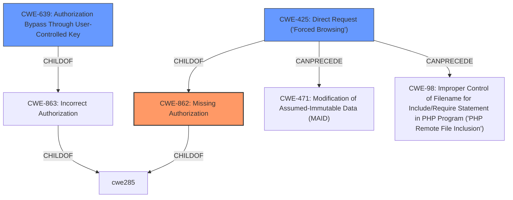

# Analysis Report for CVE-2021-42330

# Vulnerability Analysis Report: CVE-2021-42330

## Description


## Analysis (with Relationship Data)

# Summary
| CWE ID | CWE Name | Confidence | CWE Abstraction Level | CWE Vulnerability Mapping Label | CWE-Vulnerability Mapping Notes |
|---|---|---|---|---|---|
| CWE-862 | Missing Authorization | 0.9 | Class | Primary | Allowed-with-Review |
| CWE-639 | Authorization Bypass Through User-Controlled Key | 0.7 | Base | Secondary | Allowed |
| CWE-425 | Direct Request ('Forced Browsing') | 0.6 | Base | Secondary | Allowed |

## Evidence and Confidence

*   **Confidence Score:** 0.8
*   **Evidence Strength:** HIGH

## Relationship Analysis
The primary CWE is CWE-862, which is a Class-level CWE. Its children should be considered to see if they are a better fit. CWE-639 and CWE-425 are Base-level CWEs and children of CWE-863 (Incorrect Authorization), a sibling of CWE-862. CWE-425 can precede CWE-471 (Modification of Assumed-Immutable Data) and CWE-98 (Improper Control of Filename for Include/Require Statement in PHP Program ('PHP Remote File Inclusion')).



## Vulnerability Chain
The vulnerability chain starts with a **lack of authority control**. The attacker crafts URL parameters to access and edit other users' credentials and personal information. This leads to unauthorized access and modification of sensitive data.

## Summary of Analysis
The initial analysis focused on the **lack of authority control** in the Teacher Edit function of the ShinHer StudyOnline System, which allows remote attackers to access and edit other users' credentials and personal information by crafting URL parameters.

The primary CWE is CWE-862 **Missing Authorization**, as the application **does not perform an authorization check** when an actor attempts to access a resource or perform an action. This is supported by the vulnerability description key phrase "**lack of authority control**".

CWE-639 **Authorization Bypass Through User-Controlled Key** is a secondary CWE because the attacker crafts URL parameters (user-controlled key) to gain access to another user's data. The description states, "The system's authorization functionality does not prevent one user from gaining access to another user's data or record by modifying the key value identifying the data."

CWE-425 **Direct Request ('Forced Browsing')** is also a secondary CWE because the vulnerability involves accessing restricted URLs by crafting URL parameters, bypassing the intended navigation path and authorization checks. "The web application does not adequately enforce appropriate authorization on all restricted URLs, scripts, or files."

CWE-285 **Improper Authorization** was considered, as it is a parent of CWE-862, but it is too general, and CWE-862 provides a more accurate description of the vulnerability.

CWE-472 **External Control of Assumed-Immutable Web Parameter** was considered but the vulnerability is primarily about authorization **not** that an immutable value was externally controlled.

CWE-79 **Improper Neutralization of Input During Web Page Generation ('Cross-site Scripting')** was considered but is not applicable because the vulnerability doesn't involve improper neutralization of input leading to XSS.

CWE-434 **Unrestricted Upload of File with Dangerous Type** was considered but the vulnerability is not related to file uploads.

CWE-352 **Cross-Site Request Forgery (CSRF)** was considered but the vulnerability is not related to CSRF.

The selected CWEs are at the optimal level of specificity, with CWE-862 as the primary Class-level CWE and CWE-639 and CWE-425 as secondary Base-level CWEs that provide additional context to the vulnerability.


## CWE Relationship Analysis

Current CWEs represent these abstraction levels: .


### Vulnerability Chain Analysis

**Chain starting from CWE-79:**
- 79 (Improper Neutralization of Input During Web Page Generation ('Cross-site Scripting')) - ROOT


**Chain starting from CWE-862:**
- 862 (Missing Authorization) - ROOT


### CWE Relationship Diagram

```mermaid
graph TD
    classDef primary fill:#f96,stroke:#333,stroke-width:2px
    classDef secondary fill:#69f,stroke:#333
    classDef tertiary fill:#9e9,stroke:#333
```


*Report generated on 2025-04-01 21:30:44*
