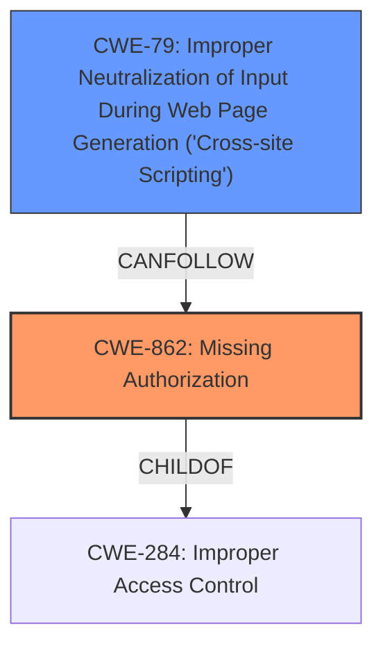

# Raw Analyzer Response for CVE-2021-42367

# Summary
| CWE ID | CWE Name | Confidence | CWE Abstraction Level | CWE Vulnerability Mapping Label | CWE-Vulnerability Mapping Notes |
|---|---|---|---|---|---|
| CWE-862 | Missing Authorization | 1.0 | Class | Allowed-with-Review | Primary CWE |
| CWE-79 | Improper Neutralization of Input During Web Page Generation ('Cross-site Scripting') | 1.0 | Base | Allowed | Secondary Candidate |

## Evidence and Confidence

*   **Confidence Score:** 1.0
*   **Evidence Strength:** HIGH

## Relationship Analysis
The primary CWE is CWE-862 **Missing Authorization**, which is a Class-level CWE. It is a child of the Pillar CWE-284 **Improper Access Control**. The secondary CWE is CWE-79 **Improper Neutralization of Input During Web Page Generation ('Cross-site Scripting')**, which is a Base-level CWE. The **missing authorization** allows lower-level users to modify settings, leading to stored XSS (CWE-79).

## Vulnerability Chain
The vulnerability chain starts with **missing authorization checks** (CWE-862), which allows low-level authenticated users to modify plugin settings. These settings are not properly neutralized, leading to stored XSS (CWE-79). The lack of authorization is the root cause, and the XSS is the impact.

## Summary of Analysis
The initial analysis identified the root cause as **missing authorization checks** on the `tawcvs_save_settings` function, leading to stored XSS. The evidence for this is strong, as the vulnerability description explicitly states "**missing authorization checks**" and "allows attackers to inject arbitrary web scripts". The CVE Reference Links Content Summary confirms this, stating "The vulnerability is due to ... missing authorization checks on the `tawcvs_save_settings` function" and "Attackers can inject arbitrary web scripts".

The Retriever Results also support this analysis, with CWE-862 **Missing Authorization** being a top candidate. CWE-79 **Improper Neutralization of Input During Web Page Generation ('Cross-site Scripting')** is also listed, reflecting the XSS vulnerability.

CWE-862 is chosen as the primary CWE because the **missing authorization** is the root cause that enables the XSS vulnerability. Without the authorization bypass, the XSS would not be exploitable by low-level users. CWE-79 is a secondary CWE because it represents the specific type of vulnerability that is exposed due to the **missing authorization**.

The relationship graph reinforces this decision, showing that CWE-862 is a child of CWE-284 **Improper Access Control**, a more general category. The abstraction levels are appropriate, with CWE-862 being a Class and CWE-79 being a Base. The mapping guidance for both CWEs allows their usage.

The selected CWEs are at the optimal level of specificity because they accurately represent both the root cause (**missing authorization**) and the resulting vulnerability (XSS).

# Enhanced Context (25 CWEs)
The following CWEs were identified as potentially relevant to this vulnerability:

## CWE-472: External Control of Assumed-Immutable Web Parameter
**Abstraction Level**: Base
**Similarity Score**: 0.76

**Description**:
The web application does not sufficiently verify inputs that are assumed to be immutable but are actually externally controllable, such as hidden form fields.

**Mapping Guidance**:
- Usage: Allowed
- Rationale: This CWE entry is at the Base level of abstraction, which is a preferred level of abstraction for mapping to the root causes of vulnerabilities.

*Rejected*. While the settings parameters could be seen as assumed-immutable, the root cause is still the authorization bypass.

## CWE-1289: Improper Validation of Unsafe Equivalence in Input
**Abstraction Level**: Base
**Similarity Score**: 0.76

**Description**:
The product receives an input value that is used as a resource identifier or other type of reference, but it does not validate or incorrectly validates that the input is equivalent to a potentially-unsafe value.

**Mapping Guidance**:
- Usage: Allowed
- Rationale: This CWE entry is at the Base level of abstraction, which is a preferred level of abstraction for mapping to the root causes of vulnerabilities.

*Rejected*. Similar to CWE-472, the root cause is the authorization bypass, not input validation.

## CWE-639: Authorization Bypass Through User-Controlled Key
**Abstraction Level**: Base
**Similarity Score**: 0.76

**Description**:
The system's authorization functionality does not prevent one user from gaining access to another user's data or record by modifying the key value identifying the data.

**Mapping Guidance**:
- Usage: Allowed
- Rationale: This CWE entry is at the Base level of abstraction, which is a preferred level of abstraction for mapping to the root causes of vulnerabilities.

*Rejected*. While this describes the authorization bypass, the broader issue is the **missing authorization** check itself, not just the user-controlled key.

## CWE-807: Reliance on Untrusted Inputs in a Security Decision
**Abstraction Level**: Base
**Similarity Score**: 0.76

**Description**:
The product uses a protection mechanism that relies on the existence or values of an input, but the input can be modified by an untrusted actor in a way that bypasses the protection mechanism.

**Mapping Guidance**:
- Usage: Allowed
- Rationale: This CWE entry is at the Base level of abstraction, which is a preferred level of abstraction for mapping to the root causes of vulnerabilities.

*Rejected*. This is more about the reliance of a protection mechanism, not authorization in general.

## CWE-184: Incomplete List of Disallowed Inputs
**Abstraction Level**: Base
**Similarity Score**: 0.75

**Description**:
The product implements a protection mechanism that relies on a list of inputs (or properties of inputs) that are not allowed by policy or otherwise require other action to neutralize before additional processing takes place, but the list is incomplete.

**Mapping Guidance**:
- Usage: Allowed
- Rationale: This CWE entry is at the Base level of abstraction, which is a preferred level of abstraction for mapping to the root causes of vulnerabilities.

*Rejected*. This is about incomplete input lists rather than **missing authorization**.

## CWE-74: Improper Neutralization of Special Elements in Output Used by a Downstream Component ('Injection')
**Abstraction Level**: Class
**Similarity Score**: 0.75

**Description**:
The product constructs all or part of a command, data structure, or record using externally-influenced input from an upstream component, but it does not neutralize or incorrectly neutralizes special elements that could modify how it is parsed or interpreted when it is sent to a downstream component.

**Mapping Guidance**:
- Usage: Discouraged
- Rationale: CWE-74 is high-level and often misused when lower-level weaknesses are more appropriate.

*Rejected*. CWE-79 is more specific for XSS.

## CWE-552: Files or Directories Accessible to External Parties
**Abstraction Level**: Base
**Similarity Score**: 0.75

**Description**:
The product makes files or directories accessible to unauthorized actors, even though they should not be.

**Mapping Guidance**:
- Usage: Allowed
- Rationale: This CWE entry is at the Base level of abstraction, which is a preferred level of abstraction for mapping to the root causes of vulnerabilities.

*Rejected*. Not applicable, as the vulnerability does not involve file access.

## CWE-274: Improper Handling of Insufficient Privileges
**Abstraction Level**: Base
**Similarity Score**: 0.75

**Description**:
The product does not handle or incorrectly handles when it has insufficient privileges to perform an operation, leading to resultant weaknesses.

**Mapping Guidance**:
- Usage: Discouraged
- Rationale: This CWE entry could be deprecated in a future version of CWE.

*Rejected*. Not applicable, as this is about the product handling insufficient privileges, not the **missing authorization** check itself.

## CWE-183: Permissive List of Allowed Inputs
**Abstraction Level**: Base
**Similarity Score**: 0.74

**Description**:
The product implements a protection mechanism that relies on a list of inputs (or properties of inputs) that are explicitly allowed by policy because the inputs are assumed to be safe, but the list is too permissive - that is, it allows an input that is unsafe, leading to resultant weaknesses.

**Mapping Guidance**:
- Usage: Allowed
- Rationale: This CWE entry is at the Base level of abstraction, which is a preferred level of abstraction for mapping to the root causes of vulnerabilities