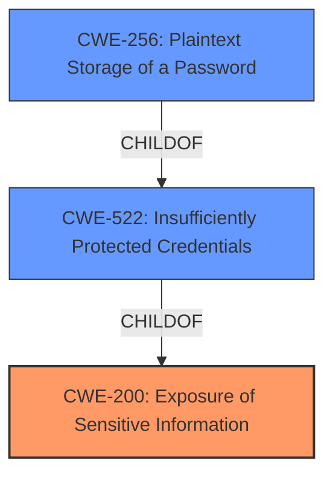

# Analysis Report for CVE-2021-42536

# Vulnerability Analysis Report: CVE-2021-42536

## Description


## Analysis (with Relationship Data)

# Summary

| CWE ID | CWE Name | Confidence | CWE Abstraction Level | CWE Vulnerability Mapping Label | CWE-Vulnerability Mapping Notes |
|---|---|---|---|---|---|
| CWE-200 | Exposure of Sensitive Information | 1.0 | Class | Primary | Allowed |
| CWE-522 | Insufficiently Protected Credentials | 0.8 | Class | Secondary | Allowed-with-Review |
| CWE-256 | Plaintext Storage of a Password | 0.7 | Base | Secondary | Allowed |

## Evidence and Confidence

*   **Confidence Score:** 0.9
*   **Evidence Strength:** HIGH

## Relationship Analysis

The primary CWE is CWE-200, which is a class-level weakness. The secondary CWEs, CWE-522 and CWE-256, represent more specific ways in which sensitive information can be exposed. CWE-522, Insufficiently Protected Credentials, is a class that is related to CWE-256 Plaintext Storage of Password. Choosing CWE-200, with supporting CWEs of CWE-522 and CWE-256, provides a comprehensive view of the vulnerability, covering both the general issue of sensitive information exposure and the specific mechanism of credential exposure.



## Vulnerability Chain

The chain of events is as follows:
1.  **Root Cause:** **Lack of access control** allowing all users read access to global variables.
2.  **Weakness:** Global variables contain sensitive information (peer username and password).
3.  **Impact:** **Disclosure of peer username and password**, potentially leading to further attacks.

## Summary of Analysis

The initial assessment identified the **disclosure of peer username and password** due to all users having access to read global variables. The retriever results suggested several potential CWEs, including CWE-522, CWE-256, and CWE-201.

The final decision prioritizes CWE-200 as the primary weakness because it directly addresses the **exposure of sensitive information**. The vulnerability description explicitly mentions the disclosure of peer usernames and passwords, making CWE-200 a fitting choice. The supporting CWEs, CWE-522 and CWE-256, provide more context on how the sensitive information is exposed and stored, respectively.

The evidence from the vulnerability description supports this classification. The "Vulnerability Description Key Phrases" section highlights the **impact** as "disclosure of peer username and password" and the "vector" as "access to read global variables". The "CVE Reference Links Content Summary" further states that the vulnerability stems from the "exposure of sensitive information to unauthorized actors" due to all users having read access to global variables.

The chosen CWEs are at the optimal level of specificity. CWE-200 is a class-level weakness that provides a general overview of the vulnerability, while CWE-522 and CWE-256 offer more specific details about the nature of the exposed information (credentials) and its storage (**plaintext**).

Relevant CWE Information:

# Enhanced Context (25 CWEs)

## CWE-639: Authorization Bypass Through User-Controlled Key
**Abstraction Level**: Base
**Similarity Score**: 0.79
**Source**: dense

**Description**:
The system's authorization functionality does not prevent one user from gaining access to another user's data or record by modifying the key value identifying the data.

**Mapping Guidance**:
- Usage: Allowed
- Rationale: This CWE entry is at the Base level of abstraction, which is a preferred level of abstraction for mapping to the root causes of vulnerabilities.

*Not selected because:* While there is an **authorization bypass**, the mechanism isn't directly related to user-controlled keys. The issue is a general **lack of access control**, not manipulation of specific keys.

## CWE-425: Direct Request ('Forced Browsing')
**Abstraction Level**: Base
**Similarity Score**: 0.79
**Source**: dense

**Description**:
The web application does not adequately enforce appropriate authorization on all restricted URLs, scripts, or files.

**Mapping Guidance**:
- Usage: Allowed
- Rationale: This CWE entry is at the Base level of abstraction, which is a preferred level of abstraction for mapping to the root causes of vulnerabilities.

*Not selected because:* This vulnerability isn't about accessing resources through direct requests. It's about **unauthorized access** to global variables due to missing access controls.

## CWE-552: Files or Directories Accessible to External Parties
**Abstraction Level**: Base
**Similarity Score**: 0.79
**Source**: dense

**Description**:
The product makes files or directories accessible to unauthorized actors, even though they should not be.

**Mapping Guidance**:
- Usage: Allowed
- Rationale: This CWE entry is at the Base level of abstraction, which is a preferred level of abstraction for mapping to the root causes of vulnerabilities.

*Not selected because:* The description involves global variables and not specifically files or directories.

## CWE-472: External Control of Assumed-Immutable Web Parameter
**Abstraction Level**: Base
**Similarity Score**: 0.79
**Source**: dense

**Description**:
The web application does not sufficiently verify inputs that are assumed to be immutable but are actually externally controllable, such as hidden form fields.

**Mapping Guidance**:
- Usage: Allowed
- Rationale: This CWE entry is at the Base level of abstraction, which is a preferred level of abstraction for mapping to the root causes of vulnerabilities.

*Not selected because:* The description involves global variables and not web parameters.

## CWE-41: Improper Resolution of Path Equivalence
**Abstraction Level**: Base
**Similarity Score**: 0.78
**Source**: dense

**Description**:
The product is vulnerable to file system contents disclosure through path equivalence. Path equivalence involves the use of special characters in file and directory names. The associated manipulations are intended to generate multiple names for the same object.

**Mapping Guidance**:
- Usage: Allowed
- Rationale: This CWE entry is at the Base level of abstraction, which is a preferred level of abstraction for mapping to the root causes of vulnerabilities.

*Not selected because:* The vulnerability is not about file system path equivalence.

## CWE-807: Reliance on Untrusted Inputs in a Security Decision
**Abstraction Level**: Base
**Similarity Score**: 0.78
**Source**: dense

**Description**:
The product uses a protection mechanism that relies on the existence or values of an input, but the input can be modified by an untrusted actor in a way that bypasses the protection mechanism.

**Mapping Guidance**:
- Usage: Allowed
- Rationale: This CWE entry is at the Base level of abstraction, which is a preferred level of abstraction for mapping to the root causes of vulnerabilities.

*Not selected because:* This vulnerability is not about reliance on untrusted inputs.

## CWE-668: Exposure of Resource to Wrong Sphere
**Abstraction Level**: Class
**Similarity Score**: 0.78
**Source**: dense

**Description**:
The product exposes a resource to the wrong control sphere, providing unintended actors with inappropriate access to the resource.

**Mapping Guidance**:
- Usage: Discouraged
- Rationale: CWE-668 is high-level and is often misused as a catch-all when lower-level CWE IDs might be applicable. It is sometimes used for low-information vulnerability reports [REF-1287]. It is a level-1 Class (i.e., a child of a Pillar). It is not useful for trend analysis.

*Not selected because:* Although applicable, CWE-200 is more specific and directly relates to **exposure of sensitive information**.

## CWE-226: Sensitive Information in Resource Not Removed Before Reuse
**Abstraction Level**: Base
**Similarity Score**: 0.78
**Source**: dense

**Description**:
The product releases a resource such as memory or a file so that it can be made available for reuse, but it does not clear or "zeroize" the information contained in the resource before the product performs a critical state transition or makes the resource available for reuse by other entities.

**Mapping Guidance**:
- Usage: Allowed
- Rationale: This CWE entry is at the Base level of abstraction, which is a preferred level of abstraction for mapping to the root causes of vulnerabilities.

*Not selected because:* This vulnerability is not about failing to clear sensitive information before resource reuse.

## CWE-451: User Interface (UI) Misrepresentation of Critical Information
**Abstraction Level**: Class
**Similarity Score**: 0.77
**Source**: dense

**Description**:
The user interface (UI) does


## CWE Relationship Analysis

Current CWEs represent these abstraction levels: .


### Vulnerability Chain Analysis

**Chain starting from CWE-41:**
- 41 (Improper Resolution of Path Equivalence) - ROOT


**Chain starting from CWE-201:**
- 201 (Insertion of Sensitive Information Into Sent Data) - ROOT


### CWE Relationship Diagram

```mermaid
graph TD
    classDef primary fill:#f96,stroke:#333,stroke-width:2px
    classDef secondary fill:#69f,stroke:#333
    classDef tertiary fill:#9e9,stroke:#333
```


*Report generated on 2025-04-02 01:15:22*
