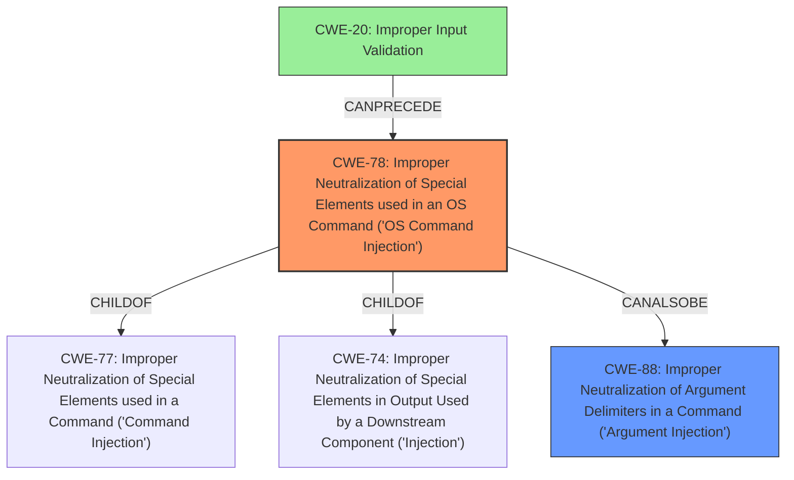

# Raw Analyzer Response for CVE-2021-42559

# Summary
| CWE ID | CWE Name | Confidence | CWE Abstraction Level | CWE Vulnerability Mapping Label | CWE-Vulnerability Mapping Notes |
|---|---|---|---|---|---|
| CWE-78 | Improper Neutralization of Special Elements used in an OS Command ('OS Command Injection') | 1 | Base | Allowed | Primary CWE |
| CWE-88 | Improper Neutralization of Argument Delimiters in a Command ('Argument Injection') | 0.7 | Base | Allowed | Secondary Candidate |
| CWE-20 | Improper Input Validation | 0.5 | Class | Discouraged | Secondary Candidate |

## Evidence and Confidence

*   **Confidence Score:** 0.9
*   **Evidence Strength:** HIGH

## Relationship Analysis
The primary CWE is CWE-78, which represents the core issue of allowing OS command injection. CWE-88 is a related weakness involving improper handling of argument delimiters, and CANALSOBE a CWE for this vulnerability. CWE-20 represents a broader class of input validation issues, which CANPRECEDE command injection vulnerabilities. CWE-78 is a base level CWE.

## Vulnerability Chain
The vulnerability chain starts with the **multiple startup requirements that execute commands**. This is followed by **improper input validation** (or lack thereof) when these commands are configured via the REST API. The lack of proper sanitization allows for **OS Command Injection**, leading to the ability to **execute arbitrary commands** on the server.

## Summary of Analysis
The initial analysis identified CWE-78 as the primary weakness. This is based on the vulnerability description stating that an authenticated user can insert arbitrary commands that will execute when the server is restarted. The "CVE Reference Links Content Summary" confirms that the root cause is the application's execution of commands defined in its configuration during server startup, which can be modified via the REST API, leading to command injection. The evidence strongly supports this classification.

The graph relationships helped to clarify the potential involvement of CWE-88, as a potential related weakness. The decision to include CWE-88 as a secondary candidate stems from the possibility that the vulnerability involves improper handling of argument delimiters within the injected commands. While the evidence does not explicitly state this, it is a plausible scenario that warrants consideration.

CWE-20 was considered, but ultimately classified as a secondary candidate with lower confidence. While the vulnerability involves a lack of input validation, the more specific CWE-78 provides a more precise characterization of the weakness.

The selected CWEs are at the optimal level of specificity because CWE-78 directly addresses the root cause, which is the ability to inject and execute arbitrary OS commands. While broader categories like CWE-20 are relevant, they do not capture the specific nature of the vulnerability as accurately as CWE-78.

Relevant CWE Information:

# Enhanced Context (25 CWEs)

## CWE-78: Improper Neutralization of Special Elements used in an OS Command ('OS Command Injection')
**Abstraction Level**: Base
**Similarity Score**: 5.03
**Source**: graph

**Description**:
The product constructs all or part of an OS command using externally-influenced input from an upstream component, but it does not neutralize or incorrectly neutralizes special elements that could modify the intended OS command when it is sent to a downstream component.

**Mapping Guidance**:
- Usage: Allowed
- Rationale: This CWE entry is at the Base level of abstraction, which is a preferred level of abstraction for mapping to the root causes of vulnerabilities.

**Relationships**:
- CANFOLLOW -> CWE-184
- CANALSOBE -> CWE-88
- CHILDOF -> CWE-77
- CHILDOF -> CWE-74

**Explanation:**
This CWE perfectly matches the vulnerability description, where the **startup requirements that execute commands** can be modified via the REST API to inject and execute arbitrary OS commands. The description "**multiple startup requirements that execute commands**" aligns with the CWE description "The product constructs all or part of an OS command using externally-influenced input from an upstream component."

## CWE-88: Improper Neutralization of Argument Delimiters in a Command ('Argument Injection')
**Abstraction Level**: Base
**Similarity Score**: 9316.45
**Source**: sparse

**Description**:
The product constructs a string for a command to be executed by a separate component
in another control sphere, but it does not properly delimit the
intended arguments, options, or switches within that command string.

**Mapping Guidance**:
- Usage: Allowed
- Rationale: This CWE entry is at the Base level of abstraction, which is a preferred level of abstraction for mapping to the root causes of vulnerabilities.

**Explanation:**
This CWE is also relevant because, in addition to injecting commands, an attacker might be able to inject arguments to existing commands, changing their behavior. While not the primary issue, it's a possible attack vector.

## CWE-20: Improper Input Validation
**Abstraction Level**: Class
**Similarity Score**: 0.273
**Source**: sparse

**Description**:
The product receives input or data, but it does not validate or incorrectly validates that the input has the properties that are required to process the data safely and correctly.

**Mapping Guidance**:
- Usage: Discouraged
- Rationale: CWE-20 is commonly misused in low-information vulnerability reports when lower-level CWEs could be used instead, or when more details about the vulnerability are available

**Explanation:**
While technically true that the commands aren't being validated, this is a very general CWE. CWE-78 is a more specific description of the vulnerability.

## Other CWEs Considered But Not Used:

*   **CWE-502: Deserialization of Untrusted Data:** This CWE was considered because the configuration could be stored as serialized data. However, the primary issue is the execution of arbitrary commands, not the deserialization process itself. Therefore, this CWE was not selected.
*   **CWE-269: Improper Privilege Management:** This CWE was considered because the injected commands could potentially be executed with elevated privileges. However, the root cause is the command injection vulnerability, not a general issue with privilege management. Therefore, this CWE was not selected.
*   **CWE-306: Missing Authentication for Critical Function:** This CWE was not selected because authentication is required, though only an authenticated user can perform the injection. The vulnerability is that the authenticated user can inject code, not that the function requires no authentication.
*   **CWE-250: Execution with Unnecessary Privileges:** This CWE was not selected because the vulnerability stems from command injection, and not the program running with elevated privileges.
*   **CWE-79: Improper Neutralization of Input During Web Page Generation ('Cross-site Scripting'):** This CWE was not selected because the injection is happening at the OS command level, not in the context of a web page.
*   **CWE-22: Improper Limitation of a Pathname to a Restricted Directory ('Path Traversal'):** This CWE was not selected because the vulnerability doesn't involve path traversal.
*   **CWE-184: Incomplete List of Disallowed Inputs:** This CWE was not selected because it is command injection and not related to a list of inputs.