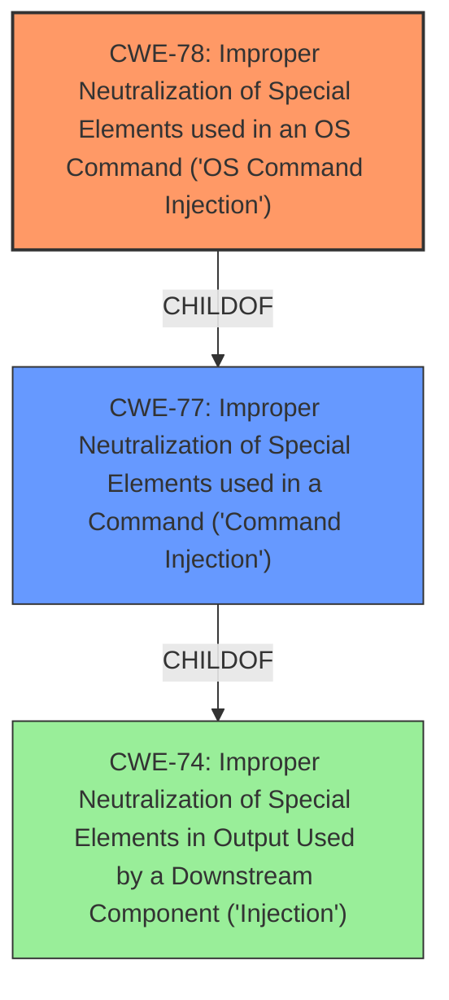

# Analysis Report for CVE-2021-42561

# Vulnerability Analysis Report: CVE-2021-42561

## Description


## Analysis (with Relationship Data)

# Summary
| CWE ID | CWE Name | Confidence | CWE Abstraction Level | CWE Vulnerability Mapping Label | CWE-Vulnerability Mapping Notes |
|---|---|---|---|---|---|
| CWE-78 | Improper Neutralization of Special Elements used in an OS Command ('OS Command Injection') | 1.0 | Base | Allowed | Primary CWE |

## Evidence and Confidence

*   **Confidence Score:** 1.0
*   **Evidence Strength:** HIGH

## Relationship Analysis
The analysis focused on the direct parent-child relationship between CWE-78 and CWE-77 and considered the abstraction levels to select the most specific and relevant CWE. The relationship `ChildOf -> CWE-77` indicates that CWE-78 is a more specific case of command injection, focusing on OS commands. Since the vulnerability involves the execution of arbitrary shell commands, CWE-78 was deemed more appropriate.



## Vulnerability Chain
The vulnerability chain starts with the **improper sanitization** of the `name` parameter, leading to the **injection of shell metacharacters**, which then results in the **execution of arbitrary shell commands**.

## Summary of Analysis
The initial analysis identified the vulnerability as a **command injection** due to the **lack of sanitization** of the `name` parameter in the Human plugin of CALDERA 2.8.1. The provided information indicates that this allows attackers to inject shell metacharacters and execute arbitrary shell commands. The Retriever results list CWE-77 as the top candidate, but also list CWE-78. After careful consideration of the definitions of CWE-77 and CWE-78, it was determined that CWE-78 is more appropriate since the vulnerability specifically involves OS commands.

The evidence from the vulnerability description states: "When activated, the Human plugin passes the unsanitized name parameter to a python os.system function. This allows attackers to use shell metacharacters (e.g., backticks `` or dollar parenthesis $() ) in order to escape the current command and execute arbitrary shell commands."

This statement directly supports the selection of CWE-78 because it explicitly mentions the use of `os.system` function, which executes OS commands and the ability to inject shell metacharacters to execute arbitrary commands.

CWE-78 is at the Base level of abstraction, which is the preferred level for mapping root causes. It accurately represents the weakness where externally-influenced input is used to construct an OS command without proper neutralization of special elements.

Relevant CWE Information:

# Enhanced Context (25 CWEs)
The following CWEs were identified as potentially relevant to this vulnerability:

## CWE-74: Improper Neutralization of Special Elements in Output Used by a Downstream Component ('Injection')
**Abstraction Level**: Class
**Similarity Score**: 0.77
**Source**: dense

**Description**:
The product constructs all or part of a command, data structure, or record using externally-influenced input from an upstream component, but it does not neutralize or incorrectly neutralizes special elements that could modify how it is parsed or interpreted when it is sent to a downstream component.

**Mapping Guidance**:
- Usage: Discouraged
- Rationale: CWE-74 is high-level and often misused when lower-level weaknesses are more appropriate.

## CWE-77: Improper Neutralization of Special Elements used in a Command ('Command Injection')
**Abstraction:** Class
**Status:** Draft

### Description
The product constructs all or part of a command using externally-influenced input from an upstream component, but it does not neutralize or incorrectly neutralizes special elements that could modify the intended command when it is sent to a downstream component.

### Extended Description
Many protocols and products have their own custom command language. While OS or shell command strings are frequently discovered and targeted, developers may not realize that these other command languages might also be vulnerable to attacks.

### Alternative Terms
Command injection: an attack-oriented phrase for this weakness. Note: often used when "OS command injection" (CWE-78) was intended.

### Relationships
ChildOf -> CWE-74
ChildOf -> CWE-74

### Mapping Guidance
**Usage:** Allowed-with-Review
**Rationale:** CWE-77 is often misused when OS command injection (CWE-78) was intended instead [REF-1287].
**Comments:** Ensure that the analysis focuses on the root-cause error that allows the execution of commands, as there are many weaknesses that can lead to this consequence. See Terminology Notes. If the weakness involves a command language besides OS shell invocation, then CWE-77 could be used.
**Reasons:**
- Frequent Misuse
**Suggested Alternatives:**
- CWE-78: OS Command Injection

### Additional Notes
**[Terminology]**

The "command injection" phrase carries different meanings, either as an attack or as a technical impact. The most common usage of "command injection" refers to the more-accurate OS command injection (CWE-78), but there are many command languages.

In vulnerability-focused analysis, the phrase may refer to any situation in which the adversary can execute commands of their own choosing, i.e., the focus is on the risk and/or technical impact of exploitation. Many proof-of-concept exploits focus on the ability to execute commands and may emphasize "command injection." However, there are dozens of weaknesses that can allow execution of commands. That is, the ability to execute commands could be resultant from another weakness.

To some, "command injection" can include cases in which the functionality intentionally allows the user to specify an entire command, which is then executed. In this case, the root cause weakness might be related to missing or incorrect authorization, since an adversary should not be able to specify arbitrary commands, but some users or admins are allowed.

CWE-77 and its descendants are specifically focused on behaviors in which the product is intentionally building a command to execute, and the adversary can inject separators into the command or otherwise change the command being executed.

**[Other]**

Command injection is a common problem with wrapper programs.

### Observed Examples
- **CVE-2022-1509:** injection of sed script syntax ("sed injection")
- **CVE-2024-5184:** API service using a large generative AI model allows direct prompt injection to leak hard-coded system prompts or execute other prompts.
- **CVE-2020-11698:** anti-spam product allows injection of SNMP commands into confiuration file

CWE-77 was considered but not chosen because it is a more general case of command injection. The vulnerability explicitly involves the execution of OS commands, making CWE-78 a more precise fit. The mapping guidance for CWE-77 also suggests considering CWE-78 when OS command injection is the specific issue.


## CWE Relationship Analysis

Current CWEs represent these abstraction levels: .


### Vulnerability Chain Analysis

**Chain starting from CWE-78:**
- 78 (Improper Neutralization of Special Elements used in an OS Command ('OS Command Injection')) - ROOT


**Chain starting from CWE-74:**
- 74 (Improper Neutralization of Special Elements in Output Used by a Downstream Component ('Injection')) - ROOT


### CWE Relationship Diagram

```mermaid
graph TD
    classDef primary fill:#f96,stroke:#333,stroke-width:2px
    classDef secondary fill:#69f,stroke:#333
    classDef tertiary fill:#9e9,stroke:#333
```


*Report generated on 2025-04-02 13:07:52*
