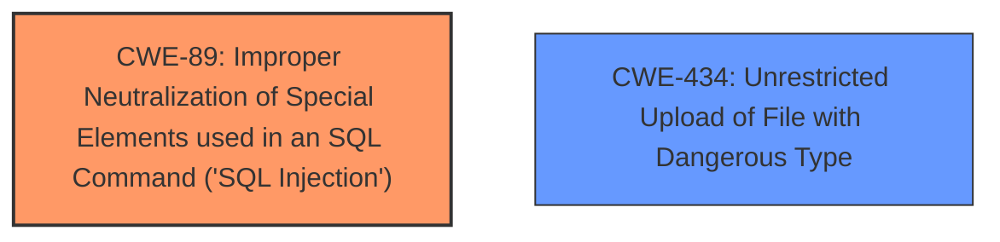

# Analysis for CVE-2021-42580

```markdown
# Summary
| CWE ID    | CWE Name                                                                     | Confidence | CWE Abstraction Level | CWE Vulnerability Mapping Label | CWE-Vulnerability Mapping Notes |
| :---------- | :--------------------------------------------------------------------------- | :--------- | :---------------------- | :------------------------------ | :------------------------------ |
| CWE-89      | Improper Neutralization of Special Elements used in an SQL Command ('SQL Injection') | 0.9        | Base                    | Primary                       | Allowed                       |
| CWE-434     | Unrestricted Upload of File with Dangerous Type                            | 0.8        | Base                    | Secondary                       | Allowed                       |

## Evidence and Confidence

*   **Confidence Score:** 0.85
*   **Evidence Strength:** HIGH

## Relationship Analysis
The primary weakness is **CWE-89** Improper Neutralization of Special Elements used in an SQL Command ('SQL Injection'), as the vulnerability description explicitly mentions **SQL injection** in the admin login.php file. **CWE-434** Unrestricted Upload of File with Dangerous Type is a secondary weakness, as the vulnerability description mentions **file upload** in Master.php. Both are base level CWEs. There is no direct relationship between these two.



## Vulnerability Chain
The vulnerability chain involves two separate weaknesses that can be exploited to achieve remote command execution.
1.  **CWE-89** ('SQL Injection') allows an attacker to bypass authentication.
2.  **CWE-434** (Unrestricted Upload of File with Dangerous Type) allows an attacker to upload malicious files after authenticating (or bypassing authentication via SQLi).
3.  These two vulnerabilities can be chained to achieve remote command execution.

## Summary of Analysis
The initial analysis focused on identifying the root causes described in the vulnerability description. The description explicitly mentions **SQL injection** and **file upload** vulnerabilities.
*   The primary weakness is **CWE-89**, which is directly related to the **SQL injection** vulnerability in the admin login.php file. This allows bypassing authentication.
*   The secondary weakness is **CWE-434**, which is related to the **file upload** vulnerability in Master.php, potentially allowing the upload of malicious files leading to remote command execution.

These CWEs are selected because they are at the base level of abstraction and accurately represent the weaknesses described in the vulnerability. The high retriever scores and explicit mention in the vulnerability description further support these selections.

Relevant CWE Information:

# Enhanced Context (25 CWEs)
The following CWEs were identified as potentially relevant to this vulnerability:

## CWE-472: External Control of Assumed-Immutable Web Parameter
**Abstraction Level**: Base
**Similarity Score**: 0.75
**Source**: dense

**Description**:
The web application does not sufficiently verify inputs that are assumed to be immutable but are actually externally controllable, such as hidden form fields.

**Mapping Guidance**:
- Usage: Allowed
- Rationale: This CWE entry is at the Base level of abstraction, which is a preferred level of abstraction for mapping to the root causes of vulnerabilities.

## CWE-434: Unrestricted Upload of File with Dangerous Type
**Abstraction Level**: Base
**Similarity Score**: 0.75
**Source**: dense

**Description**:
The product allows the upload or transfer of dangerous file types that are automatically processed within its environment.

**Mapping Guidance**:
- Usage: Allowed
- Rationale: This CWE entry is at the Base level of abstraction, which is a preferred level of abstraction for mapping to the root causes of vulnerabilities.

## CWE-425: Direct Request ('Forced Browsing')
**Abstraction Level**: Base
**Similarity Score**: 0.74
**Source**: dense

**Description**:
The web application does not adequately enforce appropriate authorization on all restricted URLs, scripts, or files.

**Mapping Guidance**:
- Usage: Allowed
- Rationale: This CWE entry is at the Base level of abstraction, which is a preferred level of abstraction for mapping to the root causes of vulnerabilities.

## CWE-74: Improper Neutralization of Special Elements in Output Used by a Downstream Component ('Injection')
**Abstraction Level**: Class
**Similarity Score**: 0.74
**Source**: dense

**Description**:
The product constructs all or part of a command, data structure, or record using externally-influenced input from an upstream component, but it does not neutralize or incorrectly neutralizes special elements that could modify how it is parsed or interpreted when it is sent to a downstream component.

**Mapping Guidance**:
- Usage: Discouraged
- Rationale: CWE-74 is high-level and often misused when lower-level weaknesses are more appropriate.

## CWE-89: Improper Neutralization of Special Elements used in an SQL Command ('SQL Injection')
**Abstraction Level**: Base
**Similarity Score**: 0.74
**Source**: dense

**Description**:
The product constructs all or part of an SQL command using externally-influenced input from an upstream component, but it does not neutralize or incorrectly neutralizes special elements that could modify the intended SQL command when it is sent to a downstream component. Without sufficient removal or quoting of SQL syntax in user-controllable inputs, the generated SQL query can cause those inputs to be interpreted as SQL instead of ordinary user data.

**Mapping Guidance**:
- Usage: Allowed
- Rationale: This CWE entry is at the Base level of abstraction, which is a preferred level of abstraction for mapping to the root causes of vulnerabilities.

## CWE-80: Improper Neutralization of Script-Related HTML Tags in a Web Page (Basic XSS)
**Abstraction Level**: Variant
**Similarity Score**: 0.73
**Source**: dense

**Description**:
The product receives input from an upstream component, but it does not neutralize or incorrectly neutralizes special characters such as "<", ">", and "&" that could be interpreted as web-scripting elements when they are sent to a downstream component that processes web pages.

**Mapping Guidance**:
- Usage: Allowed
- Rationale: This CWE entry is at the Variant level of abstraction, which is a preferred level of abstraction for mapping to the root causes of vulnerabilities.

## CWE-96: Improper Neutralization of Directives in Statically Saved Code ('Static Code Injection')
**Abstraction Level**: Base
**Similarity Score**: 0.73
**Source**: dense

**Description**:
The product receives input from an upstream component, but it does not neutralize or incorrectly neutralizes code syntax before inserting the input into an executable resource, such as a library, configuration file, or template.

**Mapping Guidance**:
- Usage: Allowed
- Rationale: This CWE entry is at the Base level of abstraction, which is a preferred level of abstraction for mapping to the root causes of vulnerabilities.

## CWE-807: Reliance on Untrusted Inputs in a Security Decision
**Abstraction Level**: Base
**Similarity Score**: 0.73
**Source**: dense

**Description**:
The product uses a protection mechanism that relies on the existence or values of an input, but the input can be modified by an untrusted actor in a way that bypasses the protection mechanism.

**Mapping Guidance**:
- Usage: Allowed
- Rationale: This CWE entry is at the Base level of abstraction, which is a preferred level of abstraction for mapping to the root causes of vulnerabilities.

## CWE-303: Incorrect Implementation of Authentication Algorithm
**Abstraction Level**: Base
**Similarity Score**: 0.73
**Source**: dense

**Description**:
The requirements for the product dictate the use of an established authentication algorithm, but the implementation of the algorithm is incorrect.

**Mapping Guidance**:
- Usage: Allowed
- Rationale: This CWE entry is at the Base level of abstraction, which is a preferred level of abstraction for mapping to the root causes of vulnerabilities.

## CWE-1391: Use of Weak Credentials
**Abstraction Level**: Class
**Similarity Score**: 0.72
**Source**: dense

**Description**:
The product uses weak credentials (such as a default key or hard-coded password) that can be calculated, derived, reused, or guessed by an attacker.

**Mapping Guidance**:
- Usage: Allowed-with-Review
- Rationale: This CWE entry is a Class and might have Base-level children that would be more appropriate

## CWE-95: Improper Neutralization of Directives in Dynamically Evaluated Code ('Eval Injection')
**Abstraction Level**: Variant
**Similarity Score**: 2890.95
**Source**: sparse

**Description**:
The product receives input from an upstream component, but it does not neutralize or incorrectly neutralizes code syntax before using the input in a dynamic evaluation call (e.g. "eval").

**Mapping Guidance**:
- Usage: Allowed
- Rationale: This CWE entry is at the Variant level of abstraction, which is a preferred level of abstraction for mapping to the root causes of vulnerabilities.

## CWE-89:

# Enhanced Query for CVE-2021-42580

# Vulnerability Description

    Sourcecodester Online Learning System 2.0 is vunlerable to sql injection authentication bypass in admin login file (/admin/login.php) and authenticated **file upload** in (Master.php) file , we can craft these two vunlerablities to get unauthenticated remote command execution.

    # Keyphrase-Specific CWE Analysis
    This vulnerability contains multiple keyphrases that may map to different CWEs. 
    Please analyze each keyphrase separately and determine the most appropriate CWE(s) for each.

    ## WEAKNESS: 'SQL injection'

Relevant CWEs for this WEAKNESS:

### 1. CWE-89: Improper Neutralization of Special Elements used in an SQL Command ('SQL Injection') (Score: 339.42)

The product constructs all or part of an SQL command using externally-influenced input from an upstream component, but it does not neutralize or incorrectly neutralizes special elements that could modify the intended SQL command when it is sent to a downstream component. Without sufficient removal o...

### 2. CWE-434: Unrestricted Upload of File with Dangerous Type (Score: 227.62)

The product allows the upload or transfer of dangerous file types that are automatically processed within its environment....

### 3. CWE-138: Improper Neutralization of Special Elements (Score: 216.63)

The product receives input from an upstream component, but it does not neutralize or incorrectly neutralizes special elements that could be interpreted as control elements or syntactic markers when they are sent to a downstream component....

### 4. CWE-95: Improper Neutralization of Directives in Dynamically Evaluated Code ('Eval Injection') (Score: 214.72)

The product receives input from an upstream component, but it does not neutralize or incorrectly neutralizes code syntax before using the input in a dynamic evaluation call (e.g. "eval")....

### 5. CWE-502: Deserialization of Untrusted Data (Score: 212.36)

The product deserializes untrusted data without sufficiently ensuring that the resulting data will be valid....

## WEAKNESS: 'file upload'

Relevant CWEs for this WEAKNESS:

### 1. CWE-89: Improper Neutralization of Special Elements used in an SQL Command ('SQL Injection') (Score: 339.42)

The product constructs all or part of an SQL command using externally-influenced input from an upstream component, but it does not neutralize or incorrectly neutralizes special elements that could modify the intended SQL command when it is sent to a downstream component. Without sufficient removal o...

### 2. CWE-434: Unrestricted Upload of File with Dangerous Type (Score: 227.62)

The product allows the upload or transfer of dangerous file types that are automatically processed within its environment....

### 3. CWE-23: Relative Path Traversal (Score: 218.08)

The product uses external input to construct a pathname that should be within a restricted directory, but it does not properly neutralize sequences such as ".." that can resolve to a location that is outside of that directory....

### 4. CWE-425: Direct Request ('Forced Browsing') (Score: 213.06)

The web application does not adequately enforce appropriate authorization on all restricted URLs, scripts, or files....

### 5. CWE-96: Improper Neutralization of Directives in Statically Saved Code ('Static Code Injection') (Score: 210.59)

The product receives input from an upstream component, but it does not neutralize or incorrectly neutralizes code syntax before inserting the input into an executable resource, such as a library, configuration file, or template....

## IMPACT: 'remote command execution'

Relevant CWEs for this IMPACT:

### 1. CWE-89: Improper Neutralization of Special Elements used in an SQL Command ('SQL Injection') (Score: 339.42)

The product constructs all or part of an SQL command using externally-influenced input from an upstream component, but it does not neutralize or incorrectly neutralizes special elements that could modify the intended SQL command when it is sent to a downstream component. Without sufficient removal o...

### 2. CWE-434: Unrestricted Upload of File with Dangerous Type (Score: 227.62)

The product allows the upload or transfer of dangerous file types that are automatically processed within its environment....

### 3. CWE-138: Improper Neutralization of Special Elements (Score: 216.63)

The product receives input from an upstream component, but it does not neutralize or incorrectly neutralizes special elements that could be interpreted as control elements or syntactic markers when they are sent to a downstream component....

### 4. CWE-95: Improper Neutralization of Directives in Dynamically Evaluated Code ('Eval Injection') (Score: 214.72)

The product receives input from an upstream component, but it does not neutralize or incorrectly neutralizes code syntax before using the input in a dynamic evaluation call (e.g. "eval")....

### 5. CWE-96: Improper Neutralization of Directives in Statically Saved Code ('Static Code Injection') (Score: 210.59)

The product receives input from an upstream component, but it does not neutralize or incorrectly neutralizes code syntax before inserting the input into an executable resource, such as a library, configuration file, or template....

## PRODUCT: 'Sourcecodester Online Learning System'

Relevant CWEs for this PRODUCT:

### 1. CWE-89: Improper Neutralization of Special Elements used in an SQL Command ('SQL Injection') (Score: 339.42)

The product constructs all or part of an SQL command using externally-influenced input from an upstream component, but it does not neutralize or incorrectly neutralizes special elements that could modify the intended SQL command when it is sent to a downstream component. Without sufficient removal o...

### 2. CWE-434: Unrestricted Upload of File with Dangerous Type (Score: 227.62)

The product allows the upload or transfer of dangerous file types that are automatically processed within its environment....

### 3. CWE-425: Direct Request ('Forced Browsing') (Score: 213.06)

The web application does not adequately enforce appropriate authorization on all restricted URLs, scripts, or files....

### 4. CWE-639: Authorization Bypass Through User-Controlled Key (Score: 82.08)

The system's authorization functionality does not prevent one user from gaining access to another user's data or record by modifying the key value identifying the data....

### 5. CWE-79: Improper Neutralization of Input During Web Page Generation ('Cross-site Scripting') (Score: 78.92)

The product does not neutralize or incorrectly neutralizes user-controllable input before it is placed in output that is used as a web page that is served to other users....

## VERSION: '2'

Relevant CWEs for this VERSION:

### 1. CWE-89: Improper Neutralization of Special Elements used in an SQL Command ('SQL Injection') (Score: 339.42)

The product constructs all or part of an SQL command using externally-influenced input from an upstream component, but it does not neutralize or incorrectly neutralizes special elements that could modify the intended SQL command when it is sent to a downstream component. Without sufficient removal o...

### 2. CWE-434: Unrestricted Upload of File with Dangerous Type (Score: 227.62)

The product allows the upload or transfer of dangerous file types that are automatically processed within its environment....

### 3. CWE-23: Relative Path Traversal (Score: 218.08)

The product uses external input to construct a pathname that should be within a restricted directory, but it does not properly neutralize sequences such as ".." that can resolve to a location that is outside of that directory....

### 4. CWE-95: Improper Neutralization of Directives in Dynamically Evaluated Code ('Eval Injection') (Score: 214.72)

The product receives input from an upstream component, but it does not neutralize or incorrectly neutralizes code syntax before using the input in a dynamic evaluation call (e.g. "eval")....

### 5. CWE-96: Improper Neutralization of Directives in Statically Saved Code ('Static Code Injection') (Score: 210.59)

The product receives input from an upstream component, but it does not neutralize or incorrectly neutralizes code syntax before inserting the input into an executable resource, such as a library, configuration file, or template....

## COMPONENT: 'admin/login.php'

Relevant CWEs for this COMPONENT:

### 1. CWE-89: Improper Neutralization of Special Elements used in an SQL Command ('SQL Injection') (Score: 339.42)

The product constructs all or part of an SQL command using externally-influenced input from an upstream component, but it does not neutralize or incorrectly neutralizes special elements that could modify the intended SQL command when it is sent to a downstream component. Without sufficient removal o...

### 2. CWE-434: Unrestricted Upload of File with Dangerous Type (Score: 227.62)

The product allows the upload or transfer of dangerous file types that are automatically processed within its environment....

### 3. CWE-23: Relative Path Traversal (Score: 218.08)

The product uses external input to construct a pathname that should be within a restricted directory, but it does not properly neutralize sequences such as ".." that can resolve to a location that is outside of that directory....

### 4. CWE-96: Improper Neutralization of Directives in Statically Saved Code ('Static Code Injection') (Score: 210.59)

The product receives input from an upstream component, but it does not neutralize or incorrectly neutralizes code syntax before inserting the input into an executable resource, such as a library, configuration file, or template....

### 5. CWE-287: Improper Authentication (Score: 82.69)

When an actor claims to have a given identity, the product does not prove or insufficiently proves that the claim is correct....

## COMPONENT: 'Master.php'

Relevant CWEs for this COMPONENT:

### 1. CWE-89: Improper Neutralization of Special Elements used in an SQL Command ('SQL Injection') (Score: 339.42)

The product constructs all or part of an SQL command using externally-influenced input from an upstream component, but it does not neutralize or incorrectly neutralizes special elements that could modify the intended SQL command when it is sent to a downstream component. Without sufficient removal o...

### 2. CWE-434: Unrestricted Upload of File with Dangerous Type (Score: 227.62)

The product allows the upload or transfer of dangerous file types that are automatically processed within its environment....

### 3. CWE-23: Relative Path Traversal (Score: 218.08)

The product uses external input to construct a pathname that should be within a restricted directory, but it does not properly neutralize sequences such as ".." that can resolve to a location that is outside of that directory....

### 4. CWE-95: Improper Neutralization of Directives in Dynamically Evaluated Code ('Eval Injection') (Score: 214.72)

The product receives input from an upstream component, but it does not neutralize or incorrectly neutralizes code syntax before using the input in a dynamic evaluation call (e.g. "eval")....

### 5. CWE-96: Improper Neutralization of Directives in Statically Saved Code ('Static Code Injection') (Score: 210.59)

The product receives input from an upstream component, but it does not neutralize or incorrectly neutralizes code syntax before inserting the input into an executable resource, such as a library, configuration file, or template....


    # Analysis Instructions
    1. For each keyphrase, identify the most appropriate CWE(s) that represent the weakness.
    2. Consider how the different keyphrases might relate to each other in the vulnerability chain.
    3. Provide a final determination of primary CWE(s) and any secondary CWEs.
    4. Format your response using the standard analysis template.

    Please analyze how these different weaknesses interact and provide a comprehensive CWE classification.
    