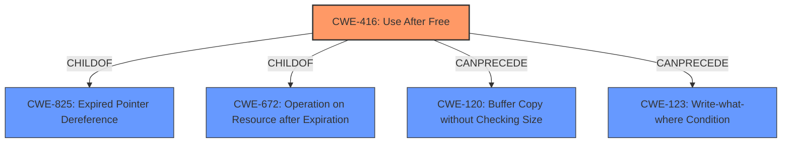

# Raw Analyzer Response for CVE-2021-42612

# Summary
| CWE ID | CWE Name | Confidence | CWE Abstraction Level | CWE Vulnerability Mapping Label | CWE-Vulnerability Mapping Notes |
|---|---|---|---|---|---|
| CWE-416 | Use After Free | 1.0 | Variant | Allowed | Primary CWE |
| CWE-404 | Improper Resource Shutdown or Release | 0.5 | Class | Allowed-with-Review | Secondary Candidate |

## Evidence and Confidence

*   **Confidence Score:** 1.0
*   **Evidence Strength:** HIGH

## Relationship Analysis
The primary relationship is that **CWE-416 (Use After Free)** is a variant of **CWE-825 (Expired Pointer Dereference)** and **CWE-672 (Operation on Resource after Expiration)**. The retriever results also suggest other relationships like **CWE-120 (Buffer Copy without Checking Size of Input)** and **CWE-123 (Write-what-where Condition)** can be preceded by **CWE-416 (Use After Free)**. Given the specific nature of the vulnerability description indicating the reuse of memory after it has been freed, **CWE-416 (Use After Free)** is the most accurate and specific classification.

## Vulnerability Chain
The vulnerability chain starts with a coding error that results in memory being freed prematurely. Subsequently, the program attempts to access this freed memory, leading to a **use-after-free** condition. The impact of this condition can range from a segmentation fault (program crash) to potentially arbitrary code execution.

## Summary of Analysis
The initial analysis identified **CWE-416 (Use After Free)** as the primary candidate based on the vulnerability description and the provided content summary. The description explicitly states a "**use after free**" condition, making **CWE-416 (Use After Free)** the most direct and accurate match. The content summary further reinforces this by detailing the root cause as improper memory management leading to a "**use-after-free**" condition. The retriever results also list **CWE-416 (Use After Free)** as a top candidate.

The relationship analysis supports this decision, as **CWE-416 (Use After Free)** is a variant, providing a specific classification for the vulnerability. The mapping guidance for **CWE-416 (Use After Free)** allows its usage and confirms that it is at the preferred variant level of abstraction.

The evidence from the vulnerability description: "A **use after free** in cleanup_index in index.c in Halibut 1.2 allows an attacker to cause a segmentation fault or possibly have other unspecified impact via a crafted text document." The "CVE Reference Links Content Summary" states "The primary vulnerability is a **use-after-free** in `cleanup_index()` in `index.c`."

**CWE-404 (Improper Resource Shutdown or Release)** was considered as a secondary CWE because it describes a general class of resource management issues. However, **CWE-416 (Use After Free)** is a more specific variant that directly addresses the vulnerability.

The selected CWEs are at the optimal level of specificity because **CWE-416 (Use After Free)** accurately and directly represents the nature of the vulnerability, while also being at the variant level of abstraction.

Relevant CWE Information:

# Enhanced Context (25 CWEs)
The following CWEs were identified as potentially relevant to this vulnerability:

## CWE-416: Use After Free
**Abstraction:** Variant
**Status:** Stable

### Description
The product reuses or references memory after it has been freed. At some point afterward, the memory may be allocated again and saved in another pointer, while the original pointer references a location somewhere within the new allocation. Any operations using the original pointer are no longer valid because the memory "belongs" to the code that operates on the new pointer.

### Extended Description
Not provided

### Alternative Terms
Dangling pointer: a pointer that no longer points to valid memory, often after it has been freed
UAF: commonly used acronym for Use After Free
Use-After-Free

### Relationships
ChildOf -> CWE-825
ChildOf -> CWE-672
ChildOf -> CWE-672
ChildOf -> CWE-672
CanPrecede -> CWE-120
CanPrecede -> CWE-123

### Mapping Guidance
**Usage:** Allowed
**Rationale:** This CWE entry is at the Variant level of abstraction, which is a preferred level of abstraction for mapping to the root causes of vulnerabilities.
**Comments:** Carefully read both the name and description to ensure that this mapping is an appropriate fit. Do not try to 'force' a mapping to a lower-level Base/Variant simply to comply with this preferred level of abstraction.
**Reasons:**
- Acceptable-Use

### Observed Examples
- **CVE-2022-20141:** Chain: an operating system kernel has insufficent resource locking (CWE-413) leading to a use after free (CWE-416).
- **CVE-2022-2621:** Chain: two threads in a web browser use the same resource (CWE-366), but one of those threads can destroy the resource before the other has completed (CWE-416).
- **CVE-2021-0920:** Chain: mobile platform race condition (CWE-362) leading to use-after-free (CWE-416), as exploited in the wild per CISA KEV.

## CWE-404: Improper Resource Shutdown or Release
**Abstraction Level**: Class
**Similarity Score**: 0.79
**Source**: dense

**Description**:
The product does not release or incorrectly releases a resource before it is made available for re-use.

**Mapping Guidance**:
- Usage: Allowed-with-Review
- Rationale: This CWE entry is a Class and might have Base-level children that would be more appropriate