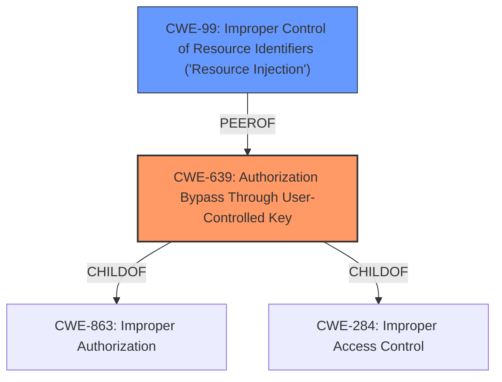

# Analysis for CVE-2021-42640

# Summary
| CWE ID | CWE Name | Confidence | CWE Abstraction Level | CWE Vulnerability Mapping Label | CWE-Vulnerability Mapping Notes |
|---|---|---|---|---|---|
| CWE-639 | Authorization Bypass Through User-Controlled Key | 1.0 | Base | Allowed | Primary CWE |
| CWE-99 | Improper Control of Resource Identifiers ('Resource Injection') | 0.7 | Class | Allowed-with-Review | Secondary Candidate |

## Evidence and Confidence

*   **Confidence Score:** 0.9
*   **Evidence Strength:** HIGH

## Relationship Analysis
The primary CWE is CWE-639, which is a Base level CWE. The retriever results also listed CWE-99. CWE-639 is a child of CWE-863 and CWE-284. The vulnerability description clearly indicates an **Insecure Direct Object Reference** (IDOR), which aligns with CWE-639's description of bypassing authorization by manipulating a user-controlled key. CWE-99 is a Class level CWE and a peer of CWE-706. Given the specificity of CWE-639 and its direct relevance to the IDOR, it is chosen as the primary CWE.

## Vulnerability Chain
The chain of events is as follows:
1.  **Root Cause:** **Insecure Direct Object Reference** (IDOR) - CWE-639: The application **fails to properly** authorize access to printer driver assignments based on user-controlled identifiers.
2.  **Impact:** Unauthorized driver reassignment - An unauthenticated attacker can reassign drivers for any printer.
3.  **Potential Consequence:** Privilege escalation or RCE - Attackers could potentially achieve privilege escalation or remote code execution on connected endpoints by manipulating driver packages.

## Summary of Analysis
The analysis is primarily based on the provided vulnerability description and the CVE Reference Links Content Summary. The key phrases "Insecure Direct Object Reference" and "reassign drivers for any printer" directly correlate with the description of CWE-639, "Authorization Bypass Through User-Controlled Key." The vulnerability stems from a driver assignment IDOR, where an attacker can manipulate driver assignment settings.

The choice of CWE-639 is further supported by the Retriever Results, which list it as the top combined result with a score of 1.000. The "Mapping Guidance" for CWE-639 states, "This CWE entry is at the Base level of abstraction, which is a preferred level of abstraction for mapping to the root causes of vulnerabilities."

CWE-99, "Improper Control of Resource Identifiers ('Resource Injection')," was also considered because the vulnerability involves manipulating identifiers to access resources (printer drivers). However, CWE-639 is a more precise fit as it specifically addresses the authorization bypass aspect of the vulnerability. CWE-99 is a Class level CWE and its mapping guidance indicates to "Examine children of this entry to see if there is a better fit."

The selected CWEs are at the optimal level of specificity because CWE-639 directly represents the **root cause** of the vulnerability, while CWE-99 represents a more general class of weaknesses. The evidence strongly supports the selection of CWE-639 as the primary CWE.

Relevant CWE Information:

# Enhanced Context (25 CWEs)

## CWE-639: Authorization Bypass Through User-Controlled Key
**Abstraction:** Base
**Status:** Incomplete

### Description
The system's authorization functionality **does not prevent** one user from gaining access to another user's data or record by modifying the key value identifying the data.

### Extended Description
Retrieval of a user record occurs in the system based on some key value that is under user control. The key would typically identify a user-related record stored in the system and would be used to lookup that record for presentation to the user. It is likely that an attacker would have to be an authenticated user in the system. However, the authorization process **would not properly check** the data access operation to ensure that the authenticated user performing the operation has sufficient entitlements to perform the requested data access, hence bypassing any other authorization checks present in the system.

### Alternative Terms
Insecure Direct Object Reference / IDOR: The "Insecure Direct Object Reference" term, as described in the OWASP Top Ten, is broader than this CWE because it also covers path traversal (CWE-22). Within the context of vulnerability theory, there is a similarity between the OWASP concept and CWE-706: Use of Incorrectly-Resolved Name or Reference.
Broken Object Level Authorization / BOLA: BOLA is used in the 2019 OWASP API Security Top 10 and is said to be the same as IDOR.
Horizontal Authorization: "Horizontal Authorization" is used to describe situations in which two users have the same privilege level, but must be prevented from accessing each other's resources. This is fairly common when using key-based access to resources in a multi-user context.

### Relationships
ChildOf -> CWE-863
ChildOf -> CWE-284

### Mapping Guidance
**Usage:** Allowed
**Rationale:** This CWE entry is at the Base level of abstraction, which is a preferred level of abstraction for mapping to the root causes of vulnerabilities.
**Comments:** Carefully read both the name and description to ensure that this mapping is an appropriate fit. Do not try to 'force' a mapping to a lower-level Base/Variant simply to comply with this preferred level of abstraction.

### Observed Examples
- **CVE-2021-36539:** An educational application **does not appropriately restrict** file IDs to a particular user. The attacker can brute-force guess IDs, indicating IDOR.

## CWE-99: Improper Control of Resource Identifiers ('Resource Injection')
**Abstraction:** Class
**Status:** Draft

### Description
The product receives input from an upstream component, but it **does not restrict** or incorrectly restricts the input before it is used as an identifier for a resource that may be outside the intended sphere of control.

### Extended Description
A resource injection issue occurs when the following two conditions are met:

1.  An attacker can specify the identifier used to access a system resource. For example, an attacker might be able to specify part of the name of a file to be opened or a port number to be used.
2.  By specifying the resource, the attacker gains a capability that would not otherwise be permitted. For example, the program may give the attacker the ability to overwrite the specified file, run with a configuration controlled by the attacker, or transmit sensitive information to a third-party server.

This may enable an attacker to access or modify otherwise protected system resources.

### Alternative Terms
Insecure Direct Object Reference: OWASP uses this term, although it is effectively the same as resource injection.

### Relationships
ChildOf -> CWE-74
PeerOf -> CWE-706
CanAlsoBe -> CWE-73

### Mapping Guidance
**Usage:** Allowed-with-Review
**Rationale:** This CWE entry is a Class and might have Base-level children that would be more appropriate
**Comments:** Examine children of this entry to see if there is a better fit

### Additional Notes
**[Relationship]** Resource injection that involves resources stored on the filesystem goes by the name path manipulation (CWE-73).