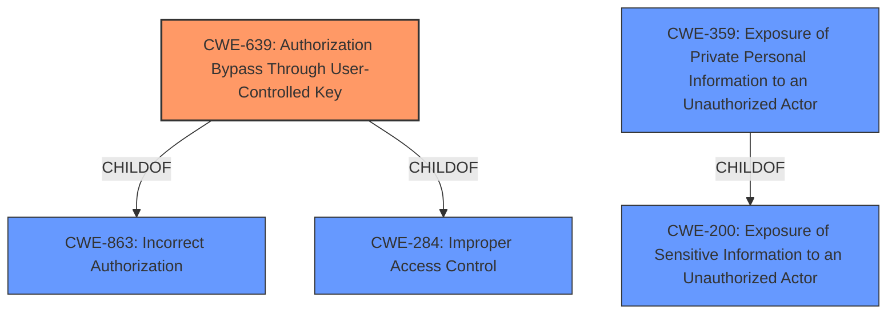

# Enhanced Analysis for CVE-2021-42641

# Summary
| CWE ID | CWE Name | Confidence | CWE Abstraction Level | CWE Vulnerability Mapping Label | CWE-Vulnerability Mapping Notes |
|---|---|---|---|---|---|
| CWE-639 | Authorization Bypass Through User-Controlled Key | 1.0 | Base | Allowed | Primary CWE |
| CWE-359 | Exposure of Private Personal Information to an Unauthorized Actor | 0.7 | Base | Allowed | Secondary Candidate |
| CWE-200 | Exposure of Sensitive Information to an Unauthorized Actor | 0.5 | Class | Discouraged | Secondary Candidate |

## Evidence and Confidence

*   **Confidence Score:** 0.9
*   **Evidence Strength:** HIGH

## Relationship Analysis
The primary CWE, CWE-639 **[CWE-639: Authorization Bypass Through User-Controlled Key]**, is a Base level CWE that describes the **rootcause** of the vulnerability, where an attacker can modify a key value to access another user's data. CWE-639 is a ChildOf CWE-863 and CWE-284, highlighting its relationship to broader authorization issues. CWE-359 **[CWE-359: Exposure of Private Personal Information to an Unauthorized Actor]** is a Base level CWE that describes the information exposure of personal information. CWE-359 is a ChildOf CWE-200 which is a general information exposure Class level CWE. The relationship analysis guided the selection of CWE-639 as the primary **rootcause** and CWE-359 as the secondary weakness of information exposure.



## Vulnerability Chain
The vulnerability chain starts with an **insecure direct object reference** (**rootcause**), allowing an unauthenticated attacker to bypass authorization and directly request user data. This leads to the exposure of usernames and email addresses (impact).

## Summary of Analysis
The initial analysis focused on identifying the **rootcause** of the vulnerability, which is the **insecure direct object reference**. The vulnerability description and the CVE reference summary both point to the fact that an attacker can access user data without proper authorization by manipulating a key value. This aligns perfectly with CWE-639 **[CWE-639: Authorization Bypass Through User-Controlled Key]**.

The secondary aspect of the vulnerability is the disclosure of sensitive information, specifically usernames and email addresses. While CWE-200 **[CWE-200: Exposure of Sensitive Information to an Unauthorized Actor]** is a general category for information exposure, CWE-359 **[CWE-359: Exposure of Private Personal Information to an Unauthorized Actor]** is more specific to the exposure of private personal information, making it a better fit.

The selection of CWE-639 as the primary CWE is based on the fact that the **rootcause** of the vulnerability is the authorization bypass, which allows the attacker to access user data. The exposure of sensitive information is a consequence of this authorization bypass.

The evidence from the vulnerability description includes:
*   "PrinterLogic Web Stack versions 19.1.1.13 SP9 and below are vulnerable to an Insecure Direct Object Reference (IDOR) vulnerability..."
*   "...allows an unauthenticated attacker to disclose the username and email address of all users."
*   "The vulnerability is due to a flaw in the PrinterLogic software that results in the disclosure of user information."

The relationship analysis and mapping guidance further support the selection of CWE-639 as the primary CWE. The CWE is at the Base level of abstraction, which is preferred for mapping to the **rootcauses** of vulnerabilities. The usage is Allowed, and the description accurately reflects the vulnerability.

The retriever results also support the selection of CWE-639, as it is the top-ranked CWE with a score of 1.0.

CWE-200 **[CWE-200: Exposure of Sensitive Information to an Unauthorized Actor]** was considered but not used as the primary CWE because it is a high-level Class and is often misused. CWE-359 **[CWE-359: Exposure of Private Personal Information to an Unauthorized Actor]** is a more specific Base level CWE that better reflects the type of information being exposed.

The final decision is based on a thorough analysis of the vulnerability description, CVE reference summary, relationship analysis, mapping guidance, and retriever results. The selected CWEs are at the optimal level of specificity and accurately reflect the **rootcause** and impact of the vulnerability.


## CWE Relationship Analysis

Current CWEs represent these abstraction levels: .


### Vulnerability Chain Analysis

**Chain starting from CWE-284:**
- 284 (Improper Access Control) - ROOT


**Chain starting from CWE-359:**
- 359 (Exposure of Private Personal Information to an Unauthorized Actor) - ROOT


### CWE Relationship Diagram

```mermaid
graph TD
    classDef primary fill:#f96,stroke:#333,stroke-width:2px
    classDef secondary fill:#69f,stroke:#333
    classDef tertiary fill:#9e9,stroke:#333
```