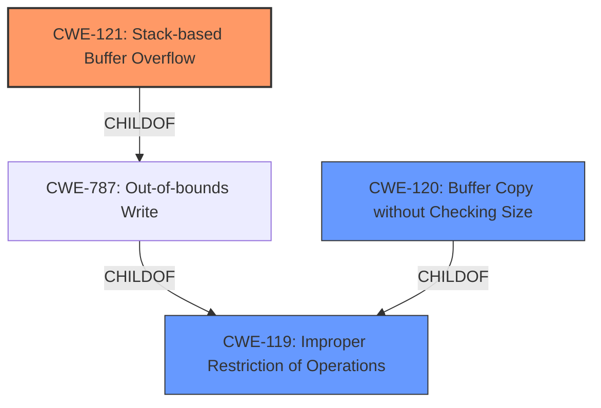

# Analysis Report for CVE-2021-42659

# Vulnerability Analysis Report: CVE-2021-42659

## Description


## Analysis (with Relationship Data)

# Summary
| CWE ID | CWE Name | Confidence | CWE Abstraction Level | CWE Vulnerability Mapping Label | CWE-Vulnerability Mapping Notes |
|---|---|---|---|---|---|
| CWE-121 | Stack-based Buffer Overflow | 0.9 | Variant | Allowed | Primary CWE |
| CWE-120 | Buffer Copy without Checking Size of Input ('Classic Buffer Overflow') | 0.7 | Base | Allowed-with-Review | Secondary Candidate |
| CWE-119 | Improper Restriction of Operations within the Bounds of a Memory Buffer | 0.6 | Class | Discouraged | Secondary Candidate |

## Evidence and Confidence

*   **Confidence Score:** 0.8
*   **Evidence Strength:** HIGH

## Relationship Analysis
The primary CWE is CWE-121, a Variant of CWE-787 and CWE-119, indicating a more specific type of buffer overflow. CWE-120 is a potential parent CWE, but the description does not give enough information to know if a buffer copy is the mechanism. CWE-119 is a higher-level class that represents the general category. The relationships influenced the decision to prefer the more specific Variant, CWE-121, which is a child of CWE-119.



## Vulnerability Chain
The vulnerability chain starts with a lack of input validation leading to a **buffer overflow** when handling a "super-long list parameter," resulting in a crash of the httpd program.

## Summary of Analysis
The initial assessment identified a **buffer overflow** vulnerability. After analyzing the provided information, including the vulnerability description and CVE reference, it's evident that the **buffer overflow** occurs on the stack. The vulnerability lies in the `formSetVirtualSer` function, where the `sscanf` function is used without proper input validation on the `list` parameter, leading to a stack corruption and crash.

The evidence for this decision is based on:

*   The **Vulnerability Description**, which states, "There is a **buffer overflow** vulnerability in the Web server httpd of the router in Tenda router devices such as Tenda AC9 V1.0 V15.03.02.19(6318) and Tenda AC9 V3.0 V15.03.06.42_multi. When setting the virtual service, the httpd program will crash and exit when the super-long list parameter occurs."
*   The **CVE Reference Links Content Summary**, which indicates the **root cause** is a lack of input validation on the length of the `list` parameter, allowing an attacker to provide a long string, overflowing the buffers `v15, v13, v11, and v9`.
*   The **CVE Reference Links Content Summary**, which also states that the **buffer overflow** corrupts the stack.

The relationships in the graph reinforce that CWE-121 is a specific instance of a **buffer overflow** that occurs on the stack. The selection is based on the provided evidence and aims for the most specific CWE that accurately describes the vulnerability.

Relevant CWE Information:

# Enhanced Context (25 CWEs)

## CWE-191: Integer Underflow (Wrap or Wraparound)
**Abstraction Level**: Base
**Similarity Score**: 0.77
**Source**: dense

**Description**:
The product subtracts one value from another, such that the result is less than the minimum allowable integer value, which produces a value that is not equal to the correct result.

**Mapping Guidance**:
- Usage: Allowed
- Rationale: This CWE entry is at the Base level of abstraction, which is a preferred level of abstraction for mapping to the root causes of vulnerabilities.

*This CWE was considered but is not a good fit because the vulnerability is a buffer overflow, not an integer underflow.*

## CWE-131: Incorrect Calculation of Buffer Size
**Abstraction Level**: Base
**Similarity Score**: 0.77
**Source**: dense

**Description**:
The product does not correctly calculate the size to be used when allocating a buffer, which could lead to a buffer overflow.

**Mapping Guidance**:
- Usage: Allowed
- Rationale: This CWE entry is at the Base level of abstraction, which is a preferred level of abstraction for mapping to the root causes of vulnerabilities.

*This CWE was considered but is not a good fit because the description indicates that the buffer overflow is caused by a lack of input validation, not an incorrect calculation of the buffer size.*

## CWE-124: Buffer Underwrite ('Buffer Underflow')
**Abstraction Level**: Base
**Similarity Score**: 0.76
**Source**: dense

**Description**:
The product writes to a buffer using an index or pointer that references a memory location prior to the beginning of the buffer.

**Mapping Guidance**:
- Usage: Allowed
- Rationale: This CWE entry is at the Base level of abstraction, which is a preferred level of abstraction for mapping to the root causes of vulnerabilities.

*This CWE was considered but is not a good fit because the vulnerability is a buffer overflow (overwrite), not an underwrite.*

## CWE-805: Buffer Access with Incorrect Length Value
**Abstraction Level**: Base
**Similarity Score**: 0.75
**Source**: dense

**Description**:
The product uses a sequential operation to read or write a buffer, but it uses an incorrect length value that causes it to access memory that is outside of the bounds of the buffer.

**Mapping Guidance**:
- Usage: Allowed
- Rationale: This CWE entry is at the Base level of abstraction, which is a preferred level of abstraction for mapping to the root causes of vulnerabilities.

*This CWE was considered but is not a good fit because the description indicates the overflow is caused by missing validation of the input length.*

## CWE-680: Integer Overflow to Buffer Overflow
**Abstraction Level**: Compound
**Similarity Score**: 0.75
**Source**: dense

**Description**:
The product performs a calculation to determine how much memory to allocate, but an integer overflow can occur that causes less memory to be allocated than expected, leading to a buffer overflow.

**Mapping Guidance**:
- Usage: Discouraged
- Rationale: This CWE entry is a named chain, which combines multiple weaknesses.

*This CWE was considered but is not a good fit because the vulnerability is due to lack of input validation, not an integer overflow leading to an incorrect buffer size.*

## CWE-126: Buffer Over-read
**Abstraction Level**: Variant
**Similarity Score**: 0.75
**Source**: dense

**Description**:
The product reads from a buffer using buffer access mechanisms such as indexes or pointers that reference memory locations after the targeted buffer.

**Mapping Guidance**:
- Usage: Allowed
- Rationale: This CWE entry is at the Variant level of abstraction, which is a preferred level of abstraction for mapping to the root causes of vulnerabilities.

*This CWE was considered but is not a good fit because the vulnerability is a buffer overflow (overwrite), not an over-read.*

## CWE-193: Off-by-one Error
**Abstraction Level**: Base
**Similarity Score**: 0.75
**Source**: dense

**Description**:
A product calculates or uses an incorrect maximum or minimum value that is 1 more, or 1 less, than the correct value.

**Mapping Guidance**:
- Usage: Allowed
- Rationale: This CWE entry is at the Base level of abstraction, which is a preferred level of abstraction for mapping to the root causes of vulnerabilities.

*This CWE was considered but is not a good fit because the vulnerability is a buffer overflow, not an off-by-one error.*

## CWE-125: Out-of-bounds Read
**Abstraction Level**: Base
**Similarity Score**: 0.74
**Source**: dense

**Description**:
The product reads data past the end, or before the beginning, of the intended buffer.

**Mapping Guidance**:
- Usage: Allowed
- Rationale: This CWE entry is at the Base level of abstraction, which is a preferred level of abstraction for mapping to the root causes of vulnerabilities.

*This CWE was considered but is not a good fit because the vulnerability is a buffer overflow (overwrite), not an out-of-bounds read.*

## CWE-190: Integer Overflow or Wraparound
**Abstraction Level**: Base
**Similarity Score**: 0.74


## CWE Relationship Analysis

Current CWEs represent these abstraction levels: .


### Vulnerability Chain Analysis

**Chain starting from CWE-121:**
- 121 (Stack-based Buffer Overflow) - ROOT


**Chain starting from CWE-787:**
- 787 (Out-of-bounds Write) - ROOT


### CWE Relationship Diagram

```mermaid
graph TD
    classDef primary fill:#f96,stroke:#333,stroke-width:2px
    classDef secondary fill:#69f,stroke:#333
    classDef tertiary fill:#9e9,stroke:#333
```


*Report generated on 2025-04-02 11:25:57*
