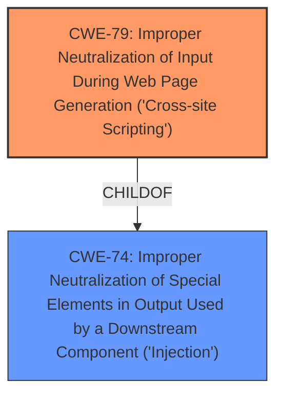

# Analysis for CVE-2021-42663

# Summary
| CWE ID | CWE Name | Confidence | CWE Abstraction Level | CWE Vulnerability Mapping Label | CWE-Vulnerability Mapping Notes |
|---|---|---|---|---|---|
| CWE-79 | Improper Neutralization of Input During Web Page Generation ('Cross-site Scripting') | 1.0 | Base | Allowed | Primary CWE |

## Evidence and Confidence

*   **Confidence Score:** 1.0
*   **Evidence Strength:** HIGH

## Relationship Analysis
The primary relationship influencing the selection of CWE-79 is its base-level abstraction, aligning with the goal of identifying the root cause. While CWE-74 (Improper Neutralization of Special Elements in Output Used by a Downstream Component ('Injection')) is a parent, CWE-79 offers more specificity, directly addressing the **improper neutralization** within web page generation. No chain relationships are apparent in this case.

## Vulnerability Chain
The vulnerability chain consists of:
1.  **Root Cause:** **HTML injection** due to **lack of proper input sanitization** of the `msg` parameter.
2.  **Weakness:** The application fails to neutralize user-controllable input before placing it in output used as a web page.
3.  **Impact:** An attacker can change the visibility of the website by injecting arbitrary HTML code.

## Summary of Analysis
The analysis concludes that CWE-79 (Improper Neutralization of Input During Web Page Generation ('Cross-site Scripting')) is the most appropriate CWE for this vulnerability. This determination is based on the evidence provided in the vulnerability description and the CVE Reference Links Content Summary, which explicitly mention **HTML injection** due to a **lack of input sanitization** in the `msg` parameter.

The vulnerability description states: "An **HTML injection** vulnerability exists in Sourcecodester Online Event Booking and Reservation System in PHP/MySQL via the msg parameter to /event-management/index.php." The CVE Reference Links Content Summary reinforces this by stating: "The vulnerability is due to a **lack of proper input sanitization** in the `msg` parameter of the `index.php` page... This allows an attacker to inject arbitrary HTML code into the page."

CWE-79 directly addresses this scenario, as it describes a situation where "the product does not neutralize or incorrectly neutralizes user-controllable input before it is placed in output that is used as a web page that is served to other users."

The graph relationships indicate that CWE-79 is a child of CWE-74, meaning it is a more specific type of injection vulnerability. Given the specific context of **HTML injection** in a web page, CWE-79 is the more accurate and optimal choice. The MITRE mapping guidance also supports this, as CWE-79 is a Base level CWE with an "Allowed" usage.

Relevant CWE Information:

# Enhanced Context (25 CWEs)

## CWE-184: Incomplete List of Disallowed Inputs
**Abstraction Level**: Base
**Similarity Score**: 0.77

**Description**:
The product implements a protection mechanism that relies on a list of inputs (or properties of inputs) that are not allowed by policy or otherwise require other action to neutralize before additional processing takes place, but the list is incomplete.
*Not Selected:* This CWE doesn't fit the description, as there's no indication of an attempt to filter disallowed inputs using a list. The core issue is the lack of any sanitization.

## CWE-74: Improper Neutralization of Special Elements in Output Used by a Downstream Component ('Injection')
**Abstraction Level**: Class
**Similarity Score**: 0.77
*Not Selected:* While CWE-74 is a broader category that includes XSS, CWE-79 is a more specific and accurate representation of the vulnerability, as it directly relates to the **improper neutralization** of input during web page generation.

## CWE-80: Improper Neutralization of Script-Related HTML Tags in a Web Page (Basic XSS)
**Abstraction Level**: Variant
**Similarity Score**: 0.77
*Not Selected:* CWE-80 is a variant of XSS, focusing on script-related HTML tags. While relevant, CWE-79 provides a more general description of the **HTML injection** vulnerability.

## CWE-41: Improper Resolution of Path Equivalence
**Abstraction Level**: Base
**Similarity Score**: 0.77
*Not Selected:* This CWE is not relevant as it deals with file system path equivalence issues, which are not part of the described vulnerability.

## CWE-425: Direct Request ('Forced Browsing')
**Abstraction Level**: Base
**Similarity Score**: 0.77
*Not Selected:* This CWE is about authorization bypass via direct requests, which is not the primary issue. The vulnerability is about injecting HTML code, not bypassing authorization.

## CWE-472: External Control of Assumed-Immutable Web Parameter
**Abstraction Level**: Base
**Similarity Score**: 0.76
*Not Selected:* This CWE is about tampering with assumed-immutable parameters. While the `msg` parameter is being manipulated, the core issue is the **lack of sanitization**, not that the parameter was meant to be immutable.

## CWE-639: Authorization Bypass Through User-Controlled Key
**Abstraction Level**: Base
**Similarity Score**: 0.76
*Not Selected:* Authorization is not the main problem. The attacker is not bypassing authorization, but rather injecting code into a parameter that is not properly sanitized.

## CWE-1289: Improper Validation of Unsafe Equivalence in Input
**Abstraction Level**: Base
**Similarity Score**: 0.76
*Not Selected:* This CWE is about validating equivalence to an unsafe value, which is not the case here. The input is not validated at all.

## CWE-807: Reliance on Untrusted Inputs in a Security Decision
**Abstraction Level**: Base
**Similarity Score**: 0.75
*Not Selected:* While the application relies on the input, it doesn't make a "security decision" based on it. The core issue is the **lack of sanitization**.

## CWE-183: Permissive List of Allowed Inputs
**Abstraction Level**: Base
**Similarity Score**: 0.75
*Not Selected:* Similar to CWE-184, there is no evidence of an attempted allowlist.

## CWE-79: Improper Neutralization of Input During Web Page Generation ('Cross-site Scripting')
**Abstraction Level**: Base
**Similarity Score**: 8477.96
*Selected:* This is the most relevant CWE, as it directly addresses the **HTML injection** vulnerability due to **lack of input sanitization**.

## CWE-116: Improper Encoding or Escaping of Output
**Abstraction Level**: Class
**Similarity Score**: 8408.73
*Not Selected:* While encoding/escaping could be a mitigation, the core issue is the **lack of neutralization** of the input. CWE-79 is a better fit.

## CWE-138: Improper Neutralization of Special Elements
**Abstraction Level**: Class
**Similarity Score**: 7860.80
*Not Selected:* This is a more general case of **improper neutralization**. CWE-79 is more specific to web page generation and XSS.

## CWE-639: Authorization Bypass Through User-Controlled Key
**Abstraction Level**: Base
**Similarity Score**: 7843.27
*Not Selected:* As explained before, authorization bypass is not the core issue.

## CWE-352: Cross-Site Request Forgery (CSRF)
**Abstraction Level**: Compound
**Similarity Score**: 7721.19
*Not Selected:* CSRF is not directly involved in this vulnerability. The attacker injects HTML code directly via a URL parameter.

## CWE-79: Improper Neutralization of Input During Web Page Generation ('Cross-site Scripting')
**Abstraction Level**: base
**Similarity Score**: 5.03
*Selected:* This is the most relevant CWE, as it directly addresses the **HTML injection** vulnerability due to **lack of input sanitization**.

## CWE-434: Unrestricted Upload of File with Dangerous Type
**Abstraction Level**: base
**Similarity Score**: 5.03
*Not Selected:* This CWE is not related to the described vulnerability, as there is no file upload functionality involved.

## CWE-494: Download of Code Without Integrity Check
**Abstraction Level**: base
**Similarity Score**: 4.33
*Not Selected:* This CWE is not relevant as it deals with code downloads without integrity checks, which is not part of the described vulnerability.

## CWE-94: Improper Control of Generation of Code ('Code Injection')
**Abstraction Level**: base
**Similarity Score**: