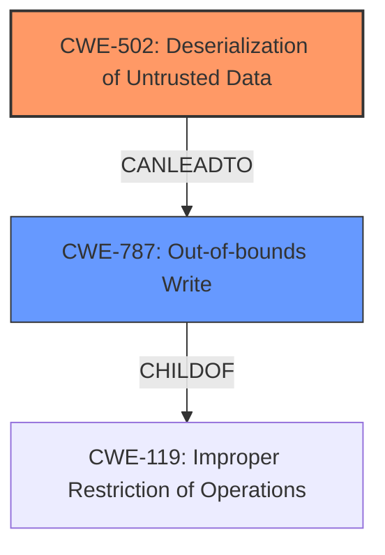

# Analysis for CVE-2021-42698

# Summary
| CWE ID | CWE Name | Confidence | CWE Abstraction Level | CWE Vulnerability Mapping Label | CWE-Vulnerability Mapping Notes |
|---|---|---|---|---|---|
| CWE-502 | Deserialization of Untrusted Data | 1.0 | Base | Allowed | Primary CWE |
| CWE-787 | Out-of-bounds Write | 0.7 | Base | Allowed | Secondary Candidate |

## Evidence and Confidence

*   **Confidence Score:** 0.9
*   **Evidence Strength:** HIGH

## Relationship Analysis
The primary relationship influencing the decision is that CWE-502 (Deserialization of Untrusted Data) can lead to other vulnerabilities. While not explicitly stated, the description hints at memory corruption, which is closely related to CWE-787 (Out-of-bounds Write). CWE-502 is a base-level CWE, providing a good balance between specificity and generality. CWE-787 is also a base-level CWE and a ChildOf CWE-119 (Improper Restriction of Operations within the Bounds of a Memory Buffer), which means it is more specific than CWE-119.



## Vulnerability Chain
The vulnerability chain starts with the **deserialization of untrusted data** (CWE-502). Due to a lack of proper validation during deserialization, this can lead to **memory corruption**, potentially resulting in an **out-of-bounds write** (CWE-787).

## Summary of Analysis
The initial analysis focused on the **deserialization of untrusted data** as the primary weakness. The vulnerability description explicitly states "Malicious manipulation of these files may allow an attacker to corrupt memory." The CVE Reference Links Content Summary also confirms that the root cause is the "lack of proper validation or sanitization during the deserialization process."

The retriever results listed CWE-502 as the top candidate, further supporting this assessment.

The relationship graph shows how CWE-502 can lead to CWE-787. This relationship, combined with the description of memory corruption, made CWE-787 a secondary candidate.

The selection of CWE-502 is based on the evidence that the application deserializes untrusted data without proper validation, and the impact is memory corruption. This aligns perfectly with the description of CWE-502. CWE-787 is included as a potential consequence of the memory corruption.

```
**Vulnerability:** Deserialization of Untrusted Data (CWE-502)

**Root Cause:** The application stores memory objects in project files as binary serialized data. This data is later deserialized to reinstate the original objects in memory. The vulnerability stems from the lack of proper validation or sanitization during the deserialization process.

**Weaknesses:**
*   The application deserializes untrusted data from project files.
*   Maliciously crafted project files can be used to manipulate the serialized data.

**Impact of Exploitation:** Successful exploitation could lead to memory corruption.
```

Relevant CWE Information:

# Enhanced Context (25 CWEs)

## CWE-226: Sensitive Information in Resource Not Removed Before Reuse
**Abstraction Level**: Base
**Similarity Score**: 0.79
**Source**: dense

**Description**:
The product releases a resource such as memory or a file so that it can be made available for reuse, but it does not clear or "zeroize" the information contained in the resource before the product performs a critical state transition or makes the resource available for reuse by other entities.

**Mapping Guidance**:
- Usage: Allowed
- Rationale: This CWE entry is at the Base level of abstraction, which is a preferred level of abstraction for mapping to the root causes of vulnerabilities.

*Not selected:* This CWE is not directly related to the vulnerability described. The vulnerability is about deserialization, not about reusing resources without clearing them.

## CWE-789: Memory Allocation with Excessive Size Value
**Abstraction Level**: Variant
**Similarity Score**: 0.79
**Source**: dense

**Description**:
The product allocates memory based on an untrusted, large size value, but it does not ensure that the size is within expected limits, allowing arbitrary amounts of memory to be allocated.

**Mapping Guidance**:
- Usage: Allowed
- Rationale: This CWE entry is at the Variant level of abstraction, which is a preferred level of abstraction for mapping to the root causes of vulnerabilities.

*Not selected:* While memory allocation could be a factor, the primary issue is the deserialization of untrusted data, not necessarily the allocation size.

## CWE-404: Improper Resource Shutdown or Release
**Abstraction Level**: Class
**Similarity Score**: 0.78
**Source**: dense

**Description**:
The product does not release or incorrectly releases a resource before it is made available for re-use.

**Mapping Guidance**:
- Usage: Allowed-with-Review
- Rationale: This CWE entry is a Class and might have Base-level children that would be more appropriate

*Not selected:* This is not about improper resource shutdown.

## CWE-131: Incorrect Calculation of Buffer Size
**Abstraction Level**: Base
**Similarity Score**: 0.77
**Source**: dense

**Description**:
The product does not correctly calculate the size to be used when allocating a buffer, which could lead to a buffer overflow.

**Mapping Guidance**:
- Usage: Allowed
- Rationale: This CWE entry is at the Base level of abstraction, which is a preferred level of abstraction for mapping to the root causes of vulnerabilities.

*Not selected:* Although the vulnerability could lead to a buffer overflow, the root cause is not incorrect calculation of buffer size.

## CWE-667: Improper Locking
**Abstraction Level**: Class
**Similarity Score**: 0.77
**Source**: dense

**Description**:
The product does not properly acquire or release a lock on a resource, leading to unexpected resource state changes and behaviors.

**Mapping Guidance**:
- Usage: Allowed-with-Review
- Rationale: This CWE entry is a Class and might have Base-level children that would be more appropriate

*Not selected:* This is not about locking.

## CWE-119: Improper Restriction of Operations within the Bounds of a Memory Buffer
**Abstraction Level**: Class
**Similarity Score**: 0.77
**Source**: dense

**Description**:
The product performs operations on a memory buffer, but it reads from or writes to a memory location outside the buffer's intended boundary. This may result in read or write operations on unexpected memory locations that could be linked to other variables, data structures, or internal program data.

**Mapping Guidance**:
- Usage: Discouraged
- Rationale: CWE-119 is commonly misused in low-information vulnerability reports when lower-level CWEs could be used instead, or when more details about the vulnerability are available.

*Not selected:* While CWE-787 is a child of this, CWE-787 is more descriptive.

## CWE-668: Exposure of Resource to Wrong Sphere
**Abstraction Level**: Class
**Similarity Score**: 0.76
**Source**: dense

**Description**:
The product exposes a resource to the wrong control sphere, providing unintended actors with inappropriate access to the resource.

**Mapping Guidance**:
- Usage: Discouraged
- Rationale: CWE-668 is high-level and is often misused as a catch-all when lower-level CWE IDs might be applicable. It is sometimes used for low-information vulnerability reports [REF-1287]. It is a level-1 Class (i.e., a child of a Pillar). It is not useful for trend analysis.

*Not selected:* This is not related to exposing resources.

## CWE-212: Improper Removal of Sensitive Information Before Storage or Transfer
**Abstraction Level**: Base
**Similarity Score**: 0.76
**Source**: dense

**Description**:
The product stores, transfers, or shares a resource that contains sensitive information, but it does not properly remove that information before the product makes the resource available to unauthorized actors.

**Mapping Guidance**:
- Usage: Allowed
- Rationale: This CWE entry is at the Base level of abstraction, which is a preferred level of abstraction for mapping to the root causes of vulnerabilities.

*Not selected:* This is not about storing sensitive information.

## CWE-908: Use of Uninitialized Resource
**Abstraction Level**: Base
**Similarity Score**: 0.76
**Source**: dense

**Description**:
The product uses or accesses a resource that has not been initialized.

**Mapping Guidance**:
- Usage: Allowed
- Rationale: This CWE entry is at the Base level of abstraction, which is a preferred level of abstraction for mapping