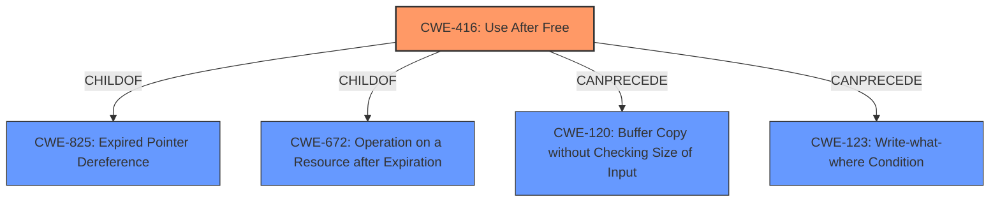

# Raw Analyzer Response for CVE-2021-42721

# Summary
| CWE ID | CWE Name | Confidence | CWE Abstraction Level | CWE Vulnerability Mapping Label | CWE-Vulnerability Mapping Notes |
|---|---|---|---|---|---|
| CWE-416 | Use After Free | 1.0 | Variant | Allowed | Primary CWE |

## Evidence and Confidence

*   **Confidence Score:** 1.0
*   **Evidence Strength:** HIGH

## Relationship Analysis
The primary relationship that influenced the decision was the direct match of the **root cause** to CWE-416. Although other CWEs were considered, none matched the provided evidence as directly as CWE-416. CWE-416 is a Variant of CWE-825 (Expired Pointer Dereference) and CWE-672 (Operation on a Resource after Expiration). The "CanPrecede" relationships of CWE-416 to CWE-120 (Buffer Copy without Checking Size of Input) and CWE-123 (Write-what-where Condition) were also considered.

## Vulnerability Chain
The vulnerability chain starts with the **use-after-free** (**CWE-416**) and leads to arbitrary code execution.
  - Root Cause: **CWE-416** (Use After Free)
  - Impact: Arbitrary code execution

## Summary of Analysis
The analysis focused on identifying the **root cause** of the vulnerability, which was explicitly described as a **use-after-free** issue. This aligns directly with the description of **CWE-416** (Use After Free): "The product reuses or references memory after it has been freed." The CVE Reference Links Content Summary confirms this, stating: "* **Root cause of vulnerability**: Use-After-Free * **Weaknesses/vulnerabilities present**: The vulnerability is a Use-After-Free (UAF) issue, which occurs when a program attempts to access memory after it has been freed. * **Impact of exploitation**: Successful exploitation of the UAF vulnerability can lead to arbitrary code execution."

The retriever results also ranked **CWE-416** as the top candidate with a score of 1.0. The MITRE mapping guidance for **CWE-416** indicates that it is at the Variant level of abstraction, which is preferred, and the Usage is ALLOWED. Other CWEs, such as buffer overflows, were considered but deemed less relevant because the **root cause** is explicitly a **use-after-free** issue, not a buffer overflow.
The final decision is based primarily on the explicit evidence from the vulnerability description and supporting CVE details, coupled with the retriever results and MITRE mapping guidance. The selection of **CWE-416** is at the optimal level of specificity as it directly reflects the **root cause** of the vulnerability.

Relevant CWE Information: