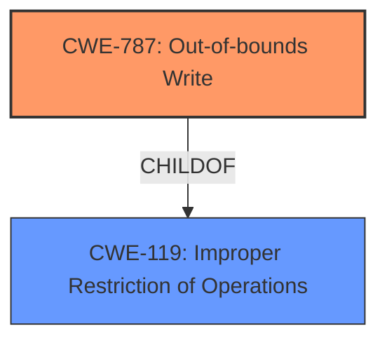

# Analysis for CVE-2021-42726

# Summary
| CWE ID  | CWE Name                     | Confidence | CWE Abstraction Level | CWE Vulnerability Mapping Label | CWE-Vulnerability Mapping Notes |
| :-------- | :--------------------------- | :--------- | :---------------------- | :------------------------------ | :------------------------------ |
| CWE-787 | Out-of-bounds Write   | 0.9      | Base                   | Primary                         | Allowed                         |
| CWE-119 | Improper Restriction of Operations within the Bounds of a Memory Buffer                     | 0.7      | Class                   | Secondary                         | Discouraged                         |

## Evidence and Confidence

*   **Confidence Score:** 0.9
*   **Evidence Strength:** HIGH

## Relationship Analysis
The primary relationship influencing the CWE selection is the ChildOf relationship between CWE-787 and CWE-119. CWE-787 is a base-level CWE that describes writing data past the end or before the beginning of the intended buffer, which aligns well with the **memory corruption** due to **insecure handling** of a malicious M4A file. CWE-119 is a class-level CWE that describes improper restriction of operations within the bounds of a memory buffer. While CWE-119 is related, CWE-787 provides a more specific description of the vulnerability.

## Vulnerability Chain
The vulnerability chain begins with the **insecure handling** of a malicious M4A file, which leads to **memory corruption**, specifically an out-of-bounds write (CWE-787). The ultimate impact is arbitrary code execution.

## Summary of Analysis
The initial assessment focused on the **memory corruption** resulting from **insecure handling** of a malicious M4A file. The retriever results strongly suggested CWE-787 (Out-of-bounds Write), which aligns directly with the vulnerability description and is also identified as the top CWE for similar CVE descriptions in the CVE Reference Links Content Summary.

The analysis of the relationship between CWE-787 and CWE-119 further solidified the choice of CWE-787 as the primary CWE, as it is a more specific description of the **memory corruption** issue.

The final decision is based on the evidence provided in the vulnerability description, combined with the retriever results and relationship analysis. CWE-787 is the optimal level of specificity, accurately representing the root cause of the vulnerability.

Relevant CWE Information:

# Enhanced Context (25 CWEs)

## CWE-1289: Improper Validation of Unsafe Equivalence in Input
**Abstraction Level**: Base
**Similarity Score**: 0.81
**Source**: dense

**Description**:
The product receives an input value that is used as a resource identifier or other type of reference, but it does not validate or incorrectly validates that the input is equivalent to a potentially-unsafe value.

**Mapping Guidance**:
- Usage: Allowed
- Rationale: This CWE entry is at the Base level of abstraction, which is a preferred level of abstraction for mapping to the root causes of vulnerabilities.

*Was considered but not selected because:** This CWE relates to validating input values against potentially unsafe values, which isn't the primary issue described. The core problem is the **insecure handling** leading to **memory corruption**, not necessarily a validation problem.

## CWE-183: Permissive List of Allowed Inputs
**Abstraction Level**: Base
**Similarity Score**: 0.77
**Source**: dense

**Description**:
The product implements a protection mechanism that relies on a list of inputs (or properties of inputs) that are explicitly allowed by policy because the inputs are assumed to be safe, but the list is too permissive - that is, it allows an input that is unsafe, leading to resultant weaknesses.

**Mapping Guidance**:
- Usage: Allowed
- Rationale: This CWE entry is at the Base level of abstraction, which is a preferred level of abstraction for mapping to the root causes of vulnerabilities.

*Was considered but not selected because:** This CWE focuses on an overly permissive list of allowed inputs, which is not directly related to the **memory corruption** issue described in the vulnerability.

## CWE-807: Reliance on Untrusted Inputs in a Security Decision
**Abstraction Level**: Base
**Similarity Score**: 0.77
**Source**: dense

**Description**:
The product uses a protection mechanism that relies on the existence or values of an input, but the input can be modified by an untrusted actor in a way that bypasses the protection mechanism.

**Mapping Guidance**:
- Usage: Allowed
- Rationale: This CWE entry is at the Base level of abstraction, which is a preferred level of abstraction for mapping to the root causes of vulnerabilities.

*Was considered but not selected because:** This CWE focuses on reliance on untrusted inputs in security decisions, which is not the central issue in the vulnerability description.

## CWE-184: Incomplete List of Disallowed Inputs
**Abstraction Level**: Base
**Similarity Score**: 0.77
**Source**: dense

**Description**:
The product implements a protection mechanism that relies on a list of inputs (or properties of inputs) that are not allowed by policy or otherwise require other action to neutralize before additional processing takes place, but the list is incomplete.

**Mapping Guidance**:
- Usage: Allowed
- Rationale: This CWE entry is at the Base level of abstraction, which is a preferred level of abstraction for mapping to the root causes of vulnerabilities.

*Was considered but not selected because:** This CWE focuses on an incomplete list of disallowed inputs, which is not directly related to the **memory corruption** issue described in the vulnerability.

## CWE-1288: Improper Validation of Consistency within Input
**Abstraction Level**: Base
**Similarity Score**: 0.77
**Source**: dense

**Description**:
The product receives a complex input with multiple elements or fields that must be consistent with each other, but it does not validate or incorrectly validates that the input is actually consistent.

**Mapping Guidance**:
- Usage: Allowed
- Rationale: This CWE entry is at the Base level of abstraction, which is a preferred level of abstraction for mapping to the root causes of vulnerabilities.

*Was considered but not selected because:** This CWE focuses on the consistency of multiple elements within the input, which is not the primary issue described in the vulnerability.

## CWE-665: Improper Initialization
**Abstraction Level**: Class
**Similarity Score**: 0.76
**Source**: dense

**Description**:
The product does not initialize or incorrectly initializes a resource, which might leave the resource in an unexpected state when it is accessed or used.

**Mapping Guidance**:
- Usage: Discouraged
- Rationale: This CWE entry is a level-1 Class (i.e., a child of a Pillar). It might have lower-level children that would be more appropriate

*Was considered but not selected because:** The vulnerability does not explicitly state improper initialization. The primary issue is the **insecure handling** of the M4A file, which leads to **memory corruption**, rather than a lack of initialization.

## CWE-138: Improper Neutralization of Special Elements
**Abstraction Level**: Class
**Similarity Score**: 0.76
**Source**: dense

**Description**:
The product receives input from an upstream component, but it does not neutralize or incorrectly neutralizes special elements that could be interpreted as control elements or syntactic markers when they are sent to a downstream component.

**Mapping Guidance**:
- Usage: Discouraged
- Rationale: This CWE entry is a level-1 Class (i.e., a child of a Pillar). It might have lower-level children that would be more appropriate

*Was considered but not selected because:** The vulnerability does not focus on the improper neutralization of special elements within the input.

## CWE-606: Unchecked Input for Loop Condition
**Abstraction Level**: Base
**Similarity Score**: 0.76
**Source**: dense

**Description**:
The product does not properly check inputs that are used for loop conditions, potentially leading to a denial of service or other consequences because of excessive looping.

**Mapping Guidance**:
- Usage: Allowed
- Rationale: This CWE entry is at the Base level of abstraction, which is a preferred level of abstraction for mapping to the root causes of vulnerabilities.

*Was considered but not selected because:** The vulnerability does not describe an issue with unchecked input for loop conditions.

## CWE-1286: Improper Validation of Syntactic Correctness of Input
**Abstraction Level**: Base
**Similarity Score**: 0.76
**Source**: dense

**Description**:
The product receives input that is expected to be well-formed - i.e., to comply with a certain syntax - but it does not validate or incorrectly validates that the input complies with the syntax.

**Mapping Guidance**:
- Usage: Allowed
- Rationale: This CWE entry is at the Base level of abstraction, which is a preferred level of abstraction for mapping to the root causes of vulnerabilities.

*Was