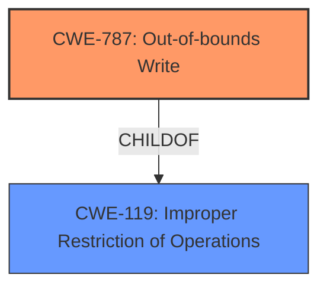

# Raw Analyzer Response for CVE-2021-42737

# Summary
| CWE ID | CWE Name | Confidence | CWE Abstraction Level | CWE Vulnerability Mapping Label | CWE-Vulnerability Mapping Notes |
|---|---|---|---|---|---|
| CWE-787 | Out-of-bounds Write | 1.0 | Base | Primary | Allowed |
| CWE-119 | Improper Restriction of Operations within a Memory Buffer | 0.8 | Class | Secondary | Allowed-with-Review |

## Evidence and Confidence

*   **Confidence Score:** 0.9
*   **Evidence Strength:** HIGH

## Relationship Analysis
The primary CWE selected is CWE-787, which is a Base level CWE and a child of the Class-level CWE-119. The relationship is hierarchical, moving from a more general class of memory buffer issues to a specific type of out-of-bounds write. There are no specific chain relationships indicated in the provided data that are applicable.

## Vulnerability Chain
The vulnerability chain begins with **insecure handling** of a malicious WAV file, leading to **memory corruption**, and ultimately resulting in arbitrary code execution. The initial **insecure handling** can be thought of as the root cause, with the **memory corruption** as the direct weakness and the arbitrary code execution as the final impact.

## Summary of Analysis
The initial analysis focused on the vulnerability description, which mentions **memory corruption** due to **insecure handling** of a malicious WAV file. The presence of **memory corruption** and arbitrary code execution suggests a memory safety issue. The primary CWE match from similar CVE descriptions is CWE-119, and the retriever results suggest CWE-787 as the best match.

The evidence from the vulnerability description includes: "Adobe Prelude version 10.1 (and earlier) is affected by a **memory corruption** vulnerability due to **insecure handling** of a malicious WAV file, potentially resulting in arbitrary code execution in the context of the current user." The CVE Reference Links Content Summary states: "**Root cause of vulnerability:** Access of Memory Location After End of Buffer (CWE-788)" and "**Weaknesses/vulnerabilities present:** Out-of-bounds read".

CWE-787 (Out-of-bounds Write) is chosen as the primary CWE because the description states "**memory corruption** vulnerability due to **insecure handling** of a malicious WAV file". **Memory corruption** is listed as an alternate term for CWE-787. The CVE Reference Links Content Summary also describes an out-of-bounds read which can be related to an out-of-bounds write.

CWE-119 (Improper Restriction of Operations within a Memory Buffer) is included as a secondary CWE because it is the parent of CWE-787 and is listed as the primary CWE match for similar CVE descriptions.

CWE-788 (Access of Memory Location After End of Buffer) was considered because it was listed as the root cause in the CVE Reference Links Content Summary. However, it was not chosen because it is discouraged and the provided text indicates an out-of-bounds write.

CWE-125 (Out-of-bounds Read) was considered but not selected as there is no out-of-bounds read in the vulnerability description. However, the CVE Reference Links Content Summary does say "Out-of-bounds read" is a weakness. Since, the Vulnerability Description states "**memory corruption** vulnerability due to **insecure handling** of a malicious WAV file" and **Memory Corruption** is listed as an alternative term for CWE-787, CWE-787 is the preferred CWE.

The selected CWEs are at the optimal level of specificity. CWE-787 is a Base level CWE, and CWE-119 is a Class level CWE. The evidence supports the selection of the Base level CWE as the primary CWE.

Relevant CWE Information:

# Enhanced Context (25 CWEs)
The following CWEs were identified as potentially relevant to this vulnerability:

## CWE-1289: Improper Validation of Unsafe Equivalence in Input
**Abstraction Level**: Base
**Similarity Score**: 0.78
**Source**: dense

**Description**:
The product receives an input value that is used as a resource identifier or other type of reference, but it does not validate or incorrectly validates that the input is equivalent to a potentially-unsafe value.

**Mapping Guidance**:
- Usage: Allowed
- Rationale: This CWE entry is at the Base level of abstraction, which is a preferred level of abstraction for mapping to the root causes of vulnerabilities.

## CWE-807: Reliance on Untrusted Inputs in a Security Decision
**Abstraction Level**: Base
**Similarity Score**: 0.77
**Source**: dense

**Description**:
The product uses a protection mechanism that relies on the existence or values of an input, but the input can be modified by an untrusted actor in a way that bypasses the protection mechanism.

**Mapping Guidance**:
- Usage: Allowed
- Rationale: This CWE entry is at the Base level of abstraction, which is a preferred level of abstraction for mapping to the root causes of vulnerabilities.

## CWE-280: Improper Handling of Insufficient Permissions or Privileges 
**Abstraction Level**: Base
**Similarity Score**: 0.77
**Source**: dense

**Description**:
The product does not handle or incorrectly handles when it has insufficient privileges to access resources or functionality as specified by their permissions. This may cause it to follow unexpected code paths that may leave the product in an invalid state.

**Mapping Guidance**:
- Usage: Allowed
- Rationale: This CWE entry is at the Base level of abstraction, which is a preferred level of abstraction for mapping to the root causes of vulnerabilities.

## CWE-274: Improper Handling of Insufficient Privileges
**Abstraction Level**: Base
**Similarity Score**: 0.76
**Source**: dense

**Description**:
The product does not handle or incorrectly handles when it has insufficient privileges to perform an operation, leading to resultant weaknesses.

**Mapping Guidance**:
- Usage: Discouraged
- Rationale: This CWE entry could be deprecated in a future version of CWE.

## CWE-266: Incorrect Privilege Assignment
**Abstraction Level**: Base
**Similarity Score**: 0.76
**Source**: dense

**Description**:
A product incorrectly assigns a privilege to a particular actor, creating an unintended sphere of control for that actor.

**Mapping Guidance**:
- Usage: Allowed
- Rationale: This CWE entry is at the Base level of abstraction, which is a preferred level of abstraction for mapping to the root causes of vulnerabilities.

## CWE-183: Permissive List of Allowed Inputs
**Abstraction Level**: Base
**Similarity Score**: 0.76
**Source**: dense

**Description**:
The product implements a protection mechanism that relies on a list of inputs (or properties of inputs) that are explicitly allowed by policy because the inputs are assumed to be safe, but the list is too permissive - that is, it allows an input that is unsafe, leading to resultant weaknesses.

**Mapping Guidance**:
- Usage: Allowed
- Rationale: This CWE entry is at the Base level of abstraction, which is a preferred level of abstraction for mapping to the root causes of vulnerabilities.

## CWE-404: Improper Resource Shutdown or Release
**Abstraction Level**: Class
**Similarity Score**: 0.76
**Source**: dense

**Description**:
The product does not release or incorrectly releases a resource before it is made available for re-use.

**Mapping Guidance**:
- Usage: Allowed-with-Review
- Rationale: This CWE entry is a Class and might have Base-level children that would be more appropriate

## CWE-653: Improper Isolation or Compartmentalization
**Abstraction Level**: Class
**Similarity Score**: 0.76
**Source**: dense

**Description**:
The product does not properly compartmentalize or isolate functionality, processes, or resources that require different privilege levels, rights, or permissions.

**Mapping Guidance**:
- Usage: Allowed
- Rationale: This CWE entry is at the Base level of abstraction, which is a preferred level of abstraction for mapping to the root causes of vulnerabilities.

## CWE-267: Privilege Defined With Unsafe Actions
**Abstraction Level**: Base
**Similarity Score**: 0.76
**Source**: dense

**Description**:
A particular privilege, role, capability, or right can be used to perform unsafe actions that were not intended, even when it is assigned to the correct entity.

**Mapping Guidance**:
- Usage: Allowed
- Rationale: This CWE entry is at the Base level of abstraction, which is a preferred level of abstraction for mapping to the root causes of vulnerabilities.

## CWE-668: Exposure of Resource to Wrong Sphere
**Abstraction Level**: Class
**Similarity Score**: 0.75
**Source**: dense

**Description**:
The product exposes a resource to the wrong control sphere,