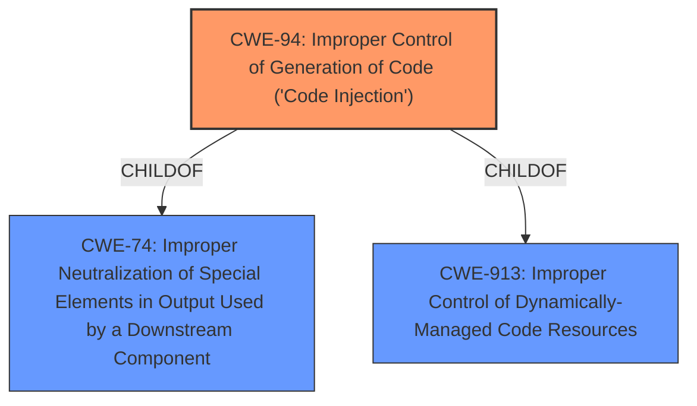

# Analysis Report for CVE-2021-42754

# Vulnerability Analysis Report: CVE-2021-42754

## Description


## Analysis (with Relationship Data)

# Summary

| CWE ID | CWE Name | Confidence | CWE Abstraction Level | CWE Vulnerability Mapping Label | CWE-Vulnerability Mapping Notes |
|---|---|---|---|---|---|
| CWE-94 | Improper Control of Generation of Code ('Code Injection') | 1.0 | Base | Primary | Allowed-with-Review |

## Evidence and Confidence

*   **Confidence Score:** 1.0
*   **Evidence Strength:** HIGH

## Relationship Analysis
The primary relationship impacting the decision is the ChildOf relationship where CWE-94 is a child of CWE-74 (Improper Neutralization of Special Elements in Output Used by a Downstream Component) and CWE-913 (Improper Control of Dynamically-Managed Code Resources). These relationships help situate CWE-94 within broader categories of injection and code management issues.



## Vulnerability Chain
The vulnerability chain starts with the **improper control of generation of code** [CWE-94], leading to the impact of an authenticated attacker being able to hijack the MacOS camera without user permission.

## Summary of Analysis
The initial assessment based on the vulnerability description and the "Vulnerability Description Key Phrases" points strongly to CWE-94. The key phrase "**improper control of generation of code**" directly aligns with the CWE-94 description. The "CVE Reference Links Content Summary" further reinforces this by explicitly stating the "**Root cause of vulnerability**: Improper control of generation of code vulnerability (CWE-94)".

The Retriever Results also lists CWE-94 as the top candidate.

The analysis concludes that CWE-94 is the most appropriate and specific classification for this vulnerability.

Relevant CWE Information:

# Enhanced Context (25 CWEs)

## CWE-94: Improper Control of Generation of Code ('Code Injection')
**Abstraction:** Base
**Status:** Draft

### Description
The product constructs all or part of a code segment using externally-influenced input from an upstream component, but it does not neutralize or incorrectly neutralizes special elements that could modify the syntax or behavior of the intended code segment.

### Extended Description
When a product allows a user's input to contain code syntax, it might be possible for an attacker to craft the code in such a way that it will alter the intended control flow of the product. Such an alteration could lead to arbitrary code execution.

### Mapping Guidance
**Usage:** Allowed-with-Review
**Rationale:** This entry is frequently misused for vulnerabilities with a technical impact of "code execution," which does not by itself indicate a root cause weakness, since dozens of weaknesses can enable code execution.
**Comments:** This weakness only applies when the product's functionality intentionally constructs all or part of a code segment. It could be that executing code could be the result of other weaknesses that do not involve the construction of code segments.

**Justification:**
CWE-94 is the most appropriate classification because the vulnerability allows an attacker to replace a legitimate camera handling library with a malicious one, effectively injecting their own code to control the camera. The vulnerability description states "**improper control of generation of code** vulnerability [CWE-94]". This is a clear indication that the application is generating code based on some input, and this process is not properly controlled, allowing for malicious code to be injected. This aligns directly with the description of CWE-94.

The use of "Allowed-with-Review" is appropriate because while the root cause is clearly code injection, it's important to confirm that the application is indeed constructing a code segment. In this case, replacing a dylib file effectively achieves the same result.


## CWE Relationship Analysis

Current CWEs represent these abstraction levels: .


### Vulnerability Chain Analysis

**Chain starting from CWE-913:**
- 913 (Improper Control of Dynamically-Managed Code Resources) - ROOT


**Chain starting from CWE-94:**
- 94 (Improper Control of Generation of Code ('Code Injection')) - ROOT


### CWE Relationship Diagram

```mermaid
graph TD
    classDef primary fill:#f96,stroke:#333,stroke-width:2px
    classDef secondary fill:#69f,stroke:#333
    classDef tertiary fill:#9e9,stroke:#333
```


*Report generated on 2025-04-01 22:05:09*
