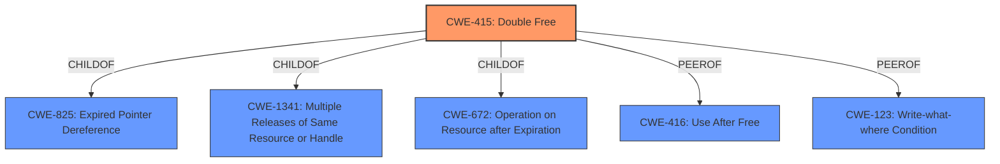

# Analysis Report for CVE-2021-42778

# Vulnerability Analysis Report: CVE-2021-42778

## Description


## Analysis (with Relationship Data)

# Summary
| CWE ID | CWE Name | Confidence | CWE Abstraction Level | CWE Vulnerability Mapping Label | CWE-Vulnerability Mapping Notes |
|---|---|---|---|---|---|
| CWE-415 | Double Free | 1.0 | Variant | Allowed | Primary CWE |

## Evidence and Confidence

*   **Confidence Score:** 1.0
*   **Evidence Strength:** HIGH

## Relationship Analysis
The primary identified CWE is CWE-415 (Double Free), which is a Variant-level weakness. CWE-415 has several relationships to other CWEs. It is a ChildOf CWE-825 (Expired Pointer Dereference), CWE-1341 (Multiple Releases of Same Resource or Handle), and CWE-672 (Operation on Resource after Expiration). It is also a PeerOf CWE-416 (Use After Free) and CWE-123 (Write-what-where Condition). The Variant level of abstraction is appropriate because the vulnerability is specifically a double free condition.



## Vulnerability Chain
The vulnerability chain consists of a **heap double free** in the `sc_pkcs15_free_tokeninfo` function. This **weakness** leads to memory corruption and potential denial of service.
  - Root Cause: **Heap Double Free** (CWE-415)
  - Impact: Memory Corruption, Denial of Service

## Summary of Analysis
The initial analysis identified CWE-415 (Double Free) as the primary **weakness** based on the vulnerability description indicating a **heap double free** in OpenSC. The CVE Reference Links Content Summary confirms the **root cause** as a double free error within the `sc_pkcs15_free_tokeninfo` function, triggered in the `idprime_get_token_name` function. The fix involved using a temporary variable to prevent freeing the same memory twice. The retriever results also listed CWE-415 as the top candidate.

The evidence from the vulnerability description key phrases indicates:
- **weakness:** **heap double free**

The evidence from the CVE Reference Links Content Summary indicates:
- "**Heap Double Free:** The core weakness is a heap double-free vulnerability. This occurs when the same block of memory on the heap is deallocated multiple times."

This evidence strongly supports the selection of CWE-415 (Double Free) as the primary CWE. The Complete CWE Specifications for CWE-415 describes the issue of calling free() twice on the same memory address, leading to memory corruption, which aligns precisely with the vulnerability description.

Other CWEs were considered but deemed less appropriate:

*   CWE-416 (Use After Free): While related to memory management issues, this CWE describes reusing memory after it has been freed, which is distinct from the double-free condition described in the vulnerability.
*   CWE-362 (Concurrent Execution using Shared Resource with Improper Synchronization ('Race Condition')): Although the vulnerability could potentially be triggered in a concurrent environment, the core issue is the double free itself, not a race condition.
*   CWE-123 (Write-what-where Condition): This CWE describes a condition where an attacker can write an arbitrary value to an arbitrary location. While a double free can potentially lead to this, the primary **weakness** is the double free itself.

The selection of CWE-415 is at the optimal level of specificity because it directly addresses the **root cause** of the vulnerability.


## CWE Relationship Analysis

Current CWEs represent these abstraction levels: .


### Vulnerability Chain Analysis

**Chain starting from CWE-415:**
- 415 (Double Free) - ROOT


**Chain starting from CWE-123:**
- 123 (Write-what-where Condition) - ROOT


### CWE Relationship Diagram

```mermaid
graph TD
    classDef primary fill:#f96,stroke:#333,stroke-width:2px
    classDef secondary fill:#69f,stroke:#333
    classDef tertiary fill:#9e9,stroke:#333
```


*Report generated on 2025-04-01 19:05:26*
