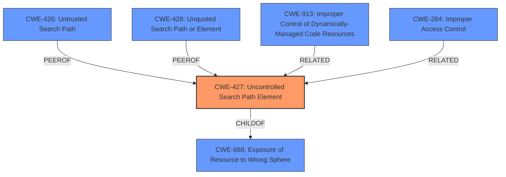

# Enhanced Analysis for CVE-2021-42809

# Summary
| CWE ID | CWE Name | Confidence | CWE Abstraction Level | CWE Vulnerability Mapping Label | CWE-Vulnerability Mapping Notes |
|---|---|---|---|---|---|
| CWE-427 | Uncontrolled Search Path Element | 0.8 | Base | Allowed | Primary CWE |
| CWE-913 | Improper Control of Dynamically-Managed Code Resources | 0.6 | Class | Allowed-with-Review | Secondary Candidate |
| CWE-284 | Improper Access Control | 0.3 | Pillar | Discouraged | Secondary Candidate |

## Evidence and Confidence

*   **Confidence Score:** 0.8
*   **Evidence Strength:** MEDIUM

## Relationship Analysis
The primary CWE is CWE-427, indicating an issue with uncontrolled search path elements. This is a Base-level CWE, offering a specific description of the vulnerability. CWE-427 is a child of CWE-668 (Exposure of Resource to Wrong Sphere), indicating a broader issue of resource exposure. CWE-427 is related to CWE-426 (Untrusted Search Path) and CWE-428 (Unquoted Search Path or Element) as peer vulnerabilities.



## Vulnerability Chain
The chain starts with the **improper access control** which leads to an **uncontrolled search path element** that allows the execution of arbitrary code.

## Summary of Analysis
The initial analysis identified **Improper Access Control** as the root cause, leading to the possibility of arbitrary code execution. The retriever results suggested CWE-913 (Improper Control of Dynamically-Managed Code Resources), CWE-426 (Untrusted Search Path), CWE-427 (Uncontrolled Search Path Element), and CWE-732 (Incorrect Permission Assignment for Critical Resource) as potential matches.

The final assessment concludes that CWE-427 (Uncontrolled Search Path Element) is the most appropriate primary CWE. This is based on the vulnerability description indicating that the Thales Sentinel Protection Installer allows the execution of arbitrary code due to **improper access control** of dynamically-managed code resources (DLL). CWE-427 directly addresses the scenario where a product uses a fixed or controlled search path, but one or more locations in that path can be controlled by unintended actors. This aligns well with the DLL loading mechanism where an attacker might be able to place a malicious DLL in a location that the installer searches.

CWE-913 was considered because it relates to the **improper control of dynamically-managed code resources**. However, the vulnerability description doesn't provide enough detail to confirm if the issue is specifically about reading or writing to these resources. CWE-284 (Improper Access Control) is too high-level and doesn't offer sufficient specificity.

The selection of CWE-427 is at the optimal level of specificity because it directly addresses the **uncontrolled search path element** issue, which is the most likely mechanism for achieving arbitrary code execution in this scenario. The evidence from the "Vulnerability Description Key Phrases" section, especially "**rootcause:** **Improper Access Control**" and "**component:** Dynamically-Managed Code Resources (DLL)", supports this choice. The confidence level is 0.8 due to the lack of more detailed information about the exact exploitation method.

Relevant CWE Information:

# Enhanced Context (25 CWEs)

## CWE-345: Insufficient Verification of Data Authenticity
**Abstraction Level**: Class
**Similarity Score**: 0.75
**Source**: dense

**Description**:
The product does not sufficiently verify the origin or authenticity of data, in a way that causes it to accept invalid data.

**Mapping Guidance**:
- Usage: Discouraged
- Rationale: This CWE entry is a level-1 Class (i.e., a child of a Pillar). It might have lower-level children that would be more appropriate
**Reasons for not selecting:** This is not a data authenticity issue.

## CWE-664: Improper Control of a Resource Through its Lifetime
**Abstraction Level**: Pillar
**Similarity Score**: 0.75
**Source**: dense

**Description**:
The product does not maintain or incorrectly maintains control over a resource throughout its lifetime of creation, use, and release.

**Mapping Guidance**:
- Usage: Discouraged
- Rationale: This CWE entry is high-level when lower-level children are available.
**Reasons for not selecting:** This is too high-level and not specific enough.

## CWE-274: Improper Handling of Insufficient Privileges
**Abstraction Level**: Base
**Similarity Score**: 0.74
**Source**: dense

**Description**:
The product does not handle or incorrectly handles when it has insufficient privileges to perform an operation, leading to resultant weaknesses.

**Mapping Guidance**:
- Usage: Discouraged
- Rationale: This CWE entry could be deprecated in a future version of CWE.
**Reasons for not selecting:** This is not about insufficient privileges.

## CWE-280: Improper Handling of Insufficient Permissions or Privileges
**Abstraction Level**: Base
**Similarity Score**: 0.74
**Source**: dense

**Description**:
The product does not handle or incorrectly handles when it has insufficient privileges to access resources or functionality as specified by their permissions. This may cause it to follow unexpected code paths that may leave the product in an invalid state.

**Mapping Guidance**:
- Usage: Allowed
- Rationale: This CWE entry is at the Base level of abstraction, which is a preferred level of abstraction for mapping to the root causes of vulnerabilities.
**Reasons for not selecting:** This is not about insufficient privileges.

## CWE-668: Exposure of Resource to Wrong Sphere
**Abstraction Level**: Class
**Similarity Score**: 0.73
**Source**: dense

**Description**:
The product exposes a resource to the wrong control sphere, providing unintended actors with inappropriate access to the resource.

**Mapping Guidance**:
- Usage: Discouraged
- Rationale: CWE-668 is high-level and is often misused as a catch-all when lower-level CWE IDs might be applicable. It is sometimes used for low-information vulnerability reports [REF-1287]. It is a level-1 Class (i.e., a child of a Pillar). It is not useful for trend analysis.
**Reasons for not selecting:** While related as a parent of CWE-427, it is too general.

## CWE-657: Violation of Secure Design Principles
**Abstraction Level**: Class
**Similarity Score**: 0.73
**Source**: dense

**Description**:
The product violates well-established principles for secure design.

**Mapping Guidance**:
- Usage: Discouraged
- Rationale: This CWE entry is a level-1 Class (i.e., a child of a Pillar). It might have lower-level children that would be more appropriate
**Reasons for not selecting:** Too broad and not specific.

## CWE-1289: Improper Validation of Unsafe Equivalence in Input
**Abstraction Level**: Base
**Similarity Score**: 0.73
**Source**: dense

**Description**:
The product receives an input value that is used as a resource identifier or other type of reference, but it does not validate or incorrectly validates that the input is equivalent to a potentially-unsafe value.

**Mapping Guidance**:
- Usage: Allowed
- Rationale: This CWE entry is at the Base level of abstraction, which is a preferred level of abstraction for mapping to the root causes of vulnerabilities.
**Reasons for not selecting:** This is not related to input validation.

## CWE-691: Insufficient Control Flow Management
**Abstraction Level**: Pillar
**Similarity Score**: 0.73
**Source**: dense

**Description**:
The code does not sufficiently manage its control flow during execution, creating conditions in which the control flow can be modified in unexpected ways.

**Mapping Guidance**:
- Usage: Discouraged
- Rationale: This CWE entry is extremely high-level, a Pillar. However, classification research is limited for


## CWE Relationship Analysis

Current CWEs represent these abstraction levels: .


### Vulnerability Chain Analysis

**Chain starting from CWE-732:**
- 732 (Incorrect Permission Assignment for Critical Resource) - ROOT


**Chain starting from CWE-428:**
- 428 (Unquoted Search Path or Element) - ROOT


### CWE Relationship Diagram

```mermaid
graph TD
    classDef primary fill:#f96,stroke:#333,stroke-width:2px
    classDef secondary fill:#69f,stroke:#333
    classDef tertiary fill:#9e9,stroke:#333
```