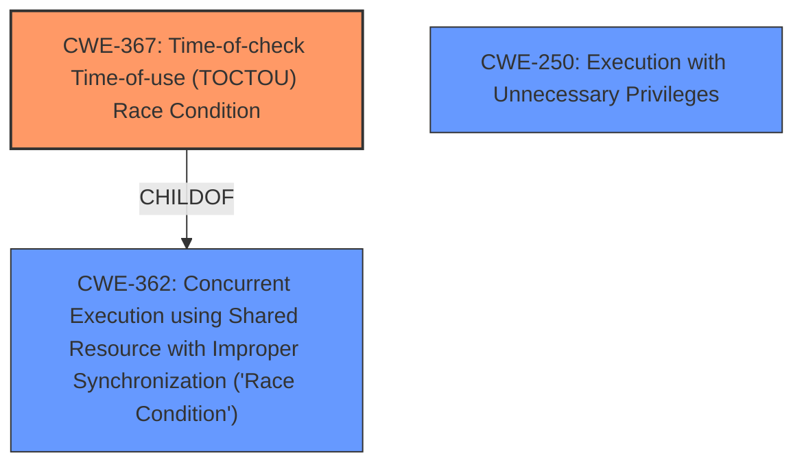

# Enhanced Analysis for CVE-2021-42835

# Summary
| CWE ID  | CWE Name                                                                                    | Confidence | CWE Abstraction Level | CWE Vulnerability Mapping Label | CWE-Vulnerability Mapping Notes |
| :-------- | :------------------------------------------------------------------------------------------ | :--------- | :---------------------- | :------------------------------ | :-------------------------------- |
| CWE-367   | Time-of-check Time-of-use (TOCTOU) Race Condition                                          | 1.0        | Base                    | Allowed                       | Primary CWE                       |
| CWE-362   | Concurrent Execution using Shared Resource with Improper Synchronization ('Race Condition') | 0.7        | Class                   | Allowed-with-Review         | Secondary Candidate                 |
| CWE-250   | Execution with Unnecessary Privileges                                                     | 0.4        | Base                    | Allowed                       | Secondary Candidate                 |

## Evidence and Confidence

*   **Confidence Score:** 0.85
*   **Evidence Strength:** HIGH

## Relationship Analysis
The primary CWE is CWE-367, a base-level weakness detailing the **TOCTOU race condition**. It's a child of CWE-362, which represents a more general class of race conditions. The CANPRECEDE relationship between CWE-367 and CWE-59 (Improper Link Resolution) wasn't applicable here because the vulnerability didn't involve symbolic links. CWE-250, execution with unnecessary privileges, was considered because the update service runs as SYSTEM, but the race condition is the root cause, not the privilege level itself.



## Vulnerability Chain
The vulnerability chain begins with a **TOCTOU race condition** (CWE-367) in the Plex Media Server update service. This allows an attacker with a foothold in the endpoint to execute arbitrary code with SYSTEM privileges. The chain is:

1.  **TOCTOU race condition** (CWE-367): The core weakness where the state of a resource changes between check and use.
2.  Code Execution (Impact): The attacker can execute code of their choice.
3.  Privilege Escalation (Impact): Code executes with SYSTEM privileges due to the update service context.

## Summary of Analysis
The initial analysis identified a **TOCTOU race condition**, allowing an attacker to execute arbitrary code with SYSTEM privileges. The root cause is the race condition (CWE-367), which occurs because the product checks the state of a resource before using it, but the resource's state can change between the check and the use.

The vulnerability description mentions "An attacker (with a foothold in a endpoint via a low-privileged user account) can access the exposed RPC service of the update service component...and execute code from a path of his choice (local, or remote via SMB) because of a **TOCTOU race condition**."

The primary CWE selected is CWE-367, which directly addresses the **TOCTOU race condition**. The retriever results also listed CWE-362, a class-level CWE that encompasses various race conditions. While applicable, CWE-367 is more specific and better represents the vulnerability. CWE-250, execution with unnecessary privileges, was considered, but the race condition is the core issue, not the privilege level itself.

The selected CWEs are at the optimal level of specificity because CWE-367 is a base-level CWE that accurately describes the **TOCTOU race condition**, and CWE-362 is a class-level CWE that provides a broader context for the vulnerability.

Relevant CWE Information:

# Enhanced Context (25 CWEs)

## CWE-667: Improper Locking
**Abstraction Level**: Class
**Similarity Score**: 0.79
**Source**: dense

**Description**:
The product does not properly acquire or release a lock on a resource, leading to unexpected resource state changes and behaviors.

**Mapping Guidance**:
- Usage: Allowed-with-Review
- Rationale: This CWE entry is a Class and might have Base-level children that would be more appropriate

## CWE-668: Exposure of Resource to Wrong Sphere
**Abstraction Level**: Class
**Similarity Score**: 0.79
**Source**: dense

**Description**:
The product exposes a resource to the wrong control sphere, providing unintended actors with inappropriate access to the resource.

**Mapping Guidance**:
- Usage: Discouraged
- Rationale: CWE-668 is high-level and is often misused as a catch-all when lower-level CWE IDs might be applicable. It is sometimes used for low-information vulnerability reports [REF-1287]. It is a level-1 Class (i.e., a child of a Pillar). It is not useful for trend analysis.

## CWE-280: Improper Handling of Insufficient Permissions or Privileges
**Abstraction Level**: Base
**Similarity Score**: 0.78
**Source**: dense

**Description**:
The product does not handle or incorrectly handles when it has insufficient privileges to access resources or functionality as specified by their permissions. This may cause it to follow unexpected code paths that may leave the product in an invalid state.

**Mapping Guidance**:
- Usage: Allowed
- Rationale: This CWE entry is at the Base level of abstraction, which is a preferred level of abstraction for mapping to the root causes of vulnerabilities.

## CWE-41: Improper Resolution of Path Equivalence
**Abstraction Level**: Base
**Similarity Score**: 0.78
**Source**: dense

**Description**:
The product is vulnerable to file system contents disclosure through path equivalence. Path equivalence involves the use of special characters in file and directory names. The associated manipulations are intended to generate multiple names for the same object.

**Mapping Guidance**:
- Usage: Allowed
- Rationale: This CWE entry is at the Base level of abstraction, which is a preferred level of abstraction for mapping to the root causes of vulnerabilities.

## CWE-798: Use of Hard-coded Credentials
**Abstraction Level**: Base
**Similarity Score**: 0.78
**Source**: dense

**Description**:
The product contains hard-coded credentials, such as a password or cryptographic key.

**Mapping Guidance**:
- Usage: Allowed
- Rationale: This CWE entry is at the Base level of abstraction, which is a preferred level of abstraction for mapping to the root causes of vulnerabilities.

## CWE-345: Insufficient Verification of Data Authenticity
**Abstraction Level**: Class
**Similarity Score**: 0.78
**Source**: dense

**Description**:
The product does not sufficiently verify the origin or authenticity of data, in a way that causes it to accept invalid data.

**Mapping Guidance**:
- Usage: Discouraged
- Rationale: This CWE entry is a level-1 Class (i.e., a child of a Pillar). It might have lower-level children that would be more appropriate

## CWE-404: Improper Resource Shutdown or Release
**Abstraction Level**: Class
**Similarity Score**: 0.78
**Source**: dense

**Description**:
The product does not release or incorrectly releases a resource before it is made available for re-use.

**Mapping Guidance**:
- Usage: Allowed-with-Review
- Rationale: This CWE entry is a Class and might have Base-level children that would be more appropriate

## CWE-367: Time-of-check Time-of-use (TOCTOU) Race Condition
**Abstraction Level**: Base
**Similarity Score**: 0.78
**Source**: dense

**Description**:
The product checks the state of a resource before using that resource, but the resource's state can change between the check and the use in a way that invalidates the results of the check. This can cause the product to perform invalid actions when the resource is in an unexpected state.

**Mapping Guidance**:
- Usage: Allowed
- Rationale: This CWE entry is at the Base level of abstraction, which is a preferred level of abstraction for mapping to the root causes of vulnerabilities.

## CWE-59: Improper Link Resolution Before File Access ('Link Following')
**Abstraction Level**: Base
**Similarity Score**: 0.78
**Source**: dense

**Description**:
The product attempts to access a file based on the filename, but it does not properly prevent that filename from identifying a link or shortcut that resolves to an unintended resource.

**Mapping Guidance**:
- Usage: Allowed
- Rationale: This CWE entry is at the Base level of abstraction, which is a preferred level of abstraction for mapping to the root causes of vulnerabilities.

## CWE-274: Improper Handling of Insufficient Privileges
**Abstraction Level**: Base
**Similarity Score**: 0.78
**Source**: dense

**Description**:


## CWE Relationship Analysis

Current CWEs represent these abstraction levels: .


### Vulnerability Chain Analysis

**Chain starting from CWE-667:**
- 667 (Improper Locking) - ROOT


**Chain starting from CWE-404:**
- 404 (Improper Resource Shutdown or Release) - ROOT


### CWE Relationship Diagram

```mermaid
graph TD
    classDef primary fill:#f96,stroke:#333,stroke-width:2px
    classDef secondary fill:#69f,stroke:#333
    classDef tertiary fill:#9e9,stroke:#333
```