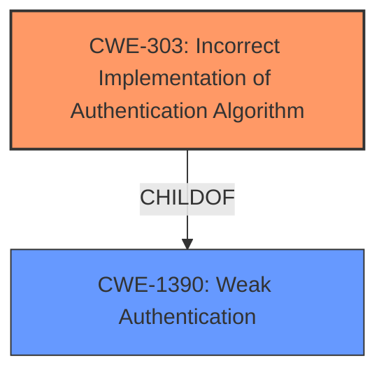

# Analysis for CVE-2021-42837

# Summary
| CWE ID | CWE Name | Confidence | CWE Abstraction Level | CWE Vulnerability Mapping Label | CWE-Vulnerability Mapping Notes |
|---|---|---|---|---|---|
| CWE-303 | Incorrect Implementation of Authentication Algorithm | 0.9 | Base | Primary | Allowed |
| CWE-1390 | Weak Authentication | 0.7 | Class | Secondary | Allowed-with-Review |

## Evidence and Confidence

*   **Confidence Score:** 0.9
*   **Evidence Strength:** MEDIUM

## Relationship Analysis
The primary relationship influencing the decision is that CWE-303 is a child of CWE-1390. Given that the vulnerability description explicitly states that the **authentication is not correctly enforced**, and login succeeds with arbitrary passwords, CWE-303, *Incorrect Implementation of Authentication Algorithm*, is a more precise, base-level classification than its parent, CWE-1390, *Weak Authentication*.

## Vulnerability Chain
The vulnerability chain starts with the **incorrect enforcement of authentication** (CWE-303), leading to the impact where **login succeeds with arbitrary passwords**.

## Summary of Analysis
The initial analysis identified CWE-1390, *Weak Authentication*, as a potential candidate, which aligns with the general problem of insufficient authentication. However, after further review, the vulnerability description indicates the **root cause** is an **incorrect implementation** rather than a general weakness, which is the reason CWE-303 was chosen as the primary CWE.

The description states: "After setting up SAML/OAuth, **authentication is not correctly enforced** on the native login page. Any valid user from the SAML/OAuth provider can be used as the username with an arbitrary password, and **login will succeed**." This clearly points to an implementation flaw in the authentication algorithm itself, as described by CWE-303.

CWE-303 is preferred because it is a Base level CWE and more accurately reflects the root cause, as opposed to the broader Class level CWE-1390.

Relevant CWE Information:

# Enhanced Context (25 CWEs)
The following CWEs were identified as potentially relevant to this vulnerability:

## CWE-303: Incorrect Implementation of Authentication Algorithm
**Abstraction Level**: Base
**Similarity Score**: 0.78
**Source**: dense

**Description**:
The requirements for the product dictate the use of an established authentication algorithm, but the implementation of the algorithm is incorrect.

**Mapping Guidance**:
- Usage: Allowed
- Rationale: This CWE entry is at the Base level of abstraction, which is a preferred level of abstraction for mapping to the root causes of vulnerabilities.

## CWE-1390: Weak Authentication
**Abstraction Level**: Class
**Similarity Score**: 0.76
**Source**: dense

**Description**:
The product uses an authentication mechanism to restrict access to specific users or identities, but the mechanism does not sufficiently prove that the claimed identity is correct.

**Mapping Guidance**:
- Usage: Allowed-with-Review
- Rationale: This CWE entry is a Class and might have Base-level children that would be more appropriate