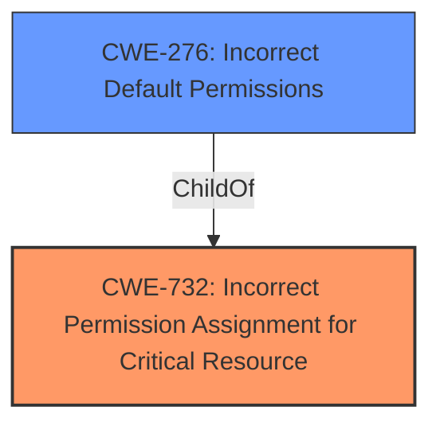

# Analysis Report for CVE-2021-42954

# Vulnerability Analysis Report: CVE-2021-42954

## Description


## Analysis (with Relationship Data)

# Summary
| CWE ID | CWE Name | Confidence | CWE Abstraction Level | CWE Vulnerability Mapping Label | CWE-Vulnerability Mapping Notes |
|---|---|---|---|---|---|
| CWE-732 | Incorrect Permission Assignment for Critical Resource | 1.0 | Class | Primary | Allowed-with-Review |
| CWE-276 | Incorrect Default Permissions | 0.9 | Base | Secondary | Allowed |

## Evidence and Confidence

*   **Confidence Score:** 0.95
*   **Evidence Strength:** HIGH

## Relationship Analysis
The primary CWE selected is CWE-732, "Incorrect Permission Assignment for Critical Resource," which is a Class-level CWE. Its children include more specific Base-level CWEs such as CWE-276, "Incorrect Default Permissions." The vulnerability involves weak file permissions, specifically full control granted to the Windows Everyone user group, leading to privilege escalation and other impacts.



## Vulnerability Chain
The vulnerability chain starts with **incorrect access control** leading to **weak file permissions**. The consequences include privilege escalation, unauthorized password reset, stealing of sensitive data, access to credentials in plaintext, access to registry values, and tampering with configuration files.
  - **Root Cause:** **Incorrect Access Control**, **Weak File Permissions**
  - **Impact:** Privilege Escalation, Data Theft, Configuration Tampering

## Summary of Analysis
The initial assessment pointed towards CWE-732, "Incorrect Permission Assignment for Critical Resource," due to the explicit mention of **weak file permissions** in the vulnerability description and the "CVE Reference Links Content Summary" section. The retriever results also ranked CWE-732 as the top candidate. The description clearly states that the application's installation directory is vulnerable to **weak file permissions** by allowing full control for the Windows Everyone user group. This aligns with the CWE-732 description: "The product specifies permissions for a security-critical resource in a way that allows that resource to be read or modified by unintended actors."

The "CVE Reference Links Content Summary" provides further evidence: "Full control permissions granted to authenticated users (non-admin) for sensitive files/folders (database, config, executable batch files, logs)."

CWE-276, "Incorrect Default Permissions," was also considered because it directly addresses the scenario where file permissions are incorrectly set during installation. However, CWE-732 is the more appropriate primary because it covers broader permission assignment issues, not just default permissions. The description indicates the application has **incorrect access control** in the installation directory.

The relationship analysis confirms that CWE-276 is a child of CWE-732, making CWE-732 a more general classification that encompasses the specific issue described.

The MITRE mapping guidance for CWE-732 notes that it is sometimes misused for vulnerabilities where permissions are not checked, which is an authorization weakness. However, in this case, the vulnerability is explicitly about incorrect permission assignment, not a failure to check permissions.

The selected CWEs are at the optimal level of specificity. CWE-732 captures the general weakness of incorrect permission assignment for critical resources, while CWE-276 specifies that the issue occurs during installation as the default permissions are incorrectly configured.

Relevant CWE Information:

# Enhanced Context (25 CWEs)
The following CWEs were identified as potentially relevant to this vulnerability:

## CWE-274: Improper Handling of Insufficient Privileges
**Abstraction Level**: Base
**Similarity Score**: 0.79
**Source**: dense

**Description**:
The product does not handle or incorrectly handles when it has insufficient privileges to perform an operation, leading to resultant weaknesses.

**Mapping Guidance**:
- Usage: Discouraged
- Rationale: This CWE entry could be deprecated in a future version of CWE.

*Not Selected*: While privilege issues are part of the vulnerability, the root cause is not about improperly *handling* insufficient privileges, but about *assigning* incorrect permissions.

## CWE-266: Incorrect Privilege Assignment
**Abstraction Level**: Base
**Similarity Score**: 0.78
**Source**: dense

**Description**:
A product incorrectly assigns a privilege to a particular actor, creating an unintended sphere of control for that actor.

**Mapping Guidance**:
- Usage: Allowed
- Rationale: This CWE entry is at the Base level of abstraction, which is a preferred level of abstraction for mapping to the root causes of vulnerabilities.

*Not Selected*: This is too close to the selected CWE-732 and CWE-276.

## CWE-280: Improper Handling of Insufficient Permissions or Privileges 
**Abstraction Level**: Base
**Similarity Score**: 0.78
**Source**: dense

**Description**:
The product does not handle or incorrectly handles when it has insufficient privileges to access resources or functionality as specified by their permissions. This may cause it to follow unexpected code paths that may leave the product in an invalid state.

**Mapping Guidance**:
- Usage: Allowed
- Rationale: This CWE entry is at the Base level of abstraction, which is a preferred level of abstraction for mapping to the root causes of vulnerabilities.

*Not Selected*: While privilege issues are part of the vulnerability, the root cause is not about improperly *handling* insufficient privileges, but about *assigning* incorrect permissions.

## CWE-267: Privilege Defined With Unsafe Actions
**Abstraction Level**: Base
**Similarity Score**: 0.77
**Source**: dense

**Description**:
A particular privilege, role, capability, or right can be used to perform unsafe actions that were not intended, even when it is assigned to the correct entity.

**Mapping Guidance**:
- Usage: Allowed
- Rationale: This CWE entry is at the Base level of abstraction, which is a preferred level of abstraction for mapping to the root causes of vulnerabilities.

*Not Selected*: This CWE is about privileges that *can be used to perform unsafe actions*, but the vulnerability is about the incorrect *assignment* of permissions.

## CWE-807: Reliance on Untrusted Inputs in a Security Decision
**Abstraction Level**: Base
**Similarity Score**: 0.76
**Source**: dense

**Description**:
The product uses a protection mechanism that relies on the existence or values of an input, but the input can be modified by an untrusted actor in a way that bypasses the protection mechanism.

**Mapping Guidance**:
- Usage: Allowed
- Rationale: This CWE entry is at the Base level of abstraction, which is a preferred level of abstraction for mapping to the root causes of vulnerabilities.

*Not Selected*: This CWE is not relevant to the described vulnerability, which is about incorrect permission assignment, not about relying on untrusted inputs in a security decision.

## CWE-472: External Control of Assumed-Immutable Web Parameter
**Abstraction Level**: Base
**Similarity Score**: 0.76
**Source**: dense

**Description**:
The web application does not sufficiently verify inputs that are assumed to be immutable but are actually externally controllable, such as hidden form fields.

**Mapping Guidance**:
- Usage: Allowed
- Rationale: This CWE entry is at the Base level of abstraction, which is a preferred level of abstraction for mapping to the root causes of vulnerabilities.

*Not Selected*: This CWE is not relevant because the vulnerability is not about web parameters.

## CWE-639: Authorization Bypass Through User-Controlled Key
**Abstraction Level**: Base
**Similarity Score**: 0.76
**Source**: dense

**Description**:
The system's authorization functionality does not prevent one user from gaining access to another user's data or record by modifying the key value identifying the data.

**Mapping Guidance**:
- Usage: Allowed
- Rationale: This CWE entry is at the Base level of abstraction, which is a preferred level of abstraction for mapping to the root causes of vulnerabilities.

*Not Selected*: The vulnerability is more directly related to weak file permissions, not a bypass through user-controlled keys.

## CWE-653: Improper Isolation or Compartmentalization
**Abstraction Level**: Class
**Similarity Score**: 0.76
**Source**: dense

**Description**:
The product does not properly compartmentalize or isolate functionality, processes, or resources that require different privilege levels, rights, or permissions.

**Mapping Guidance**:
- Usage: Allowed
- Rationale: This CWE entry is at the Base level of abstraction, which is a preferred level of abstraction for mapping to the root causes of vulnerabilities.

*Not Selected*: The primary issue is with file permissions, not improper isolation of components.

## CWE-1220: Insufficient Granularity of Access Control
**Abstraction Level**: Base
**Similarity Score**: 0.76
**Source**: dense

**Description**:
The product implements access controls via a policy or other feature with the intention to disable or restrict accesses (reads and/or writes) to assets in a system from untrusted agents. However, implemented access controls lack required granularity, which renders the control policy too broad because it allows accesses from unauthorized agents


## CWE Relationship Analysis

Current CWEs represent these abstraction levels: .


### Vulnerability Chain Analysis

**Chain starting from CWE-732:**
- 732 (Incorrect Permission Assignment for Critical Resource) - ROOT


**Chain starting from CWE-653:**
- 653 (Improper Isolation or Compartmentalization) - ROOT


### CWE Relationship Diagram

```mermaid
graph TD
    classDef primary fill:#f96,stroke:#333,stroke-width:2px
    classDef secondary fill:#69f,stroke:#333
    classDef tertiary fill:#9e9,stroke:#333
```


*Report generated on 2025-04-02 13:30:35*
