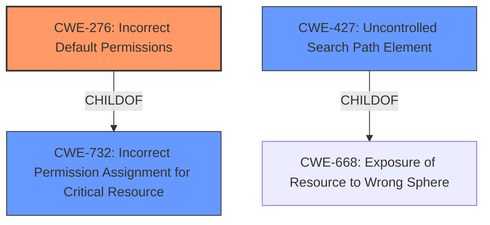

# Enhanced Analysis for CVE-2021-43037

# Summary
| CWE ID | CWE Name | Confidence | CWE Abstraction Level | CWE Vulnerability Mapping Label | CWE-Vulnerability Mapping Notes |
|---|---|---|---|---|---|
| CWE-276 | Incorrect Default Permissions | 1.0 | Base | Allowed | Primary CWE |
| CWE-732 | Incorrect Permission Assignment for Critical Resource | 0.7 | Class | Allowed-with-Review | Secondary Candidate |
| CWE-427 | Uncontrolled Search Path Element | 0.6 | Base | Allowed | Secondary Candidate |

## Evidence and Confidence

*   **Confidence Score:** 0.9
*   **Evidence Strength:** HIGH

## Relationship Analysis
The primary CWE, CWE-276 **Incorrect Default Permissions**, is a child of CWE-732 **Incorrect Permission Assignment for Critical Resource**. This hierarchical relationship indicates that CWE-276 is a more specific case of CWE-732. The relationship between CWE-427 **Uncontrolled Search Path Element** and CWE-668 **Exposure of Resource to Wrong Sphere** (CWE-427 ChildOf CWE-668) was considered but ultimately, the **insecure default permissions** leading to DLL injection and privilege escalation made CWE-276 a more direct match than CWE-427. The abstraction levels also influenced the selection, favoring the Base level CWE-276 over the Class level CWE-732 when the evidence supported the more specific classification.



## Vulnerability Chain
The vulnerability chain starts with **insecure default permissions** (CWE-276), which allows an unprivileged user to perform DLL injection and binary planting. This leads to privilege escalation, granting the attacker SYSTEM privileges.

CWE-276 (Incorrect Default Permissions) -> DLL Injection/Binary Planting -> Privilege Escalation

## Summary of Analysis
The initial analysis strongly pointed to CWE-276 **Incorrect Default Permissions** as the primary weakness, based on the vulnerability description's key phrase "**insecure default permissions**". The description clearly states that the Unitrends Windows agent was vulnerable due to these **insecure default permissions**, which then allowed privilege escalation. This is direct evidence supporting the selection of CWE-276.

The retriever results also listed CWE-276 as the top candidate.

While CWE-732 **Incorrect Permission Assignment for Critical Resource** was considered, the provided information focused on the **default permissions** rather than a specific misconfiguration of permissions for a critical resource. Therefore, CWE-276 was chosen as a more precise representation of the root cause.

CWE-427 **Uncontrolled Search Path Element** was also considered because the impact included DLL injection and binary planting, but the root cause was the **insecure default permissions** that enabled this, not an uncontrolled search path.

The final decision is based on the provided evidence, the retriever results, and the CWE specifications. CWE-276 is the most specific and accurate representation of the vulnerability's root cause.

Relevant CWE Information:

# Enhanced Context (25 CWEs)

## CWE-276: Incorrect Default Permissions
**Abstraction:** Base
**Status:** Draft

### Description
During installation, installed file permissions are set to allow anyone to modify those files.

### Extended Description
Not provided

### Alternative Terms
None

### Relationships
ChildOf -> CWE-732
ChildOf -> CWE-732

### Mapping Guidance
**Usage:** Allowed
**Rationale:** This CWE entry is at the Base level of abstraction, which is a preferred level of abstraction for mapping to the root causes of vulnerabilities.
**Comments:** Carefully read both the name and description to ensure that this mapping is an appropriate fit. Do not try to 'force' a mapping to a lower-level Base/Variant simply to comply with this preferred level of abstraction.
**Reasons:**
- Acceptable-Use

### Observed Examples
- **CVE-2005-1941:** Executables installed world-writable.
- **CVE-2002-1713:** Home directories installed world-readable.
- **CVE-2001-1550:** World-writable log files allow information loss; world-readable file has cleartext passwords.


## CWE Relationship Analysis

Current CWEs represent these abstraction levels: .


### Vulnerability Chain Analysis

**Chain starting from CWE-732:**
- 732 (Incorrect Permission Assignment for Critical Resource) - ROOT


**Chain starting from CWE-276:**
- 276 (Incorrect Default Permissions) - ROOT


### CWE Relationship Diagram

```mermaid
graph TD
    classDef primary fill:#f96,stroke:#333,stroke-width:2px
    classDef secondary fill:#69f,stroke:#333
    classDef tertiary fill:#9e9,stroke:#333
```