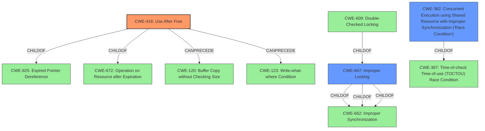

# Enhanced Analysis for CVE-2021-43057

# Summary
| CWE ID | CWE Name | Confidence | CWE Abstraction Level | CWE Vulnerability Mapping Label | CWE-Vulnerability Mapping Notes |
|---|---|---|---|---|---|
| CWE-416 | Use After Free | 1.0 | Variant | Allowed | Primary CWE |
| CWE-667 | Improper Locking | 0.5 | Class | Allowed-with-Review | Secondary Candidate |
| CWE-362 | Concurrent Execution using Shared Resource with Improper Synchronization ('Race Condition') | 0.5 | Class | Allowed-with-Review | Secondary Candidate |

## Evidence and Confidence

*   **Confidence Score:** 0.9
*   **Evidence Strength:** HIGH

## Relationship Analysis
The primary CWE identified is CWE-416 (**Use After Free**), a **Variant** level weakness. This is related to parent Class CWE-825 (**Expired Pointer Dereference**) and peer Class CWE-672 (**Operation on Resource after Expiration**). The relationship of CANPRECEDE to CWE-120 (**Buffer Copy without Checking Size**) and CWE-123 (**Write-what-where Condition**) suggests potential avenues for exploitation.

The alternative CWEs are:

CWE-667 (**Improper Locking**) is related to parent Class CWE-662 (**Improper Synchronization**). Child CWE-609 (**Double-Checked Locking**) implies potential concurrency control issues.

CWE-362 (**Concurrent Execution using Shared Resource with Improper Synchronization ('Race Condition')**) is a Class level. Child CWE-367 (**Time-of-check Time-of-use (TOCTOU) Race Condition**) suggests a potential race condition scenario.



## Vulnerability Chain
The vulnerability chain begins with the **use-after-free** condition, leading to memory corruption and privilege escalation.
  - The initial **root cause** is the **use-after-free** in `selinux_ptrace_traceme`.
  - The vulnerability impacts the memory, causing memory corruption and potential privilege escalation.

## Summary of Analysis
The primary weakness is clearly a **use-after-free** (CWE-416) vulnerability. The vulnerability description explicitly states "A **use-after-free** in selinux_ptrace_traceme (aka the SELinux handler for PTRACE_TRACEME) could be used by local attackers to cause memory corruption and escalate privileges". The CVE reference links content summary also explicitly states that the root cause stems from flaws in the Linux Kernel related to the handling of subjective and objective credentials in the SELinux and Smack security modules. Specifically, some LSM hooks were incorrectly accessing the subjective credentials of a task other than the currently executing task.

CWE-416 is a Variant-level CWE, which is preferred for mapping. The mapping guidance allows it: "This CWE entry is at the Variant level of abstraction, which is a preferred level of abstraction for mapping to the root causes of vulnerabilities."

Other CWEs considered:

*   CWE-667 (**Improper Locking**) and CWE-362 (**Concurrent Execution using Shared Resource with Improper Synchronization ('Race Condition')**): These were considered because the CVE reference links mention concurrency issues. However, the vulnerability description focuses on the **use-after-free**, making it the more direct and accurate classification. There isn't enough information to know whether this is a race condition. The access to subjective credentials of other tasks could be racy, but there isn't enough information to make this determination.

Based on the provided evidence and the CWE specifications, CWE-416 is the most appropriate and specific classification for this vulnerability.


## CWE Relationship Analysis

Current CWEs represent these abstraction levels: .


### Vulnerability Chain Analysis

**Chain starting from CWE-667:**
- 667 (Improper Locking) - ROOT


**Chain starting from CWE-662:**
- 662 (Improper Synchronization) - ROOT


### CWE Relationship Diagram

```mermaid
graph TD
    classDef primary fill:#f96,stroke:#333,stroke-width:2px
    classDef secondary fill:#69f,stroke:#333
    classDef tertiary fill:#9e9,stroke:#333
```