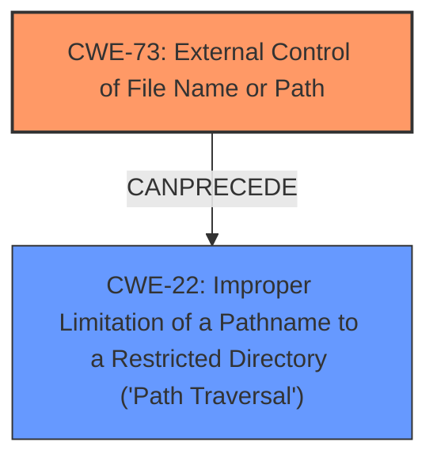

# Enhanced Analysis for CVE-2021-43066

# Summary
| CWE ID | CWE Name | Confidence | CWE Abstraction Level | CWE Vulnerability Mapping Label | CWE-Vulnerability Mapping Notes |
|---|---|---|---|---|---|
| CWE-73 | External Control of File Name or Path | 1.0 | Base | Allowed | Primary CWE |
| CWE-22 | Improper Limitation of a Pathname to a Restricted Directory ('Path Traversal') | 0.7 | Base | Allowed | Secondary Candidate |

## Evidence and Confidence

*   **Confidence Score:** 0.9
*   **Evidence Strength:** HIGH

## Relationship Analysis
The primary relationship is between CWE-73 and its potential consequence, CWE-22 (Path Traversal). CWE-73 is the root cause, allowing external control of the filename or path, which can then lead to CWE-22 if not properly validated or sanitized, allowing access to unauthorized directories. They have a CanPrecede relationship.



## Vulnerability Chain
The vulnerability chain starts with **external control of file name or path** (CWE-73), leading to potential path traversal (CWE-22) if the path is not properly limited. This can then lead to privilege escalation, as the attacker can potentially execute or delete files with admin rights.

## Summary of Analysis
The initial analysis identified CWE-73 as the primary weakness, due to the "**external control of file name or path**" vulnerability described. The CVE Reference Links Content Summary explicitly states: "An external control of file name or path vulnerability [CWE-73] exists in the FortiClient Windows MSI installer."

CWE-22 was considered as a secondary weakness, as the external control of the path could lead to path traversal if not properly handled.

The relationship between CWE-73 and CWE-22 (CanPrecede) influenced the decision to include CWE-22 as a secondary weakness.

The selected CWEs are at the optimal level of specificity, as they directly address the root cause and potential consequences of the vulnerability.

Relevant CWE Information:

# Enhanced Context (25 CWEs)
The following CWEs were identified as potentially relevant to this vulnerability:

## CWE-73: External Control of File Name or Path
**Abstraction Level**: Base
**Similarity Score**: 0.79
**Source**: dense

**Description**:
The product allows user input to control or influence paths or file names that are used in filesystem operations.

**Mapping Guidance**:
- Usage: Allowed
- Rationale: This CWE entry is at the Base level of abstraction, which is a preferred level of abstraction for mapping to the root causes of vulnerabilities.

## CWE-22: Improper Limitation of a Pathname to a Restricted Directory ('Path Traversal')
**Abstraction Level**: Base
**Similarity Score**: 8253.49
**Source**: sparse

**Description**:
The product uses external input to construct a pathname that is intended to identify a file or directory that is located underneath a restricted parent directory, but the product does not properly neutralize special elements within the pathname that can cause the pathname to resolve to a location that is outside of the restricted directory.

**Mapping Guidance**:
- Usage: Allowed
- Rationale: This CWE entry is at the Base level of abstraction, which is a preferred level of abstraction for mapping to the root causes of vulnerabilities.

### Technical Explanation for CWE-73:
The vulnerability description explicitly states "**external control of file name or path**" in the Fortinet FortiClientWindows MSI installer. This aligns directly with the description of CWE-73, which describes a scenario where user input can influence file names or paths used in file system operations.
*   **Security Implications and Potential Impact:** This can allow an attacker to access or modify system files, or other critical files, leading to privilege escalation.
*   **Relationship:** CanPrecede CWE-22 and CWE-434
*   **Primary/Secondary:** Primary. This is the root cause.
*   **Mapping Guidance:** The usage is "Allowed" and it is at the Base level of abstraction, which is preferred.

### Technical Explanation for CWE-22:
The external control of the file name or path (CWE-73) could lead to path traversal if the application does not properly validate or sanitize the input. This allows an attacker to access files or directories outside the intended restricted directory.
*   **Security Implications and Potential Impact:** Allows access to unauthorized files and directories, potentially leading to sensitive information disclosure or arbitrary code execution.
*   **Relationship:** ChildOf CWE-706, ChildOf CWE-668, CanFollow CWE-73
*   **Primary/Secondary:** Secondary. This is a potential consequence of CWE-73.
*   **Mapping Guidance:** The usage is "Allowed" and it is at the Base level of abstraction, which is preferred.

### CWEs Considered But Not Used:
*   **CWE-426: Untrusted Search Path**: While there's a file path involved, the description doesn't indicate an issue with the search path itself but rather with the ability to control the file path directly.
*   **CWE-732: Incorrect Permission Assignment for Critical Resource**: The vulnerability is not about incorrect permission assignments, but about the ability to control the file path itself.
*   **CWE-284: Improper Access Control**: Too high-level. The vulnerability is more specifically related to file path handling than general access control issues.


## CWE Relationship Analysis

Current CWEs represent these abstraction levels: .


### Vulnerability Chain Analysis

**Chain starting from CWE-732:**
- 732 (Incorrect Permission Assignment for Critical Resource) - ROOT


**Chain starting from CWE-73:**
- 73 (External Control of File Name or Path) - ROOT


### CWE Relationship Diagram

```mermaid
graph TD
    classDef primary fill:#f96,stroke:#333,stroke-width:2px
    classDef secondary fill:#69f,stroke:#333
    classDef tertiary fill:#9e9,stroke:#333
```