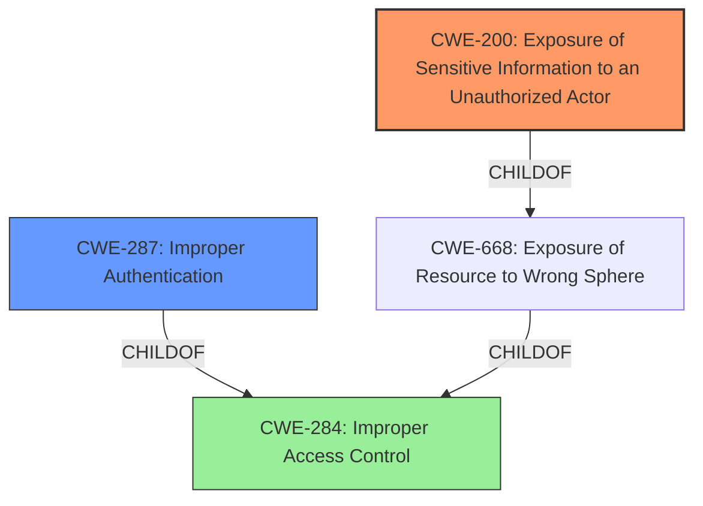

# Analysis for CVE-2021-43067

# Summary
| CWE ID | CWE Name | Confidence | CWE Abstraction Level | CWE Vulnerability Mapping Label | CWE-Vulnerability Mapping Notes |
|---|---|---|---|---|---|
| CWE-200 | Exposure of Sensitive Information to an Unauthorized Actor | 0.8 | Class | Allowed | Primary CWE |
| CWE-287 | Improper Authentication | 0.6 | Class | Discouraged | Secondary CWE |

## Evidence and Confidence

*   **Confidence Score:** 0.7
*   **Evidence Strength:** MEDIUM

## Relationship Analysis
The primary relationship considered was the parent-child relationship between CWE-284 (Improper Access Control) and its children, including CWE-287 (Improper Authentication) and CWE-200 (Exposure of Sensitive Information to an Unauthorized Actor). While CWE-284 is a high-level pillar, the specific exposure of the authentication token points towards CWE-200. CWE-287 was considered as the underlying cause but ultimately deemed secondary to the information exposure.

## Vulnerability Chain
The vulnerability chain starts with an unspecified **improper** handling of HTTP requests which leads to the **duplication of a target LDAP user's two-factor authentication token**, resulting in the **exposure of sensitive information** to an unauthorized actor.
  - Initial Flaw: **Improper** handling of HTTP requests (unspecified CWE).
  - Resulting Weakness: Duplication of the 2FA token.
  - Final Impact: Exposure of sensitive authentication information (CWE-200).

## Summary of Analysis
Initially, the description strongly suggested an **exposure of sensitive information** due to the **duplication of a 2FA token**. The vulnerability description explicitly mentions "exposure of sensitive information to an unauthorized actor". The evidence for this lies in the vulnerability description: "A exposure of sensitive information to an unauthorized actor in Fortinet FortiAuthenticator version 6.4.0...allows attacker to duplicate a target LDAP user 2 factors authentication token via crafted HTTP requests." The retriever results also listed CWE-200 as the top candidate. While the root cause is not explicitly stated, the impact is clearly information exposure.

CWE-287 (Improper Authentication) was considered as a potential root cause, as the ability to **duplicate a 2FA token** suggests a flaw in the authentication process. However, without more details on the **root cause** of the duplication, it's more accurate to classify this as an **exposure of sensitive information** (the token itself).

The selection of CWE-200 is at the appropriate level of specificity, as it directly addresses the **exposure of the authentication token**. While a more specific CWE might exist if the exact mechanism of duplication were known, the current evidence supports the high-level classification. CWE-284 (Improper Access Control) is too high-level and generic.

Relevant CWE Information:

# Enhanced Context (25 CWEs)

## CWE-538: Insertion of Sensitive Information into Externally-Accessible File or Directory
**Abstraction Level**: Base
**Similarity Score**: 0.78

**Description**:
The product places sensitive information into files or directories that are accessible to actors who are allowed to have access to the files, but not to the sensitive information.
**Rationale**: While this CWE is relevant, it is not the primary issue as the vulnerability focuses on the exposure of the token and not the file or directory it might be stored in.

## CWE-497: Exposure of Sensitive System Information to an Unauthorized Control Sphere
**Abstraction Level**: Base
**Similarity Score**: 0.75

**Description**:
The product does not properly prevent sensitive system-level information from being accessed by unauthorized actors who do not have the same level of access to the underlying system as the product does.
**Rationale**: This CWE is similar to CWE-200, but CWE-200 is more directly related to the exposure of sensitive information.

## CWE-212: Improper Removal of Sensitive Information Before Storage or Transfer
**Abstraction Level**: Base
**Similarity Score**: 0.75

**Description**:
The product stores, transfers, or shares a resource that contains sensitive information, but it does not properly remove that information before the product makes the resource available to unauthorized actors.
**Rationale**: This CWE is relevant if the token was exposed during storage or transfer, but the description does not provide enough information.

## CWE-23: Relative Path Traversal
**Abstraction Level**: Base
**Similarity Score**: 0.75

**Description**:
The product uses external input to construct a pathname that should be within a restricted directory, but it does not properly neutralize sequences such as ".." that can resolve to a location that is outside of that directory.
**Rationale**: This CWE is not relevant to the vulnerability description.

## CWE-41: Improper Resolution of Path Equivalence
**Abstraction Level**: Base
**Similarity Score**: 0.75

**Description**:
The product is vulnerable to file system contents disclosure through path equivalence. Path equivalence involves the use of special characters in file and directory names. The associated manipulations are intended to generate multiple names for the same object.
**Rationale**: This CWE is not relevant to the vulnerability description.

## CWE-668: Exposure of Resource to Wrong Sphere
**Abstraction Level**: Class
**Similarity Score**: 0.75

**Description**:
The product exposes a resource to the wrong control sphere, providing unintended actors with inappropriate access to the resource.
**Rationale**: This is a broader category and less specific than CWE-200.

## CWE-74: Improper Neutralization of Special Elements in Output Used by a Downstream Component ('Injection')
**Abstraction Level**: Class
**Similarity Score**: 0.75

**Description**:
The product constructs all or part of a command, data structure, or record using externally-influenced input from an upstream component, but it does not neutralize or incorrectly neutralizes special elements that could modify how it is parsed or interpreted when it is sent to a downstream component.
**Rationale**: This CWE is not directly related to the vulnerability description.

## CWE-552: Files or Directories Accessible to External Parties
**Abstraction Level**: Base
**Similarity Score**: 0.74

**Description**:
The product makes files or directories accessible to unauthorized actors, even though they should not be.
**Rationale**: This CWE is not directly related to the vulnerability description.

## CWE-807: Reliance on Untrusted Inputs in a Security Decision
**Abstraction Level**: Base
**Similarity Score**: 0.74

**Description**:
The product uses a protection mechanism that relies on the existence or values of an input, but the input can be modified by an untrusted actor in a way that bypasses the protection mechanism.
**Rationale**: This CWE could be related if the crafted HTTP request modified some input used in a security decision, but there isn't enough information.

## CWE-73: External Control of File Name or Path
**Abstraction Level**: Base
**Similarity Score**: 0.74

**Description**:
The product allows user input to control or influence paths or file names that are used in filesystem operations.
**Rationale**: This CWE is not relevant to the vulnerability description.

## CWE-22: Improper Limitation of a Pathname to a Restricted Directory ('Path Traversal')
**Abstraction Level**: Base
**Similarity Score**: 8094.17

**Description**:
The product uses external input to construct a pathname that is intended to identify a file or directory that is located underneath a restricted parent directory, but the product does not properly neutralize special elements within the pathname that can cause the pathname to resolve to a location that is outside of the restricted directory.
**Rationale**: This CWE is not relevant to the vulnerability description.

## CWE-23: Relative Path Traversal
**Abstraction Level**: Base
**Similarity Score**: 7838.80

**Description**:
The product uses external input to construct a pathname that should be within a restricted directory, but it does not properly neutralize sequences such as ".." that can resolve to a location that is outside of that directory.
**Rationale**: This CWE is not relevant to the vulnerability description.

## CWE-200: Exposure of Sensitive Information to an Unauthorized Actor
**Abstraction Level**: Class
**Similarity Score**: 7544.30

**Description**:
The product exposes sensitive information to an actor that is not explicitly authorized to have access to that information.
**Rationale**: As the primary weakness