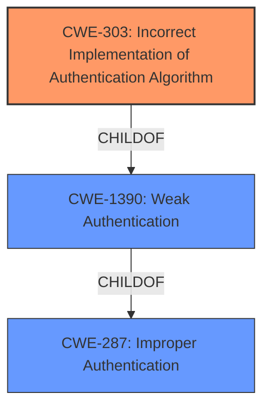

# Analysis for CVE-2021-43068

# Summary
| CWE ID  | CWE Name                                                      | Confidence | CWE Abstraction Level | CWE Vulnerability Mapping Label | CWE-Vulnerability Mapping Notes |
| :-------- | :------------------------------------------------------------ | :--------- | :---------------------- | :------------------------------ | :------------------------------ |
| CWE-303   | Incorrect Implementation of Authentication Algorithm        | 0.9        | Base                    | Primary                         | Allowed                       |
| CWE-1390  | Weak Authentication                                           | 0.7        | Class                   | Secondary                       | Allowed-with-Review           |
| CWE-287   | Improper Authentication                                       | 0.6        | Class                   | Secondary                       | Discouraged                    |

## Evidence and Confidence

*   **Confidence Score:** 0.8
*   **Evidence Strength:** HIGH

## Relationship Analysis
The primary CWE, CWE-303, is a child of CWE-1390, indicating a more specific type of weak authentication. CWE-287 is a parent of CWE-1390 and represents a more general case of improper authentication. The vulnerability involves an **incorrect implementation** of the authentication algorithm, which directly maps to CWE-303. Although CWE-1390 and CWE-287 are related, CWE-303 provides the most accurate and specific representation of the vulnerability. I have selected CWE-303 as the primary because it is at the base level of abstraction.

## Vulnerability Chain
The vulnerability chain starts with the **improper authentication**, specifically the **incorrect implementation** of the authentication algorithm (CWE-303). This leads to an authentication bypass, allowing a user to bypass the second factor of authentication. The root cause is CWE-303, and the impact can be seen as a form of weak authentication (CWE-1390) or improper authentication (CWE-287) more broadly.

## Summary of Analysis
The initial analysis identified **improper authentication** as the root cause, leading to the bypass of the second factor of authentication. The retriever results suggested CWE-303, CWE-287, and CWE-1390 as potential candidates. Upon further review, CWE-303, "Incorrect Implementation of Authentication Algorithm," was deemed the most appropriate due to its specificity and direct relevance to the vulnerability description and "CVE Reference Links Content Summary" which states: "An incorrect implementation of the authentication algorithm." The vulnerability lies in the fact that the FortiAuthenticator is not enforcing the 'Mandatory password and OTP' setting for unimported remote users during RADIUS login, effectively bypassing the second factor of authentication.

CWE-1390 (Weak Authentication) and CWE-287 (Improper Authentication) are broader classifications that, while applicable, do not capture the specific nature of the vulnerability as accurately as CWE-303.

I am overriding the general mapping guidance to prefer the base level CWE of CWE-303 because it more accurately reflects the **rootcause** of the vulnerability.

Relevant CWE Information:

# Enhanced Context (25 CWEs)
The following CWEs were identified as potentially relevant to this vulnerability:

## CWE-303: Incorrect Implementation of Authentication Algorithm
**Abstraction Level**: Base
**Similarity Score**: 0.79
**Source**: dense

**Description**:
The requirements for the product dictate the use of an established authentication algorithm, but the implementation of the algorithm is **incorrect**.

**Mapping Guidance**:
- Usage: Allowed
- Rationale: This CWE entry is at the Base level of abstraction, which is a preferred level of abstraction for mapping to the root causes of vulnerabilities.

## CWE-287: Improper Authentication
**Abstraction Level**: Class
**Similarity Score**: 3869.89
**Source**: sparse

**Description**:
When an actor claims to have a given identity, the product does not prove or insufficiently proves that the claim is correct.

**Mapping Guidance**:
- Usage: Discouraged
- Rationale: This CWE entry might be misused when lower-level CWE entries are likely to be applicable. It is a level-1 Class (i.e., a child of a Pillar).

## CWE-308: Use of Single-factor Authentication
**Abstraction Level**: Base
**Similarity Score**: 3.64
**Source**: graph

**Description**:
CWE-308: Use of Single-factor Authentication

**Mapping Guidance**:
- Usage: Allowed
- Rationale: This CWE entry is at the Base level of abstraction, which is a preferred level of abstraction for mapping to the root causes of vulnerabilities.

## CWE-1390: Weak Authentication
**Abstraction Level**: Class
**Similarity Score**: 4029.70
**Source**: sparse

**Description**:
The product uses an authentication mechanism to restrict access to specific users or identities, but the mechanism does not sufficiently prove that the claimed identity is correct.

**Mapping Guidance**:
- Usage: Allowed-with-Review
- Rationale: This CWE entry is a Class and might have Base-level children that would be more appropriate

## CWE-288: Authentication Bypass Using an Alternate Path or Channel
**Abstraction Level**: Base
**Similarity Score**: 0.77
**Source**: dense

**Description**:
The product requires authentication, but the product has an alternate path or channel that does not require authentication.

**Mapping Guidance**:
- Usage: Allowed
- Rationale: This CWE entry is at the Base level of abstraction, which is a preferred level of abstraction for mapping to the root causes of vulnerabilities.