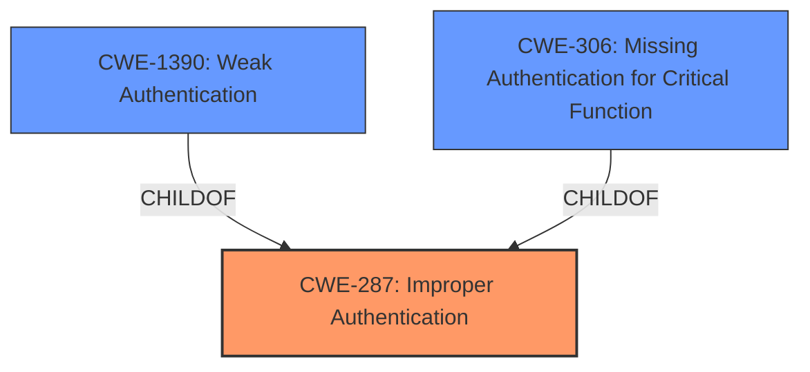

# Analysis for CVE-2021-43136

# Summary
| CWE ID | CWE Name | Confidence | CWE Abstraction Level | CWE Vulnerability Mapping Label | CWE-Vulnerability Mapping Notes |
|---|---|---|---|---|---|
| CWE-287 | Improper Authentication | 0.75 | Class | Primary CWE | Discouraged, but chosen because of lack of specific root cause |

## Evidence and Confidence

*   **Confidence Score:** 0.75
*   **Evidence Strength:** LOW

## Relationship Analysis
The primary relationship that influenced the decision was the parent-child relationship between CWE-287 (Improper Authentication) and its children, particularly CWE-1390 (Weak Authentication) and CWE-306 (Missing Authentication for Critical Function). While these child CWEs offer more specificity, the lack of root cause information in the description made it difficult to confidently select one. Thus, the higher-level CWE-287 was chosen as a compromise.

## Vulnerability Chain
The vulnerability chain is relatively simple:

1.  **Root Cause:** Unspecified **authentication bypass** **weakness**.
2.  **Impact:** Bypass authentication mechanism and obtain valid platform access.

Without more information, the specific flaw cannot be pinpointed.

## Summary of Analysis
The initial analysis identified several potential CWEs based on the vulnerability description, which mentions an **authentication bypass** issue in FormaLMS. The "Retriever Results" listed CWE-798 (Use of Hard-coded Credentials), CWE-1390 (Weak Authentication), and CWE-303 (Incorrect Implementation of Authentication Algorithm) as potential candidates.

However, the provided evidence is weak. The "CVE Reference Links Content Summary" section indicates "NOINFO," meaning there's no supporting information about the vulnerability's root cause or technical details in the linked resources. The "Vulnerability Description Key Phrases" section only highlights "**authentication bypass**" as a **weakness** but lacks specifics.

Given the limited evidence, it's challenging to pinpoint the exact root cause. While CWE-798, CWE-1390, and CWE-303 are possibilities, there's no concrete information to support any of them definitively.

CWE-287 (Improper Authentication) is selected as the primary CWE. Though discouraged because it is a Class-level CWE, the lack of root cause evidence makes it difficult to choose a more specific Base or Variant CWE. CWE-287 accurately captures the **authentication bypass** **weakness** without presuming a specific cause.

The decision is primarily based on the vulnerability description's mention of an **authentication bypass**, but the lack of supporting evidence reduces the confidence level.

Relevant CWE Information:
- "An **authentication bypass** issue in FormaLMS <= 2.4.4 allows an attacker to bypass the authentication mechanism and obtain a valid access to the platform."

I considered other CWEs but didn't use them:

*   CWE-798 (Use of Hard-coded Credentials) and CWE-259 (Use of Hard-coded Password): These require evidence of hard-coded credentials, which is not provided.
*   CWE-1390 (Weak Authentication): This requires evidence that the authentication mechanism is weak, which is not specific in the vulnerability.
*   CWE-303 (Incorrect Implementation of Authentication Algorithm): This requires evidence that an authentication algorithm was implemented incorrectly, which is not provided in the vulnerability description.
*   CWE-613 (Insufficient Session Expiration): There is no evidence about session expiration.
*   CWE-305 (Authentication Bypass by Primary Weakness): There is no evidence about what that primary weakness is.
* CWE-306 (Missing Authentication for Critical Function): There is no evidence whether critical functions are missing authentication.