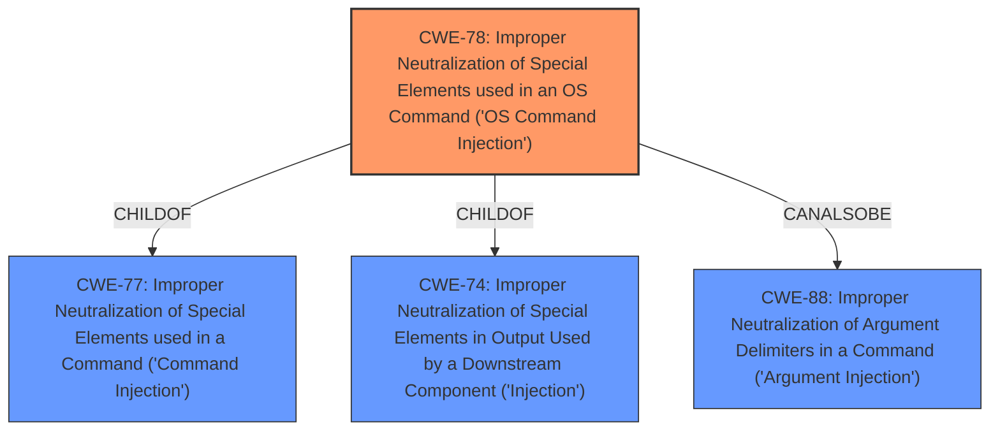

# Analysis Report for CVE-2021-43162

# Vulnerability Analysis Report: CVE-2021-43162

## Description


## Analysis (with Relationship Data)

# Summary
| CWE ID | CWE Name | Confidence | CWE Abstraction Level | CWE Vulnerability Mapping Label | CWE-Vulnerability Mapping Notes |
|---|---|---|---|---|---|
| CWE-78 | Improper Neutralization of Special Elements used in an OS Command ('OS Command Injection') | 1.0 | Base | Allowed | Primary CWE |
| CWE-77 | Improper Neutralization of Special Elements used in a Command ('Command Injection') | 0.7 | Class | Allowed-with-Review | Secondary Candidate |
| CWE-74 | Improper Neutralization of Special Elements in Output Used by a Downstream Component ('Injection') | 0.5 | Class | Discouraged | Secondary Candidate |

## Evidence and Confidence

*   **Confidence Score:** 1.0
*   **Evidence Strength:** HIGH

## Relationship Analysis
The primary CWE selected is CWE-78, which is a Base level weakness and a child of CWE-77. CWE-77 is a Class level weakness. CWE-78 is more specific because it is directly related to OS commands, while CWE-77 is more general. The relationship between CWE-78 and CWE-77 influenced the decision to choose CWE-78 as the primary mapping, due to its higher specificity. CWE-78 can also be related to CWE-88 (Improper Neutralization of Argument Delimiters in a Command ('Argument Injection')). CWE-74 is a high-level class and parent of CWE-78 and was considered but not selected as the primary CWE.



## Vulnerability Chain
The vulnerability chain begins with the **improper neutralization** of special elements within the `runPackDiagnose` function, leading to **OS command injection**. This ultimately results in **remote code execution**. The root cause is the **improper handling** of user-supplied input when constructing OS commands.

## Summary of Analysis
The analysis is based on the provided evidence which is rated as HIGH. The "CVE Reference Links Content Summary" clearly states that the root cause is a command injection flaw within the `runPackDiagnose` function, allowing an attacker to execute arbitrary commands on the system.

> The vulnerability is a command injection flaw within the `runPackDiagnose` function. This function is located in the `/usr/lib/lua/luci/modules/diagnose.lua` file.

> **Command Injection:** The `runPackDiagnose` function appears to be susceptible to command injection, allowing an attacker to execute arbitrary commands on the system.

> **Remote Code Execution (RCE):** Successful exploitation of this vulnerability allows an attacker to execute arbitrary code on the affected device.

The retriever results and graph relationships influenced the final selection. CWE-78 is the most specific and accurate representation of the vulnerability, as it directly addresses the **improper neutralization** of special elements in OS commands. The selected CWE is at the optimal level of specificity (Base). CWE-77 was considered as a more general case of command injection, but CWE-78 was preferred because the injection specifically targets OS commands. CWE-74 was also considered but deemed too general.

Relevant CWE Information:

# Enhanced Context (25 CWEs)

## CWE-184: Incomplete List of Disallowed Inputs
CWE-184 was considered because command injection can be related to an incomplete list of disallowed characters. However, the primary issue is the **improper neutralization** rather than an incomplete list, so it was not selected.

## CWE-41: Improper Resolution of Path Equivalence
CWE-41 was not selected because the vulnerability is not related to path equivalence.

## CWE-23: Relative Path Traversal
CWE-23 was not selected because the vulnerability is not related to path traversal.

## CWE-73: External Control of File Name or Path
CWE-73 was not selected because the vulnerability is not related to external control of file names or paths.

## CWE-74: Improper Neutralization of Special Elements in Output Used by a Downstream Component ('Injection')
CWE-74 was considered as a parent of CWE-78. However, CWE-78 is a more specific Base level weakness, making it a better fit than the more general Class level CWE-74.

## CWE-138: Improper Neutralization of Special Elements
CWE-138 was not selected because it's a class level CWE, and more specific options exist.

## CWE-59: Improper Link Resolution Before File Access ('Link Following')
CWE-59 was not selected because the vulnerability is not related to link resolution.

## CWE-36: Absolute Path Traversal
CWE-36 was not selected because the vulnerability is not related to path traversal.

## CWE-427: Uncontrolled Search Path Element
CWE-427 was not selected because the vulnerability is not related to search paths.

## CWE-923: Improper Restriction of Communication Channel to Intended Endpoints
CWE-923 was not selected because the vulnerability is not related to communication channels.

## CWE-22: Improper Limitation of a Pathname to a Restricted Directory ('Path Traversal')
CWE-22 was not selected because the vulnerability is not related to path traversal.

## CWE-1336: Improper Neutralization of Special Elements Used in a Template Engine
CWE-1336 was not selected because the vulnerability is not related to template engines.

## CWE-88: Improper Neutralization of Argument Delimiters in a Command ('Argument Injection')
CWE-88 could potentially be related, but the core issue is the injection of commands, not necessarily argument delimiters.

## CWE-78: Improper Neutralization of Special Elements used in an OS Command ('OS Command Injection')
CWE-78 is the selected CWE.

## CWE-98: Improper Control of Filename for Include/Require Statement in PHP Program ('PHP Remote File Inclusion')
CWE-98 was not selected because the vulnerability is not specific to PHP or file inclusion.

## CWE-94: Improper Control of Generation of Code ('Code Injection')
CWE-94 was not selected because although the impact is code execution, the root cause is command injection.

## CWE-79: Improper Neutralization of Input During Web Page Generation ('Cross-site Scripting')
CWE-79 was not selected because the vulnerability is not related to cross-site scripting.

## CWE-434: Unrestricted Upload of File with Dangerous Type
CWE-434 was not selected because the vulnerability is not related to file uploads.

## CWE-917: Improper Neutralization of Special Elements used in an Expression Language Statement ('Expression Language Injection')
CWE-917 was not selected because the vulnerability is not related to expression language injection.

## CWE-426: Untrusted Search Path
CWE-426 was not selected because the vulnerability is not related to search paths.


## CWE Relationship Analysis

Current CWEs represent these abstraction levels: .


### Vulnerability Chain Analysis

**Chain starting from CWE-36:**
- 36 (Absolute Path Traversal) - ROOT


**Chain starting from CWE-434:**
- 434 (Unrestricted Upload of File with Dangerous Type) - ROOT


### CWE Relationship Diagram

```mermaid
graph TD
    classDef primary fill:#f96,stroke:#333,stroke-width:2px
    classDef secondary fill:#69f,stroke:#333
    classDef tertiary fill:#9e9,stroke:#333
```


*Report generated on 2025-04-02 05:49:21*
