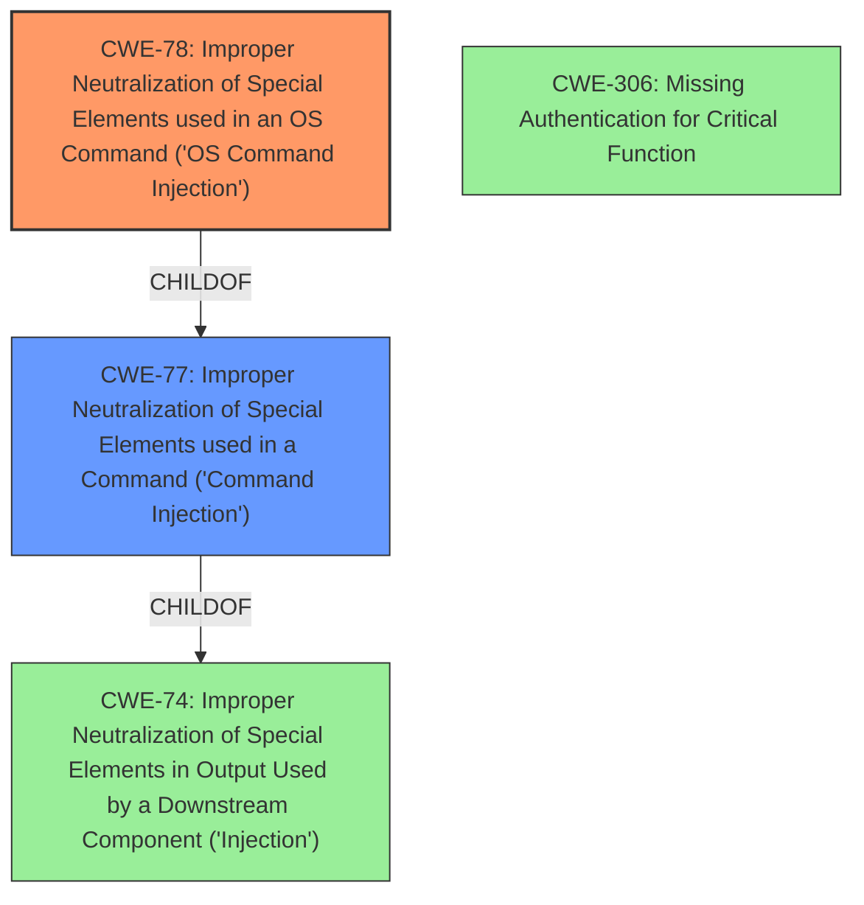

# Analysis for CVE-2021-43163

# Summary
| CWE ID | CWE Name | Confidence | CWE Abstraction Level | CWE Vulnerability Mapping Label | CWE-Vulnerability Mapping Notes |
|---|---|---|---|---|---|
| CWE-78 | Improper Neutralization of Special Elements used in an OS Command ('OS Command Injection') | 1 | Base | Allowed | Primary CWE |
| CWE-77 | Improper Neutralization of Special Elements used in a Command ('Command Injection') | 0.75 | Class | Allowed-with-Review | Secondary Candidate |
| CWE-306 | Missing Authentication for Critical Function | 0.5 | Base | Allowed | Secondary Candidate |

## Evidence and Confidence

*   **Confidence Score:** 0.85
*   **Evidence Strength:** HIGH

## Relationship Analysis
The primary CWE is CWE-78, which is a base-level CWE, making it more specific than its parent, CWE-77. CWE-78 directly addresses the **improper neutralization** of OS commands, which aligns with the vulnerability description. CWE-78 is a child of CWE-77, and CWE-77 is a child of CWE-74. The relationships here are primarily hierarchical and help refine the focus from a general injection issue (CWE-74) to the specific case of OS command injection (CWE-78). CWE-306 represents an additional factor, the **missing authentication**, that exacerbates the issue.

## Vulnerability Chain
The vulnerability chain starts with the **improper handling of input** within the `checkNet` function, leading to **OS command injection**. The absence of authentication further facilitates the exploit.

Root Cause: **Improper Neutralization** (CWE-78)
|
Impact: Remote Code Execution (RCE)

CWE-306 is included because the vulnerability is pre-authentication, which means the **missing authentication** contributes to the exploitability of the **command injection**.

## Summary of Analysis
The initial assessment identified command injection as the primary issue. The retriever results and the CVE description both support this assessment. The vulnerability description explicitly mentions **command injection** in the `checkNet` function. The CVE Reference Links Content Summary confirms this, stating that the vulnerability stems from **command injection** and that the `checkNet` function improperly handles input, allowing the injection of arbitrary shell commands. This directly aligns with the description of CWE-78.

CWE-78 is selected because it is the most specific and accurate representation of the vulnerability, focusing on the **improper neutralization** of OS commands. The confidence in this mapping is high (0.85) due to the clear evidence of **command injection** in the vulnerability description and supporting documentation.

CWE-77 was considered but ultimately ranked as secondary, as it is a broader category that includes other types of command injection, whereas the evidence points specifically to OS command injection. The Mapping Guidance for CWE-77 suggests that CWE-78 may be more appropriate, further supporting this decision.

CWE-306 was considered because the exploit is pre-authentication. This absence of authentication allows attackers to directly exploit the **command injection vulnerability** without needing credentials, which significantly increases the attack surface.

The selection of CWE-78 is at the optimal level of specificity because it directly addresses the root cause of the vulnerability, which is the **improper handling of OS commands**. This aligns with MITRE's guidance to choose the most specific CWE that accurately represents the weakness.

Relevant CWE Information:

## CWE-78: Improper Neutralization of Special Elements used in an OS Command ('OS Command Injection')
**Abstraction:** Base
**Status:** Stable

### Description
The product constructs all or part of an OS command using externally-influenced input from an upstream component, but it does not neutralize or incorrectly neutralizes special elements that could modify the intended OS command when it is sent to a downstream component.