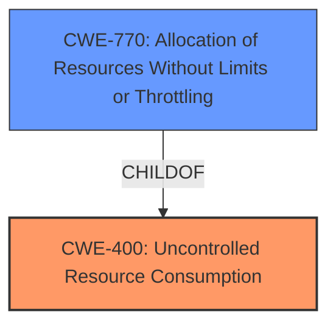

# Analysis for CVE-2021-43173

# Summary
| CWE ID | CWE Name | Confidence | CWE Abstraction Level | CWE Vulnerability Mapping Label | CWE-Vulnerability Mapping Notes |
|---|---|---|---|---|---|
| CWE-400 | Uncontrolled Resource Consumption | 0.9 | Class | Primary CWE | Allowed-with-Review |
| CWE-770 | Allocation of Resources Without Limits or Throttling | 0.8 | Base | Secondary Candidate CWE | Allowed |

## Evidence and Confidence

*   **Confidence Score:** 0.9
*   **Evidence Strength:** HIGH

## Relationship Analysis
The primary relationship influencing the decision is the parent-child relationship between CWE-400 and CWE-770. CWE-400 (Uncontrolled Resource Consumption) is a Class-level CWE, while CWE-770 (Allocation of Resources Without Limits or Throttling) is a Base-level CWE and a child of CWE-400. The Retriever results suggest both CWEs, but given the specific nature of the vulnerability involving allocation without limits, CWE-770 is considered as a good secondary candidate. While CWE-400 is broader, it still accurately describes the vulnerability.

## Vulnerability Chain
The vulnerability chain starts with the **weakness** in timeout handling, leading to a **validation delay** and culminating in a **denial of service**.

1.  **Inadequate Timeout Handling:** The timeout mechanism only applies to individual read/write operations instead of the entire request.
2.  **Uncontrolled Resource Consumption (CWE-400):** Because there isn't a proper timeout mechanism for the entire request, the connection is allowed to stay open indefinitely, consuming resources.
3.  **Stalled Validation:** The RRDP update process stalls because the connection remains open.
4.  **Denial of Service:** Routinator continues to serve old data or fails to serve any data at all, causing a denial of service.

## Summary of Analysis
The initial analysis focused on the **weakness** where the timeout mechanism was only being applied to the read/write operations and not the entire request. This resulted in the RRDP repository being able to drip-feed bytes to keep the connection alive, stalling the validation process and leading to a denial of service.

The evidence strongly supports the classification of CWE-400 (Uncontrolled Resource Consumption) as the primary CWE. The CVE Reference Links Content Summary explicitly states that the root cause is related to **inadequate timeout handling**, allowing connections to remain active indefinitely. The **impact** is a denial of service due to stalled validation. The vulnerability description key phrases also reinforce this, highlighting the **validation delay** and the resulting **stall validation**.

The graph relationships also played a role in determining the specificity of the CWE. While CWE-400 is a Class-level CWE, it accurately represents the broader issue of uncontrolled resource usage. Given the more specific nature of the vulnerability relating to allocating resources without limits or throttling, CWE-770 (Allocation of Resources Without Limits or Throttling) was considered and deemed to be a good secondary candidate.

The chosen CWEs are at the optimal level of specificity because they capture the core **weakness** of the vulnerability: the lack of proper resource control leading to a denial of service. The evidence directly supports this classification, and the relationships between the CWEs provide additional context and clarity.

Relevant CWE Information:

# Enhanced Context (25 CWEs)
The following CWEs were identified as potentially relevant to this vulnerability:

## CWE-404: Improper Resource Shutdown or Release
CWE-404 is not selected because the issue is not about improper shutdown, but more about improper control during the lifetime of the resource.

## CWE-1289: Improper Validation of Unsafe Equivalence in Input
CWE-1289 is not selected because the issue is not about validating unsafe equivalence in input.

## CWE-664: Improper Control of a Resource Through its Lifetime
CWE-664 is not selected because it is too high-level.

## CWE-226: Sensitive Information in Resource Not Removed Before Reuse
CWE-226 is not selected because the issue is not about sensitive information.

## CWE-667: Improper Locking
CWE-667 is not selected because the issue is not about improper locking.

## CWE-668: Exposure of Resource to Wrong Sphere
CWE-668 is not selected because the issue is not about exposing resources to the wrong sphere.

## CWE-41: Improper Resolution of Path Equivalence
CWE-41 is not selected because the issue is not about file system paths.

## CWE-703: Improper Check or Handling of Exceptional Conditions
CWE-703 is not selected because it is too high-level and general.

## CWE-407: Inefficient Algorithmic Complexity
CWE-407 is not selected because the issue is not about algorithmic complexity.

## CWE-131: Incorrect Calculation of Buffer Size
CWE-131 is not selected because the issue is not about buffer size calculation.

## CWE-1251: Mirrored Regions with Different Values
CWE-1251 is not selected because the issue is not about mirrored regions.

## CWE-789: Memory Allocation with Excessive Size Value
CWE-789 is not selected as a primary because, while memory allocation is involved, the core issue is the lack of limits, not the excessive size.

## CWE-1284: Improper Validation of Specified Quantity in Input
CWE-1284 is not selected because the vulnerability is not directly related to validating a specified quantity.

## CWE-835: Loop with Unreachable Exit Condition ('Infinite Loop')
CWE-835 is not selected because the vulnerability is not directly about an infinite loop. While the stalled connection *can* be seen as an infinite loop, it's a consequence, not the root cause.

## CWE-770: Allocation of Resources Without Limits or Throttling
CWE-770 is being considered as a good secondary candidate.

## CWE-1325: Improperly Controlled Sequential Memory Allocation
CWE-1325 is not selected because the vulnerability is not specifically about sequential memory allocation.

## CWE-190: Integer Overflow or Wraparound
CWE-190 is not selected because there is no evidence of an integer overflow.

## CWE-193: Off-by-one Error
CWE-193 is not selected because there is no evidence of an off-by-one error.

## CWE-476: NULL Pointer Dereference
CWE-476 is not selected because there is no evidence of a NULL pointer dereference.

## CWE-410: Insufficient Resource Pool
CWE-410 is not selected because the issue is not about an insufficient resource pool.

## CWE-295: Improper Certificate Validation
CWE-295 is not selected because certificate validation is not involved.

## CWE-322: Key Exchange without Entity Authentication
CWE-322 is not selected because key exchange is not involved.

## CWE-125: Out-of-bounds Read
CWE-125 is not selected because there is no evidence of out-of-bounds read.

# Enhanced Query for CVE-2021-43173

## Vulnerability Description
In NLnet Labs Routinator prior to 0.10.2, a validation run can be delayed significantly by an RRDP repository by not answering but slowly drip-feeding bytes to keep the connection alive. This can be used to effectively stall validation. While Routinator has a configurable time-out value for RRDP connections, this time-out was only applied to individual read or write operations rather than the complete request. Thus, if an RRDP repository sends a little bit of data before that time-out expired, it can continuously extend the time it takes for the request to finish. Since validation will only continue once the update of an RRDP repository has concluded, this delay will cause validation to stall, leading to Routinator continuing to serve the old data set or, if in the initial validation run directly after starting, never serve any data at all.

### Vulnerability Description Key Phrases
- **weakness:** **validation delay**
- **impact:** stall validation
- **vector:** slowly drip-feeding bytes
- **attacker:** RRDP repository
- **product:** NLnet Labs Routinator
- **version:** prior to 0.10.2

## CVE Reference Links Content Summary
Based on the provided information, here's an analysis of CVE-2021-43173:

**Root Cause:**

*   The vulnerability stems from a flaw in how Routinator handles RRDP (Resource Public Key Infrastructure Repository Delta Protocol) connections. Specifically, the timeout mechanism only applied to individual read/write operations and not the entire request.

**Weaknesses/Vulnerabilities:**

*   **Inadequate timeout handling:** The timeout mechanism only applied to individual read or write operations and not the entire request, allowing for a connection to remain active indefinitely as long as data was being received.

**Impact of Exploitation:**

*   **Denial of Service (DoS):** A malicious or compromised RRDP repository can exploit this by slowly sending small amounts of data. This keeps the connection alive and prevents the validation process from completing. The result is that Routinator will continue to serve old data, or, during initial startup, may never serve any data at all.
*   **Stalled Validation:** By delaying the RRDP update process, the validation process stalls.

**Attack Vectors:**

*   **Malicious RRDP Repository:** A compromised or attacker-controlled RRDP repository is required to execute the attack.
*   **Slow Data Drip:** The attack consists of the RRDP server sending small amounts of data to keep the connection alive, while delaying the overall response.

**Required Attacker Capabilities/Position:**

*   The attacker needs to control or have access to a valid RRDP repository.
*   The attacker must be able to respond to the Routinator's requests.
*   The attacker does not need to be on the same network.

**Summary of CVE-2021-43173:**

Routinator did not apply connection timeouts correctly. An attacker-controlled RRDP repository could exploit this by slowly sending data to keep the connection open indefinitely, preventing Routinator from completing the validation process and leading to a denial-of-service condition. This vulnerability is a denial of service due to stalled validation.

## Retriever Results

### Top Combined Results

| Rank | CWE ID | Name | Abstraction | Usage  | Retrievers | Individual Scores |
|------|--------|------|-------------|-------|------------|-------------------|
| 1 | 835 | Loop with Unreachable Exit Condition ('Infinite Loop') | Base | Allowed | sparse | 0.842 |
| 2 | 400 | Uncontrolled Resource Consumption | Class | Discouraged | sparse | 0.765 |
| 3 | 1284 | Improper Validation of Specified Quantity in Input | Base | Allowed | sparse | 0.634 |
| 4 | 125 | Out-of-bounds Read | Base | Allowed | sparse | 0.626 |
| 5 | 367 | Time-of-check Time-of-use (TOCTOU) Race Condition | Base | Allowed | sparse | 0.625 |
| 6 | 1288 | Improper Validation of Consistency within Input | Base | Allowed | dense | 0.408 |
| 7 | 789 | Memory Allocation with Excessive Size Value | Variant | Allowed | graph | 0.003 |
| 8 | 1333 | Inefficient Regular Expression Complexity | Base | Allowed | sparse | 0.617 |
| 9 | 295 | Improper Certificate Validation | Base | Allowed | sparse | 0.612 |
| 10 | 1251 | Mirrored Regions with Different Values | Base | Allowed | sparse | 0.611 |

# Complete CWE Specifications

## CWE-835: Loop with Unreachable Exit Condition ('Infinite Loop')
**Abstraction:** Base
**Status:** Incomplete

### Description
The product contains an iteration or loop with an exit condition that cannot be reached, i.e., an infinite loop.

### Extended Description
Not provided

### Alternative Terms
None

### Relationships
ChildOf -> CWE-834
ChildOf -> CWE-834

### Mapping Guidance
**Usage:** Allowed
**Rationale:** This CWE entry is at the Base level of abstraction, which is a preferred level of abstraction for mapping to the root causes of vulnerabilities.
**Comments:** Carefully read both the name and description to ensure that this mapping is an appropriate fit. Do not try to 'force' a mapping to a lower-level Base/Variant simply to comply with this preferred level of abstraction.
**Reasons:**
- Acceptable-Use

### Observed Examples
- **CVE-2022-22224:** Chain: an operating system does not properly process malformed Open Shortest Path First (OSPF) Type/Length/Value Identifiers (TLV) (CWE-703), which can cause the process to enter an infinite loop (CWE-835)
- **CVE-2022-25304:** A Python machine communication platform did not account for receiving a malformed packet with a null size, causing the receiving function to never update the message buffer and be caught in an infinite loop.
- **CVE-2011-1027:** Chain: off-by-one error (CWE-193) leads to infinite loop (CWE-835) using invalid hex-encoded characters.

## CWE-400: Uncontrolled Resource Consumption
**Abstraction:** Class
**Status:** Draft

### Description
The product does not properly control the allocation and maintenance of a limited resource, thereby enabling an actor to influence the amount of resources consumed, eventually leading to the exhaustion of available resources.

### Extended Description

Limited resources include memory, file system storage, database connection pool entries, and CPU. If an attacker can trigger the allocation of these limited resources, but the number or size of the resources is not controlled, then the attacker could cause a denial of service that consumes all available resources. This would prevent valid users from accessing the product, and it could potentially have an impact on the surrounding environment. For example, a memory exhaustion attack against an application could slow down the application as well as its host operating system.

There are at least three distinct scenarios which can commonly lead to resource exhaustion:

  - Lack of throttling for the number of allocated resources

  - Losing all references to a resource before reaching the shutdown stage

  - Not closing/returning a resource after processing

Resource exhaustion problems are often result due to an incorrect implementation of the following situations:

  - Error conditions and other exceptional circumstances.

  - Confusion over which part of the program is responsible for releasing the resource.

### Alternative Terms
Resource Exhaustion

### Relationships
ChildOf -> CWE-664

### Mapping Guidance
**Usage:** Discouraged
**Rationale:** CWE-400 is intended for incorrect behaviors in which the product is expected to track and restrict how many resources it consumes, but CWE-400 is often misused because it is conflated with the "technical impact" of vulnerabilities in which resource consumption occurs. It is sometimes used for low-information vulnerability reports. It is a level-1 Class (i.e., a child of a Pillar).
**Comments:** Closely analyze the specific mistake that is causing resource consumption, and perform a CWE mapping for that mistake. Consider children/descendants such as CWE-770: Allocation of Resources Without Limits or Throttling, CWE-771: Missing Reference to Active Allocated Resource, CWE-410: Insufficient Resource Pool, CWE-772: Missing Release of Resource after Effective Lifetime, CWE-834: Excessive Iteration, CWE-405: Asymmetric Resource Consumption (Amplification), and others.
**Reasons:**
- Frequent Misuse

### Additional Notes
**[Maintenance]** "Resource consumption" could be interpreted as a consequence instead of an insecure behavior, so this entry is being considered for modification. It appears to be referenced too frequently when more precise mappings are available. Some of its children, such as CWE-771, might be better considered as a chain.

**[Theoretical]** Vulnerability theory is largely about how behaviors and resources interact. "Resource exhaustion" can be regarded as either a consequence or an attack, depending on the perspective. This entry is an attempt to reflect the underlying weaknesses that enable these attacks (or consequences) to take place.

**[Other]** 

Database queries that take a long time to process are good DoS targets. An attacker would have to write a few lines of Perl code to generate enough traffic to exceed the site's ability to keep up. This would effectively prevent authorized users from using the site at all. Resources can be exploited simply by ensuring that the target machine must do much more work and consume more resources in order to service a request than the attacker must do to initiate a request.

A prime example of this can be found in old switches that were vulnerable to "macof" attacks (so named for a tool developed by Dugsong). These attacks flooded a switch with random IP and MAC address combinations, therefore exhausting the switch's cache, which held the information of which port corresponded to which MAC addresses. Once this cache was exhausted, the switch would fail in an insecure way and would begin to act simply as a hub, broadcasting all traffic on all ports and allowing for basic sniffing attacks.

**[Maintenance]** The Taxonomy_Mappings to ISA/IEC 62443 were added in CWE 4.10, but they are still under review and might change in future CWE versions. These draft mappings were performed by members of the "Mapping CWE to 62443" subgroup of the CWE-CAPEC ICS/OT Special Interest Group (SIG), and their work is incomplete as of CWE 4.10. The mappings are included to facilitate discussion and review by the broader ICS/OT community, and they are likely to change in future CWE versions.

### Observed Examples
- **CVE-2022-21668:** Chain: Python library does not limit the resources used to process images that specify a very large number of bands (CWE-1284), leading to excessive memory consumption (CWE-789) or an integer overflow (CWE-190).
- **CVE-2020-7218:** Go-based workload orchestrator does not limit resource usage with unauthenticated connections, allowing a DoS by flooding the service
- **CVE-2020-3566:** Resource exhaustion in distributed OS because of "insufficient" IGMP queue management, as exploited in the wild per CISA KEV.

## CWE-1284: Improper Validation of Specified Quantity in Input
**Abstraction:** Base
**Status:** Incomplete

### Description
The product receives input that is expected to specify a quantity (such as size or length), but it does not validate or incorrectly validates that the quantity has the required properties.

### Extended Description

Specified quantities include size, length, frequency, price, rate, number of operations, time, and others. Code may rely on specified quantities to allocate resources, perform calculations, control iteration, etc. When the quantity is not properly validated, then attackers can specify malicious quantities to cause excessive resource allocation, trigger unexpected failures, enable buffer overflows, etc.

### Alternative Terms
None

### Relationships
ChildOf -> CWE-20
ChildOf -> CWE-20
CanPrecede -> CWE-789

### Mapping Guidance
**Usage:** Allowed
**Rationale:** This CWE entry is at the Base level of abstraction, which is a preferred level of abstraction for mapping to the root causes of vulnerabilities.
**Comments:** Carefully read both the name and description to ensure that this mapping is an appropriate fit. Do not try to 'force' a mapping to a lower-level Base/Variant simply to comply with this preferred level of abstraction.
**Reasons:**
- Acceptable-Use

### Additional Notes
**[Maintenance]** This entry is still under development and will continue to see updates and content improvements.

### Observed Examples
- **CVE-2022-21668:** Chain: Python library does not limit the resources used to process images that specify a very large number of bands (CWE-1284), leading to excessive memory consumption (CWE-789) or an integer overflow (CWE-190).
- **CVE-2008-1440:** lack of validation of length field leads to infinite loop
- **CVE-2008-2374:** lack of validation of string length fields allows memory consumption or buffer over-read

## CWE-125: Out-of-bounds Read
**Abstraction:** Base
**Status:** Draft

### Description
The product reads data past the end, or before the beginning, of the intended buffer.

### Extended Description
Not provided

### Alternative Terms
OOB read: Shorthand for "Out of bounds" read

### Relationships
ChildOf -> CWE-119
ChildOf -> CWE-119
ChildOf -> CWE-119
ChildOf -> CWE-119

### Mapping Guidance
**Usage:** Allowed
**Rationale:** This CWE entry is at the Base level of abstraction, which is a preferred level of abstraction for mapping to the root causes of vulnerabilities.
**Comments:** Carefully read both the name and description to ensure that this mapping is an appropriate fit. Do not try to 'force' a mapping to a lower-level Base/Variant simply to comply with this preferred level of abstraction.
**Reasons:**
- Acceptable-Use

### Observed Examples
- **CVE-2023-1018:** The reference implementation code for a Trusted Platform Module does not implement length checks on data, allowing for an attacker to read 2 bytes past the end of a buffer.
- **CVE-2020-11899:** Out-of-bounds read in IP stack used in embedded systems, as exploited in the wild per CISA KEV.
- **CVE-2014-0160:** Chain: "Heartbleed" bug receives an inconsistent length parameter (CWE-130) enabling an out-of-bounds read (CWE-126), returning memory that could include private cryptographic keys and other sensitive data.

## CWE-367: Time-of-check Time-of-use (TOCTOU) Race Condition
**Abstraction:** Base
**Status:** Incomplete

### Description
The product checks the state of a resource before using that resource, but the resource's state can change between the check and the use in a way that invalidates the results of the check. This can cause the product to perform invalid actions when the resource is in an unexpected state.

### Extended Description
This weakness can be security-relevant when an attacker can influence the state of the resource between check and use. This can happen with shared resources such as files, memory, or even variables in multithreaded programs.

### Alternative Terms
TOCTTOU: The TOCTTOU acronym expands to "Time Of Check To Time Of Use".
TOCCTOU: The TOCCTOU acronym is most likely a typo of TOCTTOU, but it has been used in some influential documents, so the typo is repeated fairly frequently.

### Relationships
ChildOf -> CWE-362
ChildOf -> CWE-362

### Mapping Guidance
**Usage:** Allowed
**Rationale:** This CWE entry is at the Base level of abstraction, which is a preferred level of abstraction for mapping to the root causes of vulnerabilities.
**Comments:** Carefully read both the name and description to ensure that this mapping is an appropriate fit. Do not try to 'force' a mapping to a lower-level Base/Variant simply to comply with this preferred level of abstraction.
**Reasons:**
- Acceptable-Use

### Additional Notes
**[Relationship]** TOCTOU issues do not always involve symlinks, and not every symlink issue is a TOCTOU problem.

**[Research Gap]** Non-symlink TOCTOU issues are not reported frequently, but they are likely to occur in code that attempts to be secure.

### Observed Examples
- **CVE-2015-1743:** TOCTOU in sandbox process allows installation of untrusted browser add-ons by replacing a file after it has been verified, but before it is executed
- **CVE-2003-0813:** A multi-threaded race condition allows remote attackers to cause a denial of service (crash or reboot) by causing two threads to process the same RPC request, which causes one thread to use memory after it has been freed.
- **CVE-2004-0594:** PHP flaw allows remote attackers to execute arbitrary code by aborting execution before the initialization of key data structures is complete.

## CWE-1288: Improper Validation of Consistency within Input
**Abstraction:** Base
**Status:** Incomplete

### Description
The product receives a complex input with multiple elements or fields that must be consistent with each other, but it does not validate or incorrectly validates that the input is actually consistent.

### Extended Description

Some input data can be structured with multiple elements or fields that must be consistent with each other, e.g. a number-of-items field that is followed by the expected number of elements. When such complex inputs are inconsistent, attackers could trigger unexpected errors, cause incorrect actions to take place, or exploit latent vulnerabilities.

### Alternative Terms
None

### Relationships
ChildOf -> CWE-20

### Mapping Guidance
**Usage:** Allowed
**Rationale:** This CWE entry is at the Base level of abstraction, which is a preferred level of abstraction for mapping to the root causes of vulnerabilities.
**Comments:** Carefully read both the name and description to ensure that this mapping is an appropriate fit. Do not try to 'force' a mapping to a lower-level Base/Variant simply to comply with this preferred level of abstraction.
**Reasons:**
- Acceptable-Use

### Additional Notes
**[Maintenance]** This entry is still under development and will continue to see updates and content improvements.

### Observed Examples
- **CVE-2018-16733:** product does not validate that the start block appears before the end block
- **CVE-2006-3790:** size field that is inconsistent with packet size leads to buffer over-read
- **CVE-2008-4114:** system crash with offset value that is inconsistent with packet size

## CWE-789: Memory Allocation with Excessive Size Value
**Abstraction:** Variant
**Status:** Draft

### Description
The product allocates memory based on an untrusted, large size value, but it does not ensure that the size is within expected limits, allowing arbitrary amounts of memory to be allocated.

### Extended Description
Not provided

### Alternative Terms
Stack Exhaustion: When a weakness allocates excessive memory on the stack, it is often described as "stack exhaustion," which is a technical impact of the weakness. This technical impact is often encountered as a consequence of CWE-789 and/or CWE-1325.

### Relationships
ChildOf -> CWE-770
CanPrecede -> CWE-476

### Mapping Guidance
**Usage:** Allowed
**Rationale:** This CWE entry is at the Variant level of abstraction, which is a preferred level of abstraction for mapping to the root causes of vulnerabilities.
**Comments:** Carefully read both the name and description to ensure that this mapping is an appropriate fit. Do not try to 'force' a mapping to a lower-level Base/Variant simply to comply with this preferred level of abstraction.
**Reasons:**
- Acceptable-Use

### Additional Notes
**[Relationship]** This weakness can be closely associated with integer overflows (CWE-190). Integer overflow attacks would concentrate on providing an extremely large number that triggers an overflow that causes less memory to be allocated than expected. By providing a large value that does not trigger an integer overflow, the attacker could still cause excessive amounts of memory to be allocated.

**[Applicable Platform]** 

Uncontrolled memory allocation is possible in many languages, such as dynamic array allocation in perl or initial size parameters in Collections in Java. However, languages like C and C++ where programmers have the power to more directly control memory management will be more susceptible.

### Observed Examples
- **CVE-2022-21668:** Chain: Python library does not limit the resources used to process images that specify a very large number of bands (CWE-1284), leading to excessive memory consumption (CWE-789) or an integer overflow (CWE-190).
- **CVE-2010-3701:** program uses ::alloca() for encoding messages, but large messages trigger segfault
- **CVE-2008-1708:** memory consumption and daemon exit by specifying a large value in a length field

## CWE-1333: Inefficient Regular Expression Complexity
**Abstraction:** Base
**Status:** Draft

### Description
The product uses a regular expression with an inefficient, possibly exponential worst-case computational complexity that consumes excessive CPU cycles.

### Extended Description
Some regular expression engines have a feature called "backtracking". If the token cannot match, the engine "backtracks" to a position that may result in a different token that can match.
 Backtracking becomes a weakness if all of these conditions are met:

  - The number of possible backtracking attempts are exponential relative to the length of the input.

  - The input can fail to match the regular expression.

  - The input can be long enough.

 Attackers can create crafted inputs that intentionally cause the regular expression to use excessive backtracking in a way that causes the CPU consumption to spike. 

### Alternative Terms
ReDoS: ReDoS is an abbreviation of "Regular expression Denial of Service".
Regular Expression Denial of Service: While this term is attack-focused, this is commonly used to describe the weakness.
Catastrophic backtracking: This term is used to describe the behavior of the regular expression as a negative technical impact.

### Relationships
ChildOf -> CWE-407
ChildOf -> CWE-407

### Mapping Guidance
**Usage:** Allowed
**Rationale:** This CWE entry is at the Base level of abstraction, which is a preferred level of abstraction for mapping to the root causes of vulnerabilities.
**Comments:** Carefully read both the name and description to ensure that this mapping is an appropriate fit. Do not try to 'force' a mapping to a lower-level Base/Variant simply to comply with this preferred level of abstraction.
**Reasons:**
- Acceptable-Use

### Observed Examples
- **CVE-2020-5243:** server allows ReDOS with crafted User-Agent strings, due to overlapping capture groups that cause excessive backtracking.
- **CVE-2021-21317:** npm package for user-agent parser prone to ReDoS due to overlapping capture groups
- **CVE-2019-16215:** Markdown parser uses inefficient regex when processing a message, allowing users to cause CPU consumption and delay preventing processing of other messages.

## CWE-295: Improper Certificate Validation
**Abstraction:** Base
**Status:** Draft

### Description
The product does not validate, or incorrectly validates, a certificate.

### Extended Description
When a certificate is invalid or malicious, it might allow an attacker to spoof a trusted entity by interfering in the communication path between the host and client. The product might connect to a malicious host while believing it is a trusted host, or the product might be deceived into accepting spoofed data that appears to originate from a trusted host.

### Alternative Terms
None

### Relationships
ChildOf -> CWE-287
ChildOf -> CWE-287
PeerOf -> CWE-322

### Mapping Guidance
**Usage:** Allowed
**Rationale:** This CWE entry is at the Base level of abstraction, which is a preferred level of abstraction for mapping to the root causes of vulnerabilities.
**Comments:** Carefully read both the name and description to ensure that this mapping is an appropriate fit. Do not try to 'force' a mapping to a lower-level Base/Variant simply to comply with this preferred level of abstraction.
**Reasons:**
- Acceptable-Use

### Observed Examples
- **CVE-2019-12496:** A Go framework for robotics, drones, and IoT devices skips verification of root CA certificates by default.
- **CVE-2014-1266:** chain: incorrect "goto" in Apple SSL product bypasses certificate validation, allowing Adversary-in-the-Middle (AITM) attack (Apple "goto fail" bug). CWE-705 (Incorrect Control Flow Scoping) -> CWE-561 (Dead Code) -> CWE-295 (Improper Certificate Validation) -> CWE-393 (Return of Wrong Status Code) -> CWE-300 (Channel Accessible by Non-Endpoint).
- **CVE-2021-22909:** Chain: router's firmware update procedure uses curl with "-k" (insecure) option that disables certificate validation (CWE-295), allowing adversary-in-the-middle (AITM) compromise with a malicious firmware image (CWE-494).

## CWE-1251: Mirrored Regions with Different Values
**Abstraction:** Base
**Status:** Incomplete

### Description
The product's architecture mirrors regions without ensuring that their contents always stay in sync.

### Extended Description

Having mirrored regions with different values might result in the exposure of sensitive information or possibly system compromise.

In the interest of increased performance, one might need to duplicate a resource. A cache memory is a common example of this concept, which keeps a "local" copy of a data element in the high speed cache memory. Unfortunately, this speed improvement comes with a downside, since the product needs to ensure that the local copy always mirrors the original copy truthfully. If they get out of sync, the computational result is no longer true.

During hardware design, memory is not the only item which gets mirrored. There are many other entities that get mirrored, as well: registers, memory regions, and, in some cases, even whole computational units. For example, within a multi-core processor, if all memory accesses for each and every core goes through a single Memory-Management Unit (MMU) then the MMU will become a performance bottleneck. In such cases, duplicating local MMUs that will serve only a subset of the cores rather than all of them may resolve the performance issue. These local copies are also called "shadow copies" or "mirrored copies."

If the original resource never changed, local duplicate copies getting out of sync would never be an issue. However, the values of the original copy will sometimes change. When the original copy changes, the mirrored copies must also change, and change fast.

This situation of shadow-copy-possibly-out-of-sync-with-original-copy might occur as a result of multiple scenarios, including the following: 

  - After the values in the original copy change, due to some reason the original copy does not send the "update" request to its shadow copies.

  - After the values in the original copy change, the original copy dutifully sends the "update" request to its shadow copies, but due to some reason the shadow copy does not "execute" this update request.

  - After the values in the original copy change, the original copy sends the "update" request to its shadow copies, and the shadow copy executes this update request faithfully. However, during the small time period when the original copy has "new" values and the shadow copy is still holding the "old" values, an attacker can exploit the old values. Then it becomes a race condition between the attacker and the update process of who can reach the target, shadow copy first, and, if the attacker reaches first, the attacker wins.

  - The attacker might send a "spoofed" update request to the target shadow copy, pretending that this update request is coming from the original copy. This spoofed request might cause the targeted shadow copy to update its values to some attacker-friendly values, while the original copies remain unchanged by the attacker.

  - Suppose a situation where the original copy has a system of reverting back to its original value if it does not hear back from all the shadow copies that such copies have successfully completed the update request. In such a case, an attack might occur as follows: (1) the original copy might send an update request; (2) the shadow copy updates it; (3) the shadow copy sends back the successful completion message; (4) through a separate issue, the attacker is able to intercept the shadow copy's completion message. In this case, the original copy thinks that the update did not succeed, hence it reverts to its original value. Now there is a situation where the original copy has the "old" value, and the shadow copy has the "new" value.

### Alternative Terms
None

### Relationships
ChildOf -> CWE-1250

### Mapping Guidance
**Usage:** Allowed
**Rationale:** This CWE entry is at the Base level of abstraction, which is a preferred level of abstraction for mapping to the root causes of vulnerabilities.
**Comments:** Carefully read both the name and description to ensure that this mapping is an appropriate fit. Do not try to 'force' a mapping to a lower-level Base/Variant simply to comply with this preferred level of abstraction.
**Reasons:**
- Acceptable-Use

### Additional Notes
**[Research Gap]** Issues related to state and cache - creation, preservation, and update - are a significant gap in CWE that is expected to be addressed in future versions. It has relationships to concurrency and synchronization, incorrect behavior order, and other areas that already have some coverage in CWE, although the focus has typically been on independent processes on the same operating system - not on independent systems that are all a part of a larger system-of-systems.

