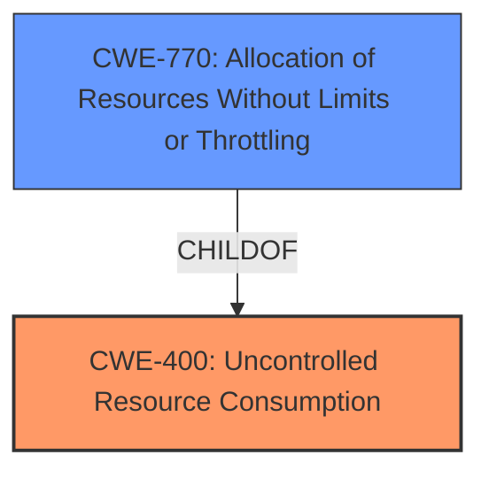

# Analysis Report for CVE-2021-43173

# Vulnerability Analysis Report: CVE-2021-43173

## Description


## Analysis (with Relationship Data)

# Summary
| CWE ID | CWE Name | Confidence | CWE Abstraction Level | CWE Vulnerability Mapping Label | CWE-Vulnerability Mapping Notes |
|---|---|---|---|---|---|
| CWE-400 | Uncontrolled Resource Consumption | 0.9 | Class | Primary CWE | Allowed-with-Review |
| CWE-770 | Allocation of Resources Without Limits or Throttling | 0.8 | Base | Secondary Candidate CWE | Allowed |

## Evidence and Confidence

*   **Confidence Score:** 0.9
*   **Evidence Strength:** HIGH

## Relationship Analysis
The primary relationship influencing the decision is the parent-child relationship between CWE-400 and CWE-770. CWE-400 (Uncontrolled Resource Consumption) is a Class-level CWE, while CWE-770 (Allocation of Resources Without Limits or Throttling) is a Base-level CWE and a child of CWE-400. The Retriever results suggest both CWEs, but given the specific nature of the vulnerability involving allocation without limits, CWE-770 is considered as a good secondary candidate. While CWE-400 is broader, it still accurately describes the vulnerability.



## Vulnerability Chain
The vulnerability chain starts with the **weakness** in timeout handling, leading to a **validation delay** and culminating in a **denial of service**.

1.  **Inadequate Timeout Handling:** The timeout mechanism only applies to individual read/write operations instead of the entire request.
2.  **Uncontrolled Resource Consumption (CWE-400):** Because there isn't a proper timeout mechanism for the entire request, the connection is allowed to stay open indefinitely, consuming resources.
3.  **Stalled Validation:** The RRDP update process stalls because the connection remains open.
4.  **Denial of Service:** Routinator continues to serve old data or fails to serve any data at all, causing a denial of service.

## Summary of Analysis
The initial analysis focused on the **weakness** where the timeout mechanism was only being applied to the read/write operations and not the entire request. This resulted in the RRDP repository being able to drip-feed bytes to keep the connection alive, stalling the validation process and leading to a denial of service.

The evidence strongly supports the classification of CWE-400 (Uncontrolled Resource Consumption) as the primary CWE. The CVE Reference Links Content Summary explicitly states that the root cause is related to **inadequate timeout handling**, allowing connections to remain active indefinitely. The **impact** is a denial of service due to stalled validation. The vulnerability description key phrases also reinforce this, highlighting the **validation delay** and the resulting **stall validation**.

The graph relationships also played a role in determining the specificity of the CWE. While CWE-400 is a Class-level CWE, it accurately represents the broader issue of uncontrolled resource usage. Given the more specific nature of the vulnerability relating to allocating resources without limits or throttling, CWE-770 (Allocation of Resources Without Limits or Throttling) was considered and deemed to be a good secondary candidate.

The chosen CWEs are at the optimal level of specificity because they capture the core **weakness** of the vulnerability: the lack of proper resource control leading to a denial of service. The evidence directly supports this classification, and the relationships between the CWEs provide additional context and clarity.

Relevant CWE Information:

# Enhanced Context (25 CWEs)
The following CWEs were identified as potentially relevant to this vulnerability:

## CWE-404: Improper Resource Shutdown or Release
CWE-404 is not selected because the issue is not about improper shutdown, but more about improper control during the lifetime of the resource.

## CWE-1289: Improper Validation of Unsafe Equivalence in Input
CWE-1289 is not selected because the issue is not about validating unsafe equivalence in input.

## CWE-664: Improper Control of a Resource Through its Lifetime
CWE-664 is not selected because it is too high-level.

## CWE-226: Sensitive Information in Resource Not Removed Before Reuse
CWE-226 is not selected because the issue is not about sensitive information.

## CWE-667: Improper Locking
CWE-667 is not selected because the issue is not about improper locking.

## CWE-668: Exposure of Resource to Wrong Sphere
CWE-668 is not selected because the issue is not about exposing resources to the wrong sphere.

## CWE-41: Improper Resolution of Path Equivalence
CWE-41 is not selected because the issue is not about file system paths.

## CWE-703: Improper Check or Handling of Exceptional Conditions
CWE-703 is not selected because it is too high-level and general.

## CWE-407: Inefficient Algorithmic Complexity
CWE-407 is not selected because the issue is not about algorithmic complexity.

## CWE-131: Incorrect Calculation of Buffer Size
CWE-131 is not selected because the issue is not about buffer size calculation.

## CWE-1251: Mirrored Regions with Different Values
CWE-1251 is not selected because the issue is not about mirrored regions.

## CWE-789: Memory Allocation with Excessive Size Value
CWE-789 is not selected as a primary because, while memory allocation is involved, the core issue is the lack of limits, not the excessive size.

## CWE-1284: Improper Validation of Specified Quantity in Input
CWE-1284 is not selected because the vulnerability is not directly related to validating a specified quantity.

## CWE-835: Loop with Unreachable Exit Condition ('Infinite Loop')
CWE-835 is not selected because the vulnerability is not directly about an infinite loop. While the stalled connection *can* be seen as an infinite loop, it's a consequence, not the root cause.

## CWE-770: Allocation of Resources Without Limits or Throttling
CWE-770 is being considered as a good secondary candidate.

## CWE-1325: Improperly Controlled Sequential Memory Allocation
CWE-1325 is not selected because the vulnerability is not specifically about sequential memory allocation.

## CWE-190: Integer Overflow or Wraparound
CWE-190 is not selected because there is no evidence of an integer overflow.

## CWE-193: Off-by-one Error
CWE-193 is not selected because there is no evidence of an off-by-one error.

## CWE-476: NULL Pointer Dereference
CWE-476 is not selected because there is no evidence of a NULL pointer dereference.

## CWE-410: Insufficient Resource Pool
CWE-410 is not selected because the issue is not about an insufficient resource pool.

## CWE-295: Improper Certificate Validation
CWE-295 is not selected because certificate validation is not involved.

## CWE-322: Key Exchange without Entity Authentication
CWE-322 is not selected because key exchange is not involved.

## CWE-125: Out-of-bounds Read
CWE-125 is not selected because there is no evidence of out-of-bounds read.


## CWE Relationship Analysis

Current CWEs represent these abstraction levels: .


### Vulnerability Chain Analysis

**Chain starting from CWE-404:**
- 404 (Improper Resource Shutdown or Release) - ROOT


**Chain starting from CWE-1284:**
- 1284 (Improper Validation of Specified Quantity in Input) - ROOT


### CWE Relationship Diagram

```mermaid
graph TD
    classDef primary fill:#f96,stroke:#333,stroke-width:2px
    classDef secondary fill:#69f,stroke:#333
    classDef tertiary fill:#9e9,stroke:#333
```


*Report generated on 2025-04-02 10:19:18*
