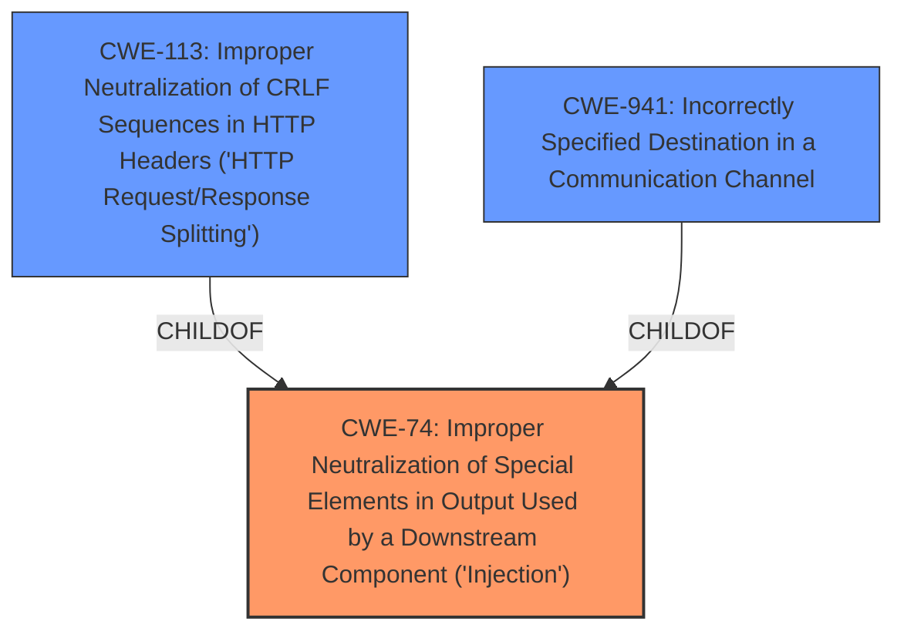

# Analysis Report for CVE-2021-43185

# Vulnerability Analysis Report: CVE-2021-43185

## Description


## Analysis (with Relationship Data)

# Summary
| CWE ID | CWE Name | Confidence | CWE Abstraction Level | CWE Vulnerability Mapping Label | CWE-Vulnerability Mapping Notes |
|---|---|---|---|---|---|
| CWE-74 | Improper Neutralization of Special Elements in Output Used by a Downstream Component ('Injection') | 0.75 | Class |  Primary | Allowed-with-Review, The vulnerability is due to **improper handling of the Host header**, which can lead to an **injection** vulnerability. |
| CWE-113 | Improper Neutralization of CRLF Sequences in HTTP Headers ('HTTP Request/Response Splitting') | 0.50 | Variant | Secondary | Allowed, This is a possible secondary CWE as the Host header could be manipulated with CRLF sequences to cause HTTP Request/Response Splitting. |
| CWE-941 | Incorrectly Specified Destination in a Communication Channel | 0.50 | Base | Secondary | Allowed, This is another possible secondary CWE since the Host header is used to specify the destination. |

## Evidence and Confidence

*   **Confidence Score:** 0.70
*   **Evidence Strength:** MEDIUM

## Relationship Analysis
The primary CWE chosen is CWE-74, which is a Class-level weakness related to injection. The secondary CWEs, CWE-113 and CWE-941, are related to the specific type of injection and the destination of the request, respectively.



## Vulnerability Chain
The vulnerability chain starts with the **improper handling of the Host header** (**ROOT CAUSE**). This leads to the possibility of **host header injection**, which allows an attacker to potentially redirect users to a malicious site or perform other attacks (**IMPACT**). The chain could also involve **CRLF injection** if the Host header is manipulated with CRLF sequences, leading to HTTP Request/Response Splitting.

## Summary of Analysis
The initial analysis indicates that the core issue is **improper handling of the Host header**, which is a form of **injection**. The "Vulnerability Description Key Phrases" mentions "**Host header injection**" as the **weakness**. The "CVE Reference Links Content Summary" section confirms that the **root cause** is "**Host header injection**".

The choice of CWE-74 as the primary CWE is based on the description of the vulnerability as a form of **injection**. While CWE-74 is a Class-level CWE, it serves as a general categorization for the type of vulnerability. Other CWEs like CWE-113 and CWE-941 were considered as secondary CWEs because they represent more specific aspects of the vulnerability, such as the possibility of CRLF injection and the incorrect specification of the destination.

The relationships between the CWEs support this decision. CWE-113 and CWE-941 are both children of CWE-74, indicating that they are specific types of injection vulnerabilities. The selection of CWE-74 is at an appropriate level of specificity, as it captures the general nature of the injection vulnerability without being overly specific about the exact type of injection or the destination of the request.

The MITRE mapping guidance for CWE-74 discourages its use when lower-level weaknesses are more appropriate. However, in this case, the evidence is not sufficient to pinpoint a more specific type of injection. Therefore, CWE-74 is chosen as the primary CWE with the understanding that it may be refined if more information becomes available.

The evidence supporting this decision is primarily from the "Vulnerability Description Key Phrases" and the "CVE Reference Links Content Summary" sections, which both mention "**Host header injection**" as the **root cause** of the vulnerability.


## CWE Relationship Analysis

Current CWEs represent these abstraction levels: .


### Vulnerability Chain Analysis

**Chain starting from CWE-113:**
- 113 (Improper Neutralization of CRLF Sequences in HTTP Headers ('HTTP Request/Response Splitting')) - ROOT


**Chain starting from CWE-74:**
- 74 (Improper Neutralization of Special Elements in Output Used by a Downstream Component ('Injection')) - ROOT


### CWE Relationship Diagram

```mermaid
graph TD
    classDef primary fill:#f96,stroke:#333,stroke-width:2px
    classDef secondary fill:#69f,stroke:#333
    classDef tertiary fill:#9e9,stroke:#333
```


*Report generated on 2025-04-02 06:57:07*
