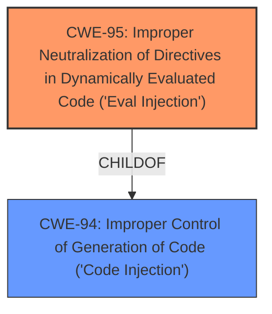

# Analysis for CVE-2021-43269

# Summary
| CWE ID | CWE Name | Confidence | CWE Abstraction Level | CWE Vulnerability Mapping Label | CWE-Vulnerability Mapping Notes |
|---|---|---|---|---|---|
| CWE-95 | Improper Neutralization of Directives in Dynamically Evaluated Code ('Eval Injection') | 1.0 | Variant | Allowed | Primary CWE |
| CWE-94 | Improper Control of Generation of Code ('Code Injection') | 0.7 | Base | Allowed-with-Review | Secondary Candidate |

## Evidence and Confidence

*   **Confidence Score:** 0.9
*   **Evidence Strength:** HIGH

## Relationship Analysis
The primary relationship impacting the decision is the parent-child relationship between CWE-94 and CWE-95. CWE-95 is a Variant of CWE-94, offering a more specific classification for **eval injection**.

## Vulnerability Chain
The vulnerability chain consists of:
1.  **Root Cause:** **Eval injection** vulnerability due to improper neutralization of directives in dynamically evaluated code.
2.  **Impact:** Arbitrary code execution.

## Summary of Analysis
The initial assessment strongly suggests CWE-95 as the primary weakness due to the explicit mention of "**eval injection**" in the vulnerability description. CWE-95 directly addresses this specific type of vulnerability. The retriever results also list CWE-95 as the top combined result. CWE-94 is a valid secondary candidate due to its broader scope encompassing code injection, but CWE-95 provides a more precise classification.

The evidence supporting this decision is the vulnerability description stating "**eval injection** allows an attacker to change a devices proxy configuration to use a malicious proxy auto-config (PAC) file, leading to arbitrary code execution." The direct mention of "eval injection" aligns perfectly with CWE-95.

The hierarchical relationship between CWE-94 and CWE-95 further solidifies the selection of CWE-95. As a variant of CWE-94, CWE-95 offers a more specific and accurate representation of the vulnerability. The MITRE mapping guidance for CWE-95 recommends careful consideration of the name and description to ensure an appropriate fit, which is clearly the case here.

Therefore, the selected CWEs are at the optimal level of specificity, with CWE-95 accurately representing the **eval injection** vulnerability and CWE-94 serving as a broader classification for code injection if a less specific categorization is desired.

Relevant CWE Information:

# Enhanced Context (25 CWEs)

## CWE-95: Improper Neutralization of Directives in Dynamically Evaluated Code ('Eval Injection')
**Abstraction:** Variant
**Status:** Incomplete

### Description
The product receives input from an upstream component, but it does not neutralize or incorrectly neutralizes code syntax before using the input in a dynamic evaluation call (e.g. "eval").

### Extended Description
This may allow an attacker to execute arbitrary code, or at least modify what code can be executed.

### Alternative Terms
None

### Relationships
ChildOf -> CWE-94

### Mapping Guidance
**Usage:** Allowed
**Rationale:** This CWE entry is at the Variant level of abstraction, which is a preferred level of abstraction for mapping to the root causes of vulnerabilities.
**Comments:** Carefully read both the name and description to ensure that this mapping is an appropriate fit. Do not try to 'force' a mapping to a lower-level Base/Variant simply to comply with this preferred level of abstraction.
**Reasons:**
- Acceptable-Use

### Additional Notes
**[Other]** Factors: special character errors can play a role in increasing the variety of code that can be injected, although some vulnerabilities do not require special characters at all, e.g. when a single function without arguments can be referenced and a terminator character is not necessary.

### Observed Examples
- **CVE-2024-4181:** Framework for LLM applications allows eval injection via a crafted response from a hosting provider.
- **CVE-2022-2054:** Python compiler uses eval() to execute malicious strings as Python code.
- **CVE-2021-22204:** Chain: regex in EXIF processor code does not correctly determine where a string ends (CWE-625), enabling eval injection (CWE-95), as exploited in the wild per CISA KEV.

**Technical Explanation:**

*   **CWE-95: Improper Neutralization of Directives in Dynamically Evaluated Code ('Eval Injection')**
    *   **Match:** The vulnerability description explicitly states "**eval injection**". This perfectly aligns with CWE-95, which describes the scenario where a product fails to neutralize code syntax before using it in a dynamic evaluation call (e.g., eval()).
    *   **Security Implications:** An attacker can inject arbitrary code by providing a malicious PAC file that exploits the **eval injection** vulnerability. This leads to arbitrary code execution on the affected device.
    *   **Relationships:** CWE-95 is a variant of CWE-94 (Improper Control of Generation of Code), indicating a parent-child relationship.
    *   **Mapping Guidance:** The MITRE mapping guidance allows usage of CWE-95 and recommends careful consideration of the name and description, which aligns perfectly with the vulnerability description.
    *   **Primary/Secondary:** Primary.
*   **CWE-94: Improper Control of Generation of Code ('Code Injection')**
    *   **Match:** The vulnerability involves the execution of arbitrary code through a malicious PAC file, which can be considered as a form of code injection.
    *   **Security Implications:** Code injection can allow an attacker to execute arbitrary commands on the system, potentially leading to complete compromise.
    *   **Relationships:** CWE-94 is a parent of CWE-95, indicating a broader category of code injection vulnerabilities.
    *   **Mapping Guidance:** MITRE guidance suggests reviewing this CWE entry, as it is commonly misused and less specific than its variants.
    *   **Primary/Secondary:** Secondary.

**CWEs Considered but Not Used:**

*   CWE-20 (Improper Input Validation): While input validation could be a factor, the primary weakness is the **eval injection** itself, making CWE-95 a more accurate representation.
*   CWE-74 (Improper Neutralization of Special Elements in Output Used by a Downstream Component ('Injection')): This is a broader category of injection vulnerabilities. While it could apply, CWE-95 is more specific to the **eval injection** vulnerability.