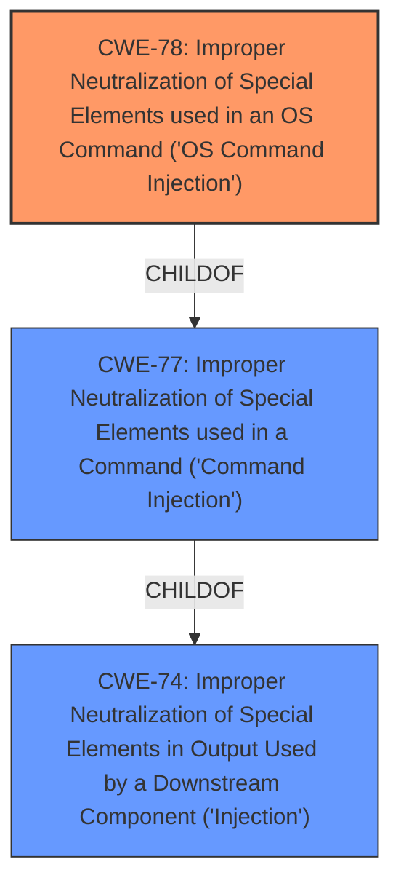

# Enhanced Analysis for CVE-2021-43283

# Summary
| CWE ID | CWE Name | Confidence | CWE Abstraction Level | CWE Vulnerability Mapping Label | CWE-Vulnerability Mapping Notes |
|---|---|---|---|---|---|
| CWE-78 | Improper Neutralization of Special Elements used in an OS Command ('OS Command Injection') | 1.0 | Base | Allowed | Primary CWE |

## Evidence and Confidence

*   **Confidence Score:** 1.0
*   **Evidence Strength:** HIGH

## Relationship Analysis
The primary relationship that influenced the decision was the ChildOf relationship between CWE-78 and CWE-77. While CWE-77 is a broader class encompassing command injection in general, CWE-78 specifically addresses OS command injection, which aligns perfectly with the vulnerability description. The analysis focused on the base level for specificity.



## Vulnerability Chain
The vulnerability chain begins with the **improper neutralization** of special elements within the input, leading directly to the execution of arbitrary OS commands.

## Summary of Analysis
The initial assessment identified **command injection** as the key weakness. The vulnerability description explicitly mentions that the issue allows an attacker to inject arbitrary shell commands to be executed by the device with root privileges. The selection of CWE-78 is based on the evidence provided, particularly the phrases "command injection" and "execute arbitrary shell commands." The retriever results also strongly suggest CWE-77 and CWE-78 as top candidates.

The graph relationships influenced the final selection by highlighting the hierarchical structure of CWEs related to injection. While CWE-77 (Improper Neutralization of Special Elements used in a Command) is a valid candidate, CWE-78 (Improper Neutralization of Special Elements used in an OS Command) is more specific and accurately reflects the nature of the vulnerability, as it involves OS commands.

The selected CWE is at the optimal level of specificity because it directly addresses the **root cause** of the vulnerability: the failure to properly neutralize special elements in OS commands. This allows attackers to inject and execute arbitrary commands on the system.
Here is the supporting evidence: "A **command injection** vulnerability was found within the web interface of the device, allowing an attacker with valid credentials to inject arbitrary shell commands to be executed by the device with root privileges."

Relevant CWE Information:

# Enhanced Context (25 CWEs)
The following CWEs were identified as potentially relevant to this vulnerability:

## CWE-274: Improper Handling of Insufficient Privileges
**Abstraction Level**: Base
**Similarity Score**: 0.77
**Source**: dense

**Description**:
The product does not handle or incorrectly handles when it has insufficient privileges to perform an operation, leading to resultant weaknesses.

**Mapping Guidance**:
- Usage: Discouraged
- Rationale: This CWE entry could be deprecated in a future version of CWE.

*Not Selected*: This CWE does not align with the root cause of the vulnerability, which is command injection. The vulnerability is not about handling insufficient privileges but about **improper neutralization** of special elements in commands.

## CWE-280: Improper Handling of Insufficient Permissions or Privileges 
**Abstraction Level**: Base
**Similarity Score**: 0.77
**Source**: dense

**Description**:
The product does not handle or incorrectly handles when it has insufficient privileges to access resources or functionality as specified by their permissions. This may cause it to follow unexpected code paths that may leave the product in an invalid state.

**Mapping Guidance**:
- Usage: Allowed
- Rationale: This CWE entry is at the Base level of abstraction, which is a preferred level of abstraction for mapping to the root causes of vulnerabilities.

*Not Selected*: Similar to CWE-274, this CWE is not directly related to the **root cause** of the vulnerability. The issue is not about handling insufficient permissions but about the **improper neutralization** of command elements.

## CWE-73: External Control of File Name or Path
**Abstraction Level**: Base
**Similarity Score**: 0.77
**Source**: dense

**Description**:
The product allows user input to control or influence paths or file names that are used in filesystem operations.

**Mapping Guidance**:
- Usage: Allowed
- Rationale: This CWE entry is at the Base level of abstraction, which is a preferred level of abstraction for mapping to the root causes of vulnerabilities.

*Not Selected*: While the vulnerability involves the web interface, which could potentially interact with files, the core issue is command injection, not external control of file names or paths.

## CWE-653: Improper Isolation or Compartmentalization
**Abstraction Level**: Class
**Similarity Score**: 0.77
**Source**: dense

**Description**:
The product does not properly compartmentalize or isolate functionality, processes, or resources that require different privilege levels, rights, or permissions.

**Mapping Guidance**:
- Usage: Allowed
- Rationale: This CWE entry is at the Base level of abstraction, which is a preferred level of abstraction for mapping to the root causes of vulnerabilities.

*Not Selected*: This CWE is too high-level and doesn't directly address the command injection vulnerability. The issue is not primarily about compartmentalization but about **improper neutralization** of command elements.

## CWE-266: Incorrect Privilege Assignment
**Abstraction Level**: Base
**Similarity Score**: 0.76
**Source**: dense

**Description**:
A product incorrectly assigns a privilege to a particular actor, creating an unintended sphere of control for that actor.

**Mapping Guidance**:
- Usage: Allowed
- Rationale: This CWE entry is at the Base level of abstraction, which is a preferred level of abstraction for mapping to the root causes of vulnerabilities.

*Not Selected*: The vulnerability is not about incorrect privilege assignment but about the **improper neutralization** of command elements, allowing arbitrary command execution.

## CWE-807: Reliance on Untrusted Inputs in a Security Decision
**Abstraction Level**: Base
**Similarity Score**: 0.76
**Source**: dense

**Description**:
The product uses a protection mechanism that relies on the existence or values of an input, but the input can be modified by an untrusted actor in a way that bypasses the protection mechanism.

**Mapping Guidance**:
- Usage: Allowed
- Rationale: This CWE entry is at the Base level of abstraction, which is a preferred level of abstraction for mapping to the root causes of vulnerabilities.

*Not Selected*: While the vulnerability involves untrusted input, the core issue is the **improper neutralization** of special elements in commands, not the reliance on untrusted inputs in a security decision.

## CWE-184: Incomplete List of Disallowed Inputs
**Abstraction Level**: Base
**Similarity Score**: 0.76
**Source**: dense

**Description**:
The product implements a protection mechanism that relies on a list of inputs (or properties of inputs) that are not allowed by policy or otherwise require other action to neutralize before additional processing takes place, but the list is incomplete.

**Mapping Guidance**:
- Usage: Allowed
- Rationale: This CWE entry is at the Base level of abstraction, which is a preferred level of abstraction for mapping to the root causes of vulnerabilities.

*Not Selected*: This CWE is relevant but not as direct as CWE-78. While an incomplete list of disallowed inputs can contribute to command injection, the core issue is the **improper neutralization** itself.

## CWE-74: Improper Neutralization of Special Elements in Output Used by a Downstream Component ('Injection')
**Abstraction Level**: Class
**Similarity Score**: 0.76
**Source**: dense

**Description**:
The product constructs all or part of a command, data structure, or record using externally-influenced input from an upstream component, but it does not neutralize or incorrectly neutralizes special elements that could modify how it is parsed or interpreted when it is sent to a downstream component.

**Mapping Guidance**:
- Usage: Discouraged
- Rationale: CWE-74 is high-level and often misused when lower-level weaknesses are more appropriate.

*Not Selected*: CWE-74 is a parent of CWE-78, and the mapping guidance suggests using lower-level weaknesses when available. CWE-78 is a more specific and appropriate match.

## CWE-41: Improper Resolution of Path Equivalence
**Abstraction Level**: Base
**Similarity Score**: 0.76
**Source**: dense

**Description**:
The product is vulnerable to file system contents disclosure through path equivalence. Path equivalence involves the use of special characters in file and directory names. The associated manipulations are intended to generate multiple names for the same object.

**Mapping Guidance**:
- Usage: Allowed
- Rationale: This CWE entry is at the Base level of abstraction, which is a preferred


## CWE Relationship Analysis

Current CWEs represent these abstraction levels: .


### Vulnerability Chain Analysis

**Chain starting from CWE-73:**
- 73 (External Control of File Name or Path) - ROOT


**Chain starting from CWE-653:**
- 653 (Improper Isolation or Compartmentalization) - ROOT


### CWE Relationship Diagram

```mermaid
graph TD
    classDef primary fill:#f96,stroke:#333,stroke-width:2px
    classDef secondary fill:#69f,stroke:#333
    classDef tertiary fill:#9e9,stroke:#333
```