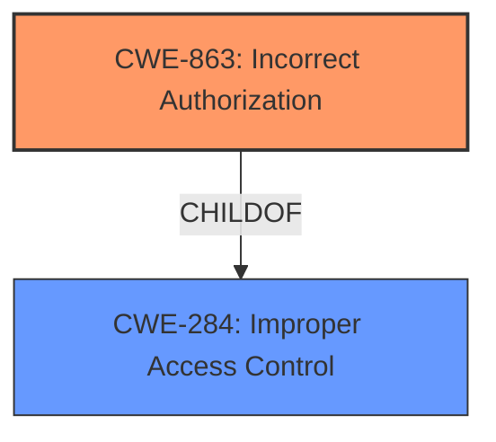

# Raw Analyzer Response for CVE-2021-43337

# Summary
| CWE ID  | CWE Name                                          | Confidence | CWE Abstraction Level | CWE Vulnerability Mapping Label | CWE-Vulnerability Mapping Notes |
|---------|---------------------------------------------------|------------|-----------------------|---------------------------------|---------------------------------|
| CWE-863 | Incorrect Authorization                           | 0.9        | Class                 | Allowed-with-Review             | Primary CWE                     |
| CWE-284 | Improper Access Control                           | 0.7        | Pillar                  | Discouraged                    | Secondary Candidate             |

## Evidence and Confidence

*   **Confidence Score:** 0.8
*   **Evidence Strength:** HIGH

## Relationship Analysis
The primary relationship that impacted my decision was the parent-child relationship between CWE-284 (Improper Access Control) and CWE-863 (Incorrect Authorization). While CWE-284 is a high-level pillar, CWE-863 is a more specific class that better captures the essence of the vulnerability. Since the vulnerability involves an authorization check that is performed incorrectly, CWE-863 is more appropriate. Other peer relationships, such as those with authentication-related CWEs, were considered but deemed less relevant as the vulnerability is about authorization after a user is already authenticated.

## Vulnerability Chain
The chain of events for this vulnerability is as follows:
1.  **Root Cause:** **Incorrect Access Control** within SlurmDBD, specifically due to improper implementation of access control rules when `AccountingStoreFlags=job_script` and/or `job_env` options are enabled. (CWE-863 Incorrect Authorization)
2.  **Weakness:** The system **fails to properly restrict access** to job scripts and environment files.
3.  **Impact:** Users can request and gain access to job scripts and environment files to which they should not have access, potentially leading to information disclosure.

## Summary of Analysis
The initial assessment identified **incorrect access control** as the primary issue. The evidence from the vulnerability description and CVE reference links strongly supports this. The CVE reference summary explicitly mentions "**inadequate access control**" and "**bypass of intended restrictions**."
The retriever results also point to CWE-284 (Improper Access Control) and CWE-863 (Incorrect Authorization).

The relationship analysis clarified that CWE-863 (Incorrect Authorization) is a more specific child of CWE-284 and is a better fit because the problem lies in the incorrect performance of the authorization check, not a complete lack of access control.

The final decision to map to CWE-863 is based on the evidence from the CVE reference links, the retriever results, and the hierarchical relationship between CWE-284 and CWE-863. CWE-863 is at the optimal level of specificity because it directly addresses the authorization check being performed incorrectly, which is the **root cause** of the vulnerability.

Relevant CWE Information:

# Enhanced Context (25 CWEs)
The following CWEs were identified as potentially relevant to this vulnerability:

## CWE-274: Improper Handling of Insufficient Privileges
**Abstraction Level**: Base
**Similarity Score**: 0.77
**Source**: dense

**Description**:
The product does not handle or incorrectly handles when it has insufficient privileges to perform an operation, leading to resultant weaknesses.

**Mapping Guidance**:
- Usage: Discouraged
- Rationale: This CWE entry could be deprecated in a future version of CWE.

*Not Selected:* This CWE is about handling insufficient privileges, which isn't the primary issue here. The issue is about incorrectly granting access, not failing to handle a lack of privileges.

## CWE-280: Improper Handling of Insufficient Permissions or Privileges 
**Abstraction Level**: Base
**Similarity Score**: 0.76
**Source**: dense

**Description**:
The product does not handle or incorrectly handles when it has insufficient privileges to access resources or functionality as specified by their permissions. This may cause it to follow unexpected code paths that may leave the product in an invalid state.

**Mapping Guidance**:
- Usage: Allowed
- Rationale: This CWE entry is at the Base level of abstraction, which is a preferred level of abstraction for mapping to the root causes of vulnerabilities.

*Not Selected:* Similar to CWE-274, this CWE focuses on handling insufficient privileges, which is not the core problem.

## CWE-1220: Insufficient Granularity of Access Control
**Abstraction Level**: Base
**Similarity Score**: 0.76
**Source**: dense

**Description**:
The product implements access controls via a policy or other feature with the intention to disable or restrict accesses (reads and/or writes) to assets in a system from untrusted agents. However, implemented access controls lack required granularity, which renders the control policy too broad because it allows accesses from unauthorized agents to the security-sensitive assets.

**Mapping Guidance**:
- Usage: Allowed
- Rationale: This CWE entry is at the Base level of abstraction, which is a preferred level of abstraction for mapping to the root causes of vulnerabilities.

*Not Selected:* While this could be a contributing factor, the primary issue is that the access control rules are incorrect, not necessarily that the granularity is insufficient.

## CWE-668: Exposure of Resource to Wrong Sphere
**Abstraction Level**: Class
**Similarity Score**: 0.76
**Source**: dense

**Description**:
The product exposes a resource to the wrong control sphere, providing unintended actors with inappropriate access to the resource.

**Mapping Guidance**:
- Usage: Discouraged
- Rationale: CWE-668 is high-level and is often misused as a catch-all when lower-level CWE IDs might be applicable. It is sometimes used for low-information vulnerability reports [REF-1287]. It is a level-1 Class (i.e., a child of a Pillar). It is not useful for trend analysis.

*Not Selected:* This is a high-level class and CWE-863 is more specific.

## CWE-266: Incorrect Privilege Assignment
**Abstraction Level**: Base
**Similarity Score**: 0.76
**Source**: dense

**Description**:
A product incorrectly assigns a privilege to a particular actor, creating an unintended sphere of control for that actor.

**Mapping Guidance**:
- Usage: Allowed
- Rationale: This CWE entry is at the Base level of abstraction, which is a preferred level of abstraction for mapping to the root causes of vulnerabilities.

*Not Selected:* This CWE focuses on assigning incorrect privileges, which is close but not quite the right fit. CWE-863 focuses on the authorization check itself being incorrect.

## CWE-653: Improper Isolation or Compartmentalization
**Abstraction Level**: Class
**Similarity Score**: 0.75
**Source**: dense

**Description**:
The product does not properly compartmentalize or isolate functionality, processes, or resources that require different privilege levels, rights, or permissions.

**Mapping Guidance**:
- Usage: Allowed
- Rationale: This CWE entry is at the Base level of abstraction, which is a preferred level of abstraction for mapping to the root causes of vulnerabilities.

*Not Selected:* This CWE describes a lack of isolation, which isn't the primary problem.

## CWE-639: Authorization Bypass Through User-Controlled Key
**Abstraction Level**: Base
**Similarity Score**: 0.75
**Source**: dense

**Description**:
The system's authorization functionality does not prevent one user from gaining access to another user's data or record by modifying the key value identifying the data.

**Mapping Guidance**:
- Usage: Allowed
- Rationale: This CWE entry is at the Base level of abstraction, which is a preferred level of abstraction for mapping to the root causes of vulnerabilities.

*Not Selected:* The vulnerability does not appear to be specifically related to user-controlled keys.

## CWE-664: Improper Control of a Resource Through its Lifetime
**Abstraction Level**: Pillar
**Similarity Score**: 0.75
**Source**: dense

**Description**:
The product does not maintain or incorrectly maintains control over a resource throughout its lifetime of creation, use, and release.

**Mapping Guidance**:
- Usage: Discouraged
- Rationale: This CWE entry is high-level when lower-level children are available.

*Not Selected:* This is a high-level pillar and not specific enough.

## CWE-267: Privilege Defined With Unsafe Actions
**Abstraction Level**: Base
**Similarity Score**: 0.74
**Source**: dense

**Description**:
A particular privilege, role, capability, or right can be used to perform unsafe actions that were not intended, even when it is assigned to the correct entity.

**Mapping Guidance**:
- Usage: Allowed
- Rationale: This CWE entry is at the Base level of abstraction, which is a preferred level of abstraction for mapping to the root causes of vulnerabilities.

*Not Selected:* This CWE is not