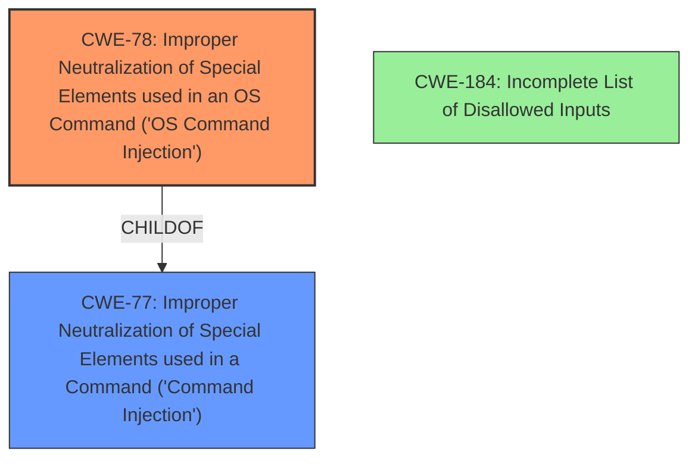

# Analysis Report for CVE-2021-43339

# Vulnerability Analysis Report: CVE-2021-43339

## Description


## Analysis (with Relationship Data)

# Summary
| CWE ID  | CWE Name                                                                                                                                        | Confidence | CWE Abstraction Level | CWE Vulnerability Mapping Label | CWE-Vulnerability Mapping Notes |
| ------- | ----------------------------------------------------------------------------------------------------------------------------------------------- | ---------- | ----------------------- | --------------------------------- | --------------------------------- |
| CWE-78  | Improper Neutralization of Special Elements used in an OS Command ('OS Command Injection')                                                    | 1          | Base                    | Primary CWE                       | Allowed                           |
| CWE-77  | Improper Neutralization of Special Elements used in a Command ('Command Injection')                                                            | 0.7        | Class                   | Secondary Candidate               | Allowed-with-Review             |
| CWE-184 | Incomplete List of Disallowed Inputs                                                                                                            | 0.6        | Base                    | Secondary Candidate               | Allowed                           |

## Evidence and Confidence

*   **Confidence Score:** 0.9
*   **Evidence Strength:** HIGH

## Relationship Analysis
The primary CWE is CWE-78, which is a Base level CWE. The Retriever Results also suggest CWE-77 as a candidate, and it is the parent of CWE-78, but it is too high level. CWE-184 is also a candidate because the exploit bypasses restrictions on character usage (spaces, forward slashes, etc.) using techniques like manipulating the Internal Field Separator (IFS) and using `xxd` to represent restricted characters which shows the list of disallowed inputs is incomplete.



## Vulnerability Chain
The vulnerability chain starts with **insufficient input validation** which leads to **command injection** and the ability to **execute commands**. The incomplete list of disallowed inputs allowed the attacker to bypass restrictions.

## Summary of Analysis
The analysis concludes that the primary weakness is CWE-78. The vulnerability description states that it is possible for an authenticated attacker to **inject commands** via `file_name` in the export functionality. The **CVE Reference Links Content Summary** section provides strong evidence to support this conclusion. Specifically, it states: "The application is vulnerable to **command injection** via the `file_name` parameter" and "The application fails to properly sanitize user-supplied input in the `file_name` parameter, allowing attackers to **inject arbitrary shell commands**." This directly aligns with the definition of CWE-78, which involves the improper neutralization of special elements used in an OS command. The vulnerability allows for remote code execution due to the ability to inject and execute arbitrary commands on the server.

CWE-77 was considered but deemed less specific than CWE-78. While CWE-77 covers command injection in general, CWE-78 is specific to OS commands, which is the case in this vulnerability.

CWE-184 was considered because the attacker was able to bypass some input validation, but that is not the primary weakness.

Relevant CWE Information:
```
## Vulnerability Description
In Ericsson Network Location before 2021-07-31, it is possible for an authenticated attacker to inject commands via file_name in the export functionality. For example, a new admin user could be created.
```

```
**Root Cause of Vulnerability:**

*   The vulnerability lies within the "export" feature of the Ericsson Network Location Mobile Positioning Systems (MPS) web application. Specifically, the `file_name` parameter in the export functionality is vulnerable to command injection. This parameter is used to create files on the server, and it's not properly sanitized.

**Weaknesses/Vulnerabilities Present:**

*   **Command Injection:** The application is vulnerable to command injection via the `file_name` parameter.
*   **Insufficient Input Validation:** The application fails to properly sanitize user-supplied input in the `file_name` parameter, allowing attackers to inject arbitrary shell commands.
```


## CWE Relationship Analysis

Current CWEs represent these abstraction levels: .


### Vulnerability Chain Analysis

**Chain starting from CWE-78:**
- 78 (Improper Neutralization of Special Elements used in an OS Command ('OS Command Injection')) - ROOT


**Chain starting from CWE-77:**
- 77 (Improper Neutralization of Special Elements used in a Command ('Command Injection')) - ROOT


### CWE Relationship Diagram

```mermaid
graph TD
    classDef primary fill:#f96,stroke:#333,stroke-width:2px
    classDef secondary fill:#69f,stroke:#333
    classDef tertiary fill:#9e9,stroke:#333
```


*Report generated on 2025-04-02 00:39:11*
