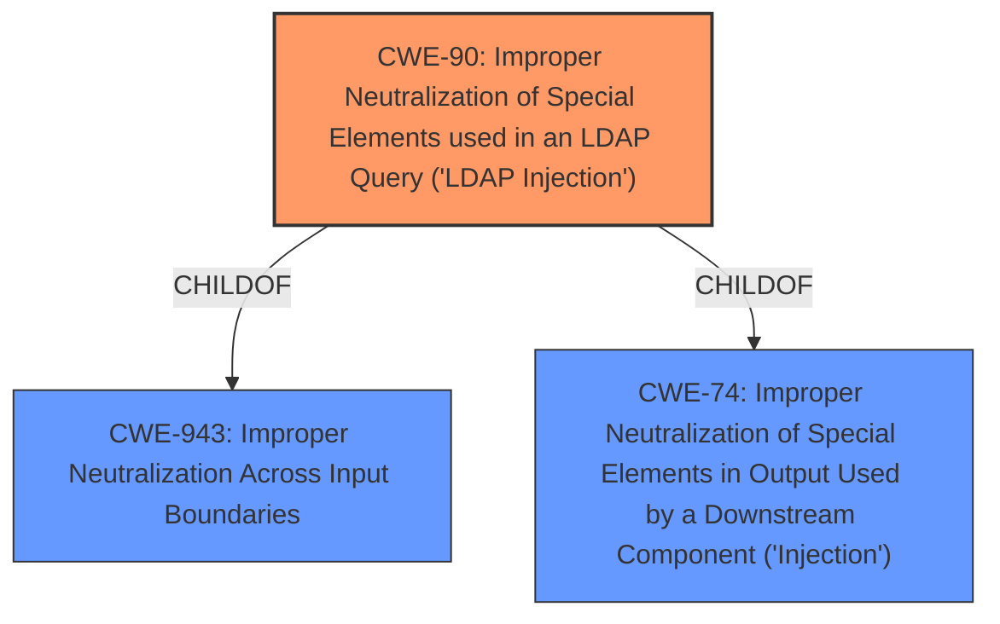

# Analysis for CVE-2021-43350

# Summary
| CWE ID | CWE Name | Confidence | CWE Abstraction Level | CWE Vulnerability Mapping Label | CWE-Vulnerability Mapping Notes |
|---|---|---|---|---|---|
| CWE-90 | Improper Neutralization of Special Elements used in an LDAP Query ('LDAP Injection') | 1.0 | Base | Primary | Allowed |

## Evidence and Confidence

*   **Confidence Score:** 1.0
*   **Evidence Strength:** HIGH

## Relationship Analysis
The primary relationship influencing the decision is the direct match of the vulnerability description to CWE-90, which is a Base level CWE. CWE-90 is a child of CWE-943 (Improper Neutralization Across Input Boundaries) and CWE-74 (Improper Neutralization of Special Elements in Output Used by a Downstream Component ('Injection')), but CWE-90 provides the most specific description of the vulnerability. The relationships between CWE-90 and other CWEs, such as the CANFOLLOW relationship to authentication and verification errors, is consistent with the provided vulnerability description.

## Vulnerability Chain
The chain of events for this vulnerability is as follows:
1.  **Root Cause:** **Lack of sanitization** of user-supplied input in the `POST /login` endpoint.
2.  **Weakness:** **Improper Neutralization** of special elements used in an LDAP query.
3.  **Impact:** **LDAP injection**, leading to potential authentication bypass and information disclosure.

## Summary of Analysis
The initial analysis strongly pointed to CWE-90, and a deeper review of the evidence confirmed this assessment. The vulnerability description explicitly states that an unauthenticated user can send a request with a specially-crafted username to inject unsanitized content into the LDAP filter. The CVE Reference Links Content Summary confirms that the root cause is a **lack of sanitization** of user-supplied input when constructing LDAP filters, leading to **LDAP Injection**.

The retriever results also support this conclusion, with CWE-90 being the top-ranked CWE.

The selected CWE is at the optimal level of specificity because it directly describes the vulnerability: **Improper Neutralization of Special Elements used in an LDAP Query ('LDAP Injection')**. While higher-level CWEs like CWE-74 or CWE-943 could apply, CWE-90 provides the most accurate and specific classification. The MITRE mapping guidance supports the selection of a Base level CWE when appropriate.

Relevant CWE Information:

# Enhanced Context (25 CWEs)

## CWE-90: Improper Neutralization of Special Elements used in an LDAP Query ('LDAP Injection')
**Abstraction:** Base
**Status:** Draft

### Description
The product constructs all or part of an LDAP query using externally-influenced input from an upstream component, but it does not neutralize or incorrectly neutralizes special elements that could modify the intended LDAP query when it is sent to a downstream component.

### Extended Description
Not provided

### Alternative Terms
None

### Relationships
ChildOf -> CWE-943

### Mapping Guidance
**Usage:** Allowed
**Rationale:** This CWE entry is at the Base level of abstraction, which is a preferred level of abstraction for mapping to the root causes of vulnerabilities.
**Comments:** Carefully read both the name and description to ensure that this mapping is an appropriate fit. Do not try to 'force' a mapping to a lower-level Base/Variant simply to comply with this preferred level of abstraction.
**Reasons:**
- Acceptable-Use

### Additional Notes
**[Relationship]** Factors: resultant to special character mismanagement, MAID, or denylist/allowlist problems. Can be primary to authentication and verification errors.

### Observed Examples
- **CVE-2021-41232:** Chain: authentication routine in Go-based agile development product does not escape user name (CWE-116), allowing LDAP injection (CWE-90)
- **CVE-2005-2301:** Server does not properly escape LDAP queries, which allows remote attackers to cause a DoS and possibly conduct an LDAP injection attack.