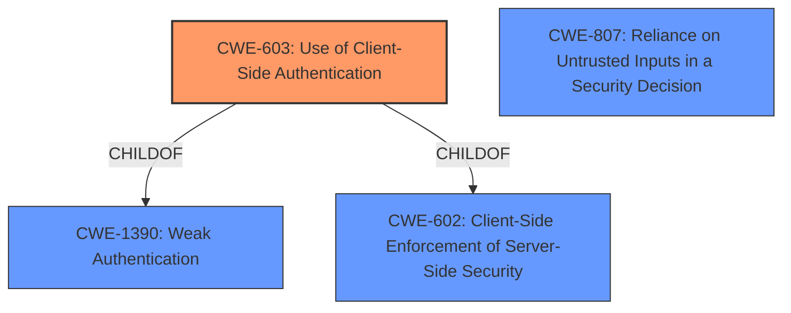

# Raw Analyzer Response for CVE-2021-43355

# Summary
| CWE ID | CWE Name | Confidence | CWE Abstraction Level | CWE Vulnerability Mapping Label | CWE-Vulnerability Mapping Notes |
|---|---|---|---|---|---|
| CWE-603 | Use of Client-Side Authentication | 1.0 | Base | Allowed | Primary CWE |
| CWE-602 | Client-Side Enforcement of Server-Side Security | 0.7 | Class | Allowed-with-Review | Secondary Candidate |
| CWE-807 | Reliance on Untrusted Inputs in a Security Decision | 0.6 | Base | Allowed | Secondary Candidate |

## Evidence and Confidence

*   **Confidence Score:** 0.9
*   **Evidence Strength:** HIGH

## Relationship Analysis
The primary CWE, CWE-603, is a base-level weakness and a child of CWE-1390 (Weak Authentication) and CWE-602 (Client-Side Enforcement of Server-Side Security). CWE-602 is a class-level weakness, representing a broader category of issues where the server relies on the client for security measures. CWE-807 (Reliance on Untrusted Inputs in a Security Decision) is related as the client-side checks are essentially untrusted inputs being used for a security decision.

## Vulnerability Chain
The vulnerability chain starts with the **root cause** of **client-side validation without authentication**. This leads to **reliance on untrusted inputs** and ultimately allows an attacker to **login with service privileges**, bypassing authentication.

## Summary of Analysis
The initial analysis correctly identifies **client-side validation without authentication** as the **root cause**. The vulnerability description states that "Fresenius Kabi Vigilant Software Suite... allows user input to be validated on the client side without authentication by the server." The "CVE Reference Links Content Summary" further reinforces this by stating the "Vigilant MasterMed application performs user input validation on the client-side (using JavaScript) without proper server-side authentication" and mentions "Use of Client-side Authentication (CWE-603): The server relies on client-side validation, which can be bypassed or disabled by malicious users. The server does not authenticate requests itself".

CWE-603 (Use of Client-Side Authentication) is the most specific and appropriate CWE because the application performs authentication within client code but not in server code, allowing server-side authentication to be bypassed. This aligns directly with the vulnerability description and the provided evidence. The MITRE mapping guidance designates CWE-603 as ALLOWED, and the description fits the vulnerability perfectly.

CWE-602 (Client-Side Enforcement of Server-Side Security) is a related but more general CWE. While applicable, CWE-603 is more precise. The mapping guidance designates CWE-602 as ALLOWED-WITH-REVIEW, suggesting a more specific child CWE might be a better fit.

CWE-807 (Reliance on Untrusted Inputs in a Security Decision) is also relevant, as the client-side validation results are untrusted inputs used for making authentication decisions.

I considered other CWEs but deemed them less fitting:

*   CWE-306 (Missing Authentication for Critical Function): This is not the core issue, since there *is* authentication, but it's performed on the client-side and thus bypassable.
*   CWE-1336 (Improper Neutralization of Special Elements Used in a Template Engine): Not related to template engine issues.
*   CWE-203 (Observable Discrepancy): Not related to observable discrepancies.
*   CWE-471 (Modification of Assumed-Immutable Data (MAID)): While client-side code could be considered assumed-immutable, the core issue is the lack of server-side authentication, not the modification of data.
*   CWE-295 (Improper Certificate Validation): Not related to certificate validation issues.
*   CWE-918 (Server-Side Request Forgery (SSRF)): Not related to SSRF.
*   CWE-287 (Improper Authentication): This is a class-level CWE and CWE-603 is a better fit.

My assessment is heavily based on the provided evidence, with the "Vulnerability Description", "Vulnerability Description Key Phrases", and "CVE Reference Links Content Summary" sections all supporting the classification of CWE-603 as the primary weakness.
The selection of CWE-603 is at the optimal level of specificity as it directly reflects the weakness of using client-side authentication without server-side validation.

Relevant CWE Information:

# Enhanced Context (25 CWEs)

## CWE-602: Client-Side Enforcement of Server-Side Security
**Abstraction Level**: Class
**Similarity Score**: 0.79
**Source**: dense

**Description**:
The product is composed of a server that relies on the client to implement a mechanism that is intended to protect the server.

**Mapping Guidance**:
- Usage: Allowed-with-Review
- Rationale: This CWE entry is a Class and might have Base-level children that would be more appropriate

## CWE-303: Incorrect Implementation of Authentication Algorithm
**Abstraction Level**: Base
**Similarity Score**: 0.79
**Source**: dense

**Description**:
The requirements for the product dictate the use of an established authentication algorithm, but the implementation of the algorithm is incorrect.

**Mapping Guidance**:
- Usage: Allowed
- Rationale: This CWE entry is at the Base level of abstraction, which is a preferred level of abstraction for mapping to the root causes of vulnerabilities.

## CWE-807: Reliance on Untrusted Inputs in a Security Decision
**Abstraction Level**: Base
**Similarity Score**: 0.79
**Source**: dense

**Description**:
The product uses a protection mechanism that relies on the existence or values of an input, but the input can be modified by an untrusted actor in a way that bypasses the protection mechanism.

**Mapping Guidance**:
- Usage: Allowed
- Rationale: This CWE entry is at the Base level of abstraction, which is a preferred level of abstraction for mapping to the root causes of vulnerabilities.

## CWE-603: Use of Client-Side Authentication
**Abstraction Level**: Base
**Similarity Score**: 0.78
**Source**: dense

**Description**:
A client/server product performs authentication within client code but not in server code, allowing server-side authentication to be bypassed via a modified client that omits the authentication check.

**Mapping Guidance**:
- Usage: Allowed
- Rationale: This CWE entry is at the Base level of abstraction, which is a preferred level of abstraction for mapping to the root causes of vulnerabilities.

## CWE-1289: Improper Validation of Unsafe Equivalence in Input
**Abstraction Level**: Base
**Similarity Score**: 0.77
**Source**: dense

**Description**:
The product receives an input value that is used as a resource identifier or other type of reference, but it does not validate or incorrectly validates that the input is equivalent to a potentially-unsafe value.

**Mapping Guidance**:
- Usage: Allowed
- Rationale: This CWE entry is at the Base level of abstraction, which is a preferred level of abstraction for mapping to the root causes of vulnerabilities.

## CWE-1390: Weak Authentication
**Abstraction Level**: Class
**Similarity Score**: 0.77
**Source**: dense

**Description**:
The product uses an authentication mechanism to restrict access to specific users or identities, but the mechanism does not sufficiently prove that the claimed identity is correct.

**Mapping Guidance**:
- Usage: Allowed-with-Review
- Rationale: This CWE entry is a Class and might have Base-level children that would be more appropriate

## CWE-345: Insufficient Verification of Data Authenticity
**Abstraction Level**: Class
**Similarity Score**: 0.77
**Source**: dense

**Description**:
The product does not sufficiently verify the origin or authenticity of data, in a way that causes it to accept invalid data.

**Mapping Guidance**:
- Usage: Discouraged
- Rationale: This CWE entry is a level-1 Class (i.e., a child of a Pillar). It might have lower-level children that would be more appropriate

## CWE-1391: Use of Weak Credentials
**Abstraction Level**: Class
**Similarity Score**: 0.77
**Source**: dense

**Description**:
The product uses weak credentials (such