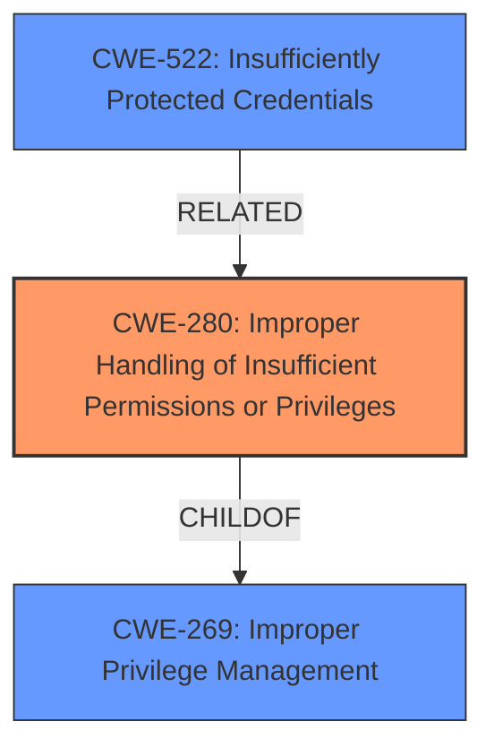

# Analysis for CVE-2021-43397

# Summary
| CWE ID | CWE Name | Confidence | CWE Abstraction Level | CWE Vulnerability Mapping Label | CWE-Vulnerability Mapping Notes |
|---|---|---|---|---|---|
| CWE-280 | Improper Handling of Insufficient Permissions or Privileges | 0.8 | Base | Allowed | Primary CWE |
| CWE-522 | Insufficiently Protected Credentials | 0.7 | Class | Allowed-with-Review | Secondary CWE |
| CWE-269 | Improper Privilege Management | 0.6 | Class | Discouraged | Secondary CWE |

## Evidence and Confidence

*   **Confidence Score:** 0.8
*   **Evidence Strength:** HIGH

## Relationship Analysis
The primary CWE is CWE-280 which is a base level CWE. CWE-269 is a class level CWE and parent of CWE-280. CWE-522 is also a class level CWE and related to the exposure of API keys.

## Vulnerability Chain
The vulnerability chain starts with **insufficient privilege handling** by a 'User Admin', leading to the ability to list all users including system administrators and retrieve their API keys, ultimately leading to **privilege escalation** to a 'System Administrator' role.
  - Improper handling of insufficient privileges (CWE-280) leads to
  - Exposure of sensitive information (API keys) via insecure API access control.
  - Privilege escalation to System Administrator.

## Summary of Analysis
The initial analysis focused on the root cause of the privilege escalation vulnerability in LiquidFiles. The **Vulnerability Description Key Phrases** pointed to an elevation of privileges. The **CVE Reference Links Content Summary** provided crucial details: a 'User Admin' can list all users (including System Administrators) and retrieve their API keys, which are then used for HTTP basic authentication. This leads to privilege escalation.

The primary CWE was chosen as CWE-280 Improper Handling of Insufficient Permissions or Privileges because the root cause lies in how the system handles the permissions of a 'User Admin', allowing them to access information they should not have access to (API keys of SysAdmins). This aligns with the CWE's description of incorrectly handling insufficient privileges to access resources.

CWE-522 Insufficiently Protected Credentials was added as a secondary CWE because the API keys, which are sensitive credentials, were exposed, leading to the escalation. The **root cause** is the **improper handling of privileges**, leading to exposure of credentials.

CWE-269 Improper Privilege Management was also added as a secondary CWE due to its relevance to the vulnerability, but CWE-280 was chosen as the primary CWE as it is a more specific representation of the **improper handling of insufficient privileges**.

The decision is primarily based on the **CVE Reference Links Content Summary**, which states, "The LiquidFiles API allows a 'User Admin' to list all registered users, including System Administrators, and retrieve their API keys." This clearly indicates **improper privilege handling** that leads to the exposure of sensitive information.

The selected CWEs are at the optimal level of specificity, with CWE-280 being a Base level CWE that accurately represents the root cause, and CWE-522 being a Class level CWE that highlights a critical aspect of the vulnerability.

Other CWEs Considered:

*   CWE-269: Improper Privilege Management - While relevant, it's a more general class. CWE-280 is more specific.
*   CWE-522: Insufficiently Protected Credentials - Relevant as API keys are exposed, but not the primary root cause.
*   CWE-798: Use of Hard-coded Credentials - Not applicable, as the API keys are not hard-coded, but exposed due to **improper access control**.
*   CWE-863: Incorrect Authorization - Authorization is not the problem. User Admins can list other users but shouldn't have access to the API keys of system administrators.
*   CWE-250: Execution with Unnecessary Privileges - Not applicable, as the 'User Admin' is not necessarily executing with unnecessary privileges, but **accessing data due to insufficient permission checks**.

# Enhanced Context (25 CWEs)
The following CWEs were identified as potentially relevant to this vulnerability:

## CWE-807: Reliance on Untrusted Inputs in a Security Decision
**Abstraction Level**: Base
**Similarity Score**: 0.80
**Source**: dense

**Description**:
The product uses a protection mechanism that relies on the existence or values of an input, but the input can be modified by an untrusted actor in a way that bypasses the protection mechanism.

**Mapping Guidance**:
- Usage: Allowed
- Rationale: This CWE entry is at the Base level of abstraction, which is a preferred level of abstraction for mapping to the root causes of vulnerabilities.

## CWE-472: External Control of Assumed-Immutable Web Parameter
**Abstraction Level**: Base
**Similarity Score**: 0.79
**Source**: dense

**Description**:
The web application does not sufficiently verify inputs that are assumed to be immutable but are actually externally controllable, such as hidden form fields.

**Mapping Guidance**:
- Usage: Allowed
- Rationale: This CWE entry is at the Base level of abstraction, which is a preferred level of abstraction for mapping to the root causes of vulnerabilities.

## CWE-1391: Use of Weak Credentials
**Abstraction Level**: Class
**Similarity Score**: 0.78
**Source**: dense

**Description**:
The product uses weak credentials (such as a default key or hard-coded password) that can be calculated, derived, reused, or guessed by an attacker.

**Mapping Guidance**:
- Usage: Allowed-with-Review
- Rationale: This CWE entry is a Class and might have Base-level children that would be more appropriate

## CWE-798: Use of Hard-coded Credentials
**Abstraction Level**: Base
**Similarity Score**: 0.78
**Source**: dense

**Description**:
The product contains hard-coded credentials, such as a password or cryptographic key.

**Mapping Guidance**:
- Usage: Allowed
- Rationale: This CWE entry is at the Base level of abstraction, which is a preferred level of abstraction for mapping to the root causes of vulnerabilities.

## CWE-274: Improper Handling of Insufficient Privileges
**Abstraction Level**: Base
**Similarity Score**: 0.78
**Source**: dense

**Description**:
The product does not handle or incorrectly handles when it has insufficient privileges to perform an operation, leading to resultant weaknesses.

**Mapping Guidance**:
- Usage: Discouraged
- Rationale: This CWE entry could be deprecated in a future version of CWE.

## CWE-345: Insufficient Verification of Data Authenticity
**Abstraction Level**: Class
**Similarity Score**: 0.77
**Source**: dense

**Description**:
The product does not sufficiently verify the origin or authenticity of data, in a way that causes it to accept invalid data.

**Mapping Guidance**:
- Usage: Discouraged
- Rationale: This CWE entry is a level-1 Class (i.e., a child of a Pillar). It might have lower-level children that would be more appropriate

## CWE-280: Improper Handling of Insufficient Permissions or Privileges 
**Abstraction Level**: Base
**Similarity Score**: 0.77
**Source**: dense

**Description**:
The product does not handle or incorrectly handles when it has insufficient privileges to access resources or functionality as specified by their permissions. This may cause it to follow unexpected code paths that may leave the product in an invalid state.

**Mapping Guidance**:
- Usage: Allowed
- Rationale: This CWE entry is at the Base level of abstraction, which is a preferred level of abstraction for mapping to the root causes of vulnerabilities.

## CWE-330: Use of Insufficiently Random Values
**Abstraction Level**: Class
**Similarity Score**: 0.77
**Source**: dense

**Description**:
The product uses insufficiently random numbers or values in a security context that depends on unpredictable numbers.

**Mapping Guidance**:
- Usage: Discouraged
- Rationale: This CWE entry is a level-1 Class (i.e., a child of a Pillar). It might have lower-level children that would be more appropriate

## CWE-303: Incorrect Implementation of Authentication Algorithm
**Abstraction Level**: Base
**Similarity Score**: 0.77
**Source**: dense

**Description**:
The requirements for the product dictate the use of an established authentication algorithm, but the implementation of the algorithm is incorrect.