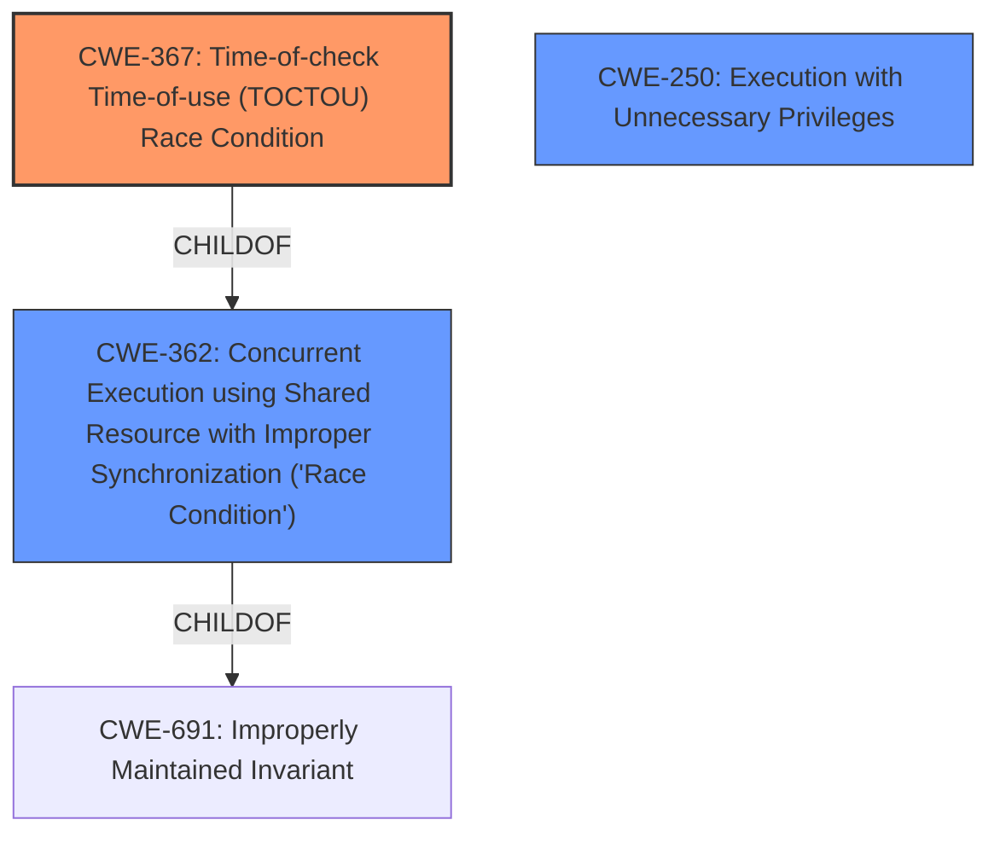

# Analysis Report for CVE-2021-43411

# Vulnerability Analysis Report: CVE-2021-43411

## Description


## Analysis (with Relationship Data)

# Summary
| CWE ID | CWE Name | Confidence | CWE Abstraction Level | CWE Vulnerability Mapping Label | CWE-Vulnerability Mapping Notes |
|---|---|---|---|---|---|
| CWE-367 | Time-of-check Time-of-use (TOCTOU) Race Condition | 0.9 | Base | Allowed | Primary CWE |
| CWE-250 | Execution with Unnecessary Privileges | 0.7 | Base | Allowed | Secondary CWE |
| CWE-362 | Concurrent Execution using Shared Resource with Improper Synchronization ('Race Condition') | 0.6 | Class | Allowed-with-Review | Secondary CWE |

## Evidence and Confidence

*   **Confidence Score:** 0.8
*   **Evidence Strength:** HIGH

## Relationship Analysis
The primary relationship influencing the CWE selection is the parent-child relationship between CWE-367 (TOCTOU Race Condition) and CWE-362 (Concurrent Execution using Shared Resource with Improper Synchronization). CWE-367 is a specific type of CWE-362. CWE-250 (Execution with Unnecessary Privileges) is included because the vulnerability exists due to the process having elevated privileges during a vulnerable window. Selecting CWE-367 provides a more precise characterization of the vulnerability than the broader CWE-362.



## Vulnerability Chain
The vulnerability chain involves a **race condition** (CWE-367) during setuid execution. The process gains elevated privileges before the old task and process port are invalidated. This leads to a window where the process has root privileges but is still accessible through its old, unprivileged task and process port. This can be exploited to gain full root access. The chain is as follows:
1.  Setuid execution begins.
2.  Process reauthenticated with new privileges (Root Cause and Contributor).
3.  **Race Condition** (CWE-367): Old task/process port not yet invalidated.
4.  Exploit leverages the vulnerable window.
5.  Full Root Access.

## Summary of Analysis
The initial analysis focused on identifying the **root cause** of the vulnerability. The vulnerability description and CVE Reference Links Content Summary clearly point to a **race condition** during the setuid execution. The process reauthenticates with elevated privileges before the old task and process port are invalidated. This creates a window where the process has root privileges but is still accessible through its old, unprivileged task and process port. The retriever results also suggested CWE-362 (Concurrent Execution using Shared Resource with Improper Synchronization ('Race Condition')), but based on the vulnerability description, CWE-367 is more specific.

The evidence from the CVE Reference Links Content Summary states: "The vulnerability lies in a **race condition** during setuid execution on the Hurd operating system. Specifically, the process is reauthenticated with new (elevated) privileges before the old task and process port are invalidated. This creates a window of time where the process has root privileges but is still accessible through its old, unprivileged task and process port."

The final decision to select CWE-367 as the primary CWE is based on its specific description of a **time-of-check time-of-use race condition**, which aligns perfectly with the vulnerability's technical details. The graph relationships confirm that CWE-367 is a child of CWE-362, making it a more specific and appropriate choice.

Other CWEs considered but not used:

*   CWE-269 (Improper Privilege Management): While privilege escalation is the impact, the **root cause** is the **race condition**, not the improper management of privileges itself. The updated code atomic operation (`proc_reauthenticate_reassign`) fixes the race, not the privilege management directly.
*   CWE-250 (Execution with Unnecessary Privileges): This is a secondary factor, as the race condition is only exploitable because the process gains elevated privileges too early.
*   CWE-362 (Concurrent Execution using Shared Resource with Improper Synchronization ('Race Condition')): While technically correct, CWE-367 is a more specific variant that better captures the TOCTOU nature of the vulnerability.
*   CWE-416 (Use After Free): This CWE was considered because of the timing window and the potential for the old task to be freed, but this isn't the core issue. The vulnerability is about the process being accessible through the old port *while* having elevated privileges.
*   CWE-280 (Improper Handling of Insufficient Permissions or Privileges) and CWE-274 (Improper Handling of Insufficient Privileges): These are incorrect as the process has elevated privileges at the time of the race condition.

The selected CWEs are at the optimal level of specificity because they accurately represent the **root cause** (CWE-367) and contributing factors (CWE-250) of the vulnerability, providing a clear and concise classification.


## CWE Relationship Analysis

Current CWEs represent these abstraction levels: .


### Vulnerability Chain Analysis

**Chain starting from CWE-691:**
- 691 (Insufficient Control Flow Management) - ROOT


**Chain starting from CWE-416:**
- 416 (Use After Free) - ROOT


### CWE Relationship Diagram

```mermaid
graph TD
    classDef primary fill:#f96,stroke:#333,stroke-width:2px
    classDef secondary fill:#69f,stroke:#333
    classDef tertiary fill:#9e9,stroke:#333
```


*Report generated on 2025-04-02 16:16:25*
