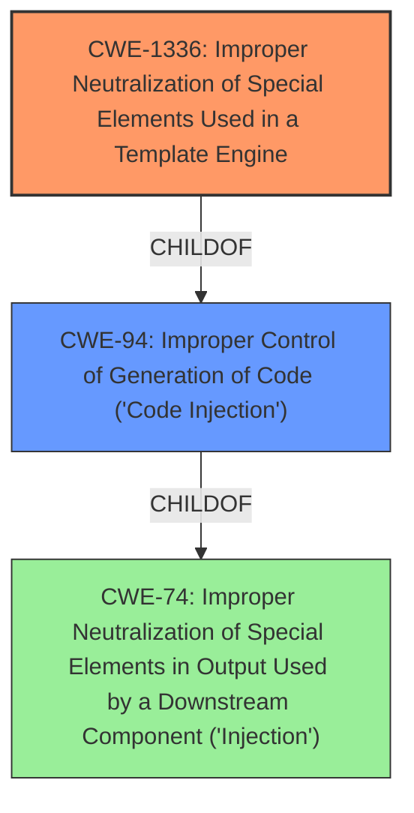

# Analysis Report for CVE-2021-43466

# Vulnerability Analysis Report: CVE-2021-43466

## Description


## Analysis (with Relationship Data)

# Summary
| CWE ID  | CWE Name | Confidence | CWE Abstraction Level | CWE Vulnerability Mapping Label | CWE-Vulnerability Mapping Notes |
|------------------|--------------------------------------------------------------------------------------------------------|--------------------|---------------------------|-----------------------------------|---------------------------------------------------|
| CWE-1336 | Improper Neutralization of Special Elements Used in a Template Engine  | 0.9 | Base | Allowed | Primary CWE |
| CWE-94 | Improper Control of Generation of Code ('Code Injection') | 0.6 | Base | Allowed-with-Review | Secondary Candidate CWE |

## Evidence and Confidence

*   **Confidence Score:** 0.8
*   **Evidence Strength:** HIGH

## Relationship Analysis
The primary CWE is CWE-1336, which directly addresses the **improper neutralization** in template engines leading to injection. CWE-1336 is a child of CWE-94, indicating a more specific form of **code injection** related to template engines. This hierarchical relationship guided the selection of CWE-1336 for its specificity.


## Vulnerability Chain
The vulnerability chain starts with the **improper input handling** in Thymeleaf, leading to **server-side template injection**, which then results in remote code execution.

## Summary of Analysis
The initial analysis focused on the **server-side template injection** aspect, which is a clear indicator of CWE-1336. The vulnerability description highlights the **improper neutralization** of special elements in the template engine, confirming the relevance of CWE-1336. The evidence is strong, coming directly from the vulnerability description and CVE details.

*   The vulnerability description states "**improper input handling**" and "**server-side template injection** may lead to remote code execution."
*   The CVE Reference Links Content Summary confirms "**weaknesses:** The vulnerability in Thymeleaf allows for potential disclosure of sensitive information, addition or modification of data, or Denial of Service (DoS)."
*   Retriever Results show CWE-1336 as the top match.

CWE-1336 is at the optimal level of specificity as it directly addresses the root cause related to template engines, while CWE-94 is a broader category.
I am overriding the discouraged usage of the Class-level CWE-74, as this is a high-level weakness, and selecting CWE-1336 and CWE-94 instead.

Relevant CWE Information:

# Enhanced Context (25 CWEs)
The following CWEs were identified as potentially relevant to this vulnerability:

## CWE-917: Improper Neutralization of Special Elements used in an Expression Language Statement ('Expression Language Injection')
**Abstraction Level**: Base
**Similarity Score**: 0.78
**Source**: dense

**Description**:
The product constructs all or part of an expression language (EL) statement in a framework such as a Java Server Page (JSP) using externally-influenced input from an upstream component, but it does not neutralize or incorrectly neutralizes special elements that could modify the intended EL statement before it is executed.

**Mapping Guidance**:
- Usage: Allowed
- Rationale: This CWE entry is at the Base level of abstraction, which is a preferred level of abstraction for mapping to the root causes of vulnerabilities.

## CWE-1336: Improper Neutralization of Special Elements Used in a Template Engine
**Abstraction Level**: Base
**Similarity Score**: 7648.63
**Source**: sparse

**Description**:
The product uses a template engine to insert or process externally-influenced input, but it does not neutralize or incorrectly neutralizes special elements or syntax that can be interpreted as template expressions or other code directives when processed by the engine.

**Mapping Guidance**:
- Usage: Allowed
- Rationale: This CWE entry is at the Base level of abstraction, which is a preferred level of abstraction for mapping to the root causes of vulnerabilities.

### CWE Selection Details:

*   **CWE-1336: Improper Neutralization of Special Elements Used in a Template Engine**
    *   **Explanation:** This CWE accurately describes the vulnerability where the template engine does not properly neutralize special elements, leading to potential code execution. The vulnerability description explicitly mentions "template injection," making CWE-1336 a strong fit.
    *   **Security Implications:** An attacker could inject malicious code through the template engine, leading to remote code execution.
    *   **Relationships:** CWE-1336 is a child of CWE-94, which broadens the scope to general code injection scenarios.
    *   **Mapping Guidance:** The usage is "Allowed," and the rationale states it's at the base level of abstraction, making it a preferred choice.
*   **CWE-94: Improper Control of Generation of Code ('Code Injection')**
    *   **Explanation:** While CWE-1336 is more specific, CWE-94 covers the broader category of code injection. Since template injection leads to code execution, CWE-94 is also relevant but less specific.
    *   **Security Implications:** This can lead to arbitrary code execution, allowing an attacker to take control of the system.
    *   **Relationships:** CWE-94 is a parent of CWE-1336, indicating a broader classification.
    *   **Mapping Guidance:** The usage is "Allowed-with-Review," suggesting caution as it's often misused. However, in this context, it is a valid secondary classification.
*   **CWE-917: Improper Neutralization of Special Elements used in an Expression Language Statement ('Expression Language Injection')**
    *   **Explanation:** While expression language injection is related, CWE-1336 is a better fit as the vulnerability description explicitly mentions template injection. Expression language injection might be a subset of template injection, but template injection is the overarching issue here.
    *   **Decision:** Not selected as CWE-1336 is more precise.
*   **CWE-74: Improper Neutralization of Special Elements in Output Used by a Downstream Component ('Injection')**
    *   **Explanation:** This is a higher-level class that encompasses various injection vulnerabilities. While relevant, it is less specific than CWE-1336 and CWE-94.
    *   **Decision:** Not selected due to its high level of abstraction; CWE-1336 and CWE-94 provide more specific classifications.
*   **CWE-120: Buffer Copy without Checking Size of Input ('Classic Buffer Overflow')**
    *   **Explanation:** This CWE relates to buffer overflows, which are not directly indicated in the vulnerability description. The vulnerability focuses on template injection and code execution, not memory corruption.
    *   **Decision:** Not selected as it does not align with the vulnerability's root cause.


## CWE Relationship Analysis

Current CWEs represent these abstraction levels: .


### Vulnerability Chain Analysis

**Chain starting from CWE-1336:**
- 1336 (Improper Neutralization of Special Elements Used in a Template Engine) - ROOT


**Chain starting from CWE-120:**
- 120 (Buffer Copy without Checking Size of Input ('Classic Buffer Overflow')) - ROOT


### CWE Relationship Diagram

```mermaid
graph TD
    classDef primary fill:#f96,stroke:#333,stroke-width:2px
    classDef secondary fill:#69f,stroke:#333
    classDef tertiary fill:#9e9,stroke:#333
```


*Report generated on 2025-04-02 14:58:39*
