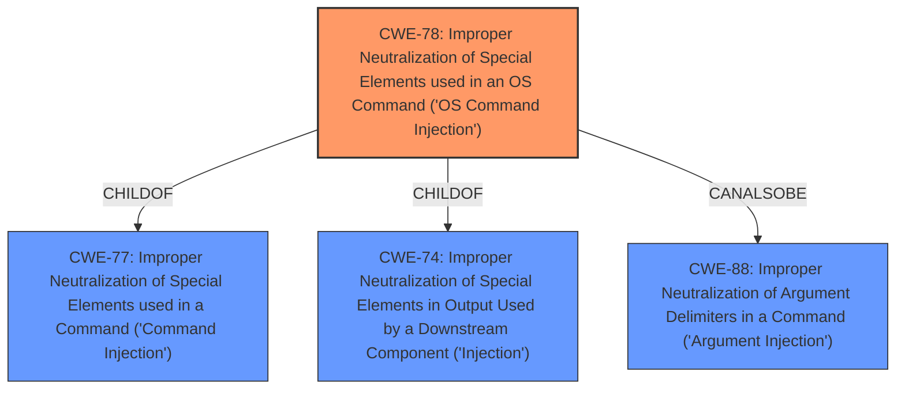

# Analysis Report for CVE-2021-43469

# Vulnerability Analysis Report: CVE-2021-43469

## Description


## Analysis (with Relationship Data)

# Summary
| CWE ID | CWE Name | Confidence | CWE Abstraction Level | CWE Vulnerability Mapping Label | CWE-Vulnerability Mapping Notes |
|---|---|---|---|---|---|
| CWE-78 | Improper Neutralization of Special Elements used in an OS Command ('OS Command Injection') | 1 | Base | Allowed | Primary CWE |

## Evidence and Confidence

*   **Confidence Score:** 1
*   **Evidence Strength:** HIGH

## Relationship Analysis
The primary relationship that influences the CWE selection is the hierarchical one, with CWE-78 being a child of CWE-77 and CWE-74. This indicates that CWE-78 is more specific and directly related to OS command injection, which aligns perfectly with the vulnerability description. The `CanAlsoBe` relationship between CWE-78 and CWE-88 suggests that argument injection could potentially be a contributing factor, but the primary issue remains the injection of OS commands. Therefore, selecting CWE-78 provides the most accurate representation of the vulnerability.



## Vulnerability Chain
The vulnerability chain starts with **weak passwords** or no password protection, leading to **command injection**, and ultimately resulting in remote command execution.
  - **Root Cause:** Weak Passwords / Inadequate Authentication
  - **Weakness:** Improper Neutralization of Special Elements used in OS Command
  - **Impact:** Remote Command Execution

## Summary of Analysis
The initial analysis strongly suggests that **command injection** is the core issue, as the VINGA WR-N300U router is affected by a command execution vulnerability in the goahead component. The Retriever Results also indicates that CWE-78, CWE-77 and CWE-88 are top matches. The evidence from CVE Reference Links Content Summary explicitly states "Command injection" as one of the **weaknesses/vulnerabilities present**. This solid evidence supports the selection of CWE-78.
The confidence score is 1 due to the presence of explicit evidence.
CWE-78 is selected as it represents the most specific and accurate classification of the vulnerability.

Relevant CWE Information:

# Enhanced Context (25 CWEs)

## CWE-78: Improper Neutralization of Special Elements used in an OS Command ('OS Command Injection')
**Abstraction:** Base
**Status:** Stable

### Description
The product constructs all or part of an OS command using externally-influenced input from an upstream component, but it does not neutralize or incorrectly neutralizes special elements that could modify the intended OS command when it is sent to a downstream component.

### Extended Description


This weakness can lead to a vulnerability in environments in which the attacker does not have direct access to the operating system, such as in web applications. Alternately, if the weakness occurs in a privileged program, it could allow the attacker to specify commands that normally would not be accessible, or to call alternate commands with privileges that the attacker does not have. The problem is exacerbated if the compromised process does not follow the principle of least privilege, because the attacker-controlled commands may run with special system privileges that increases the amount of damage.


There are at least two subtypes of OS command injection:


  - The application intends to execute a single, fixed program that is under its own control. It intends to use externally-supplied inputs as arguments to that program. For example, the program might use system("nslookup [HOSTNAME]") to run nslookup and allow the user to supply a HOSTNAME, which is used as an argument. Attackers cannot prevent nslookup from executing. However, if the program does not remove command separators from the HOSTNAME argument, attackers could place the separators into the arguments, which allows them to execute their own program after nslookup has finished executing.

  - The application accepts an input that it uses to fully select which program to run, as well as which commands to use. The application simply redirects this entire command to the operating system. For example, the program might use "exec([COMMAND])" to execute the [COMMAND] that was supplied by the user. If the COMMAND is under attacker control, then the attacker can execute arbitrary commands or programs. If the command is being executed using functions like exec() and CreateProcess(), the attacker might not be able to combine multiple commands together in the same line.

From a weakness standpoint, these variants represent distinct programmer errors. In the first variant, the programmer clearly intends that input from untrusted parties will be part of the arguments in the command to be executed. In the second variant, the programmer does not intend for the command to be accessible to any untrusted party, but the programmer probably has not accounted for alternate ways in which malicious attackers can provide input.

### Alternative Terms
Shell injection
Shell metacharacters
OS Command Injection

### Relationships
ChildOf -> CWE-77
ChildOf -> CWE-74
ChildOf -> CWE-77
ChildOf -> CWE-77
CanAlsoBe -> CWE-88

### Mapping Guidance
**Usage:** Allowed
**Rationale:** This CWE entry is at the Base level of abstraction, which is a preferred level of abstraction for mapping to the root causes of vulnerabilities.
**Comments:** Carefully read both the name and description to ensure that this mapping is an appropriate fit. Do not try to 'force' a mapping to a lower-level Base/Variant simply to comply with this preferred level of abstraction.
**Reasons:**
- Acceptable-Use

### Observed Examples
- **CVE-2020-10987:** OS command injection in Wi-Fi router, as exploited in the wild per CISA KEV.
- **CVE-2020-10221:** Template functionality in network configuration management tool allows OS command injection, as exploited in the wild per CISA KEV.
- **CVE-2020-9054:** Chain: improper input validation (CWE-20) in username parameter, leading to OS command injection (CWE-78), as exploited in the wild per CISA KEV.

### Explanation of why other CWEs were considered but not used:

*   **CWE-77: Improper Neutralization of Special Elements used in a Command ('Command Injection')**: This is a Class-level CWE, and while related, CWE-78 is more specific to OS commands.
*   **CWE-88: Improper Neutralization of Argument Delimiters in a Command ('Argument Injection')**: This could be a contributing factor, but the primary weakness is the ability to inject entire OS commands.
*   **CWE-416: Use After Free**, **CWE-138: Improper Neutralization of Special Elements**, **CWE-121: Stack-based Buffer Overflow**, **CWE-123: Write-what-where Condition**, **CWE-917: Improper Neutralization of Special Elements used in an Expression Language Statement ('Expression Language Injection')**, **CWE-624: Executable Regular Expression Error**, **CWE-787: Out-of-bounds Write**: These CWEs are not directly related to the **command injection** vulnerability described.


## CWE Relationship Analysis

Current CWEs represent these abstraction levels: .


### Vulnerability Chain Analysis

**Chain starting from CWE-121:**
- 121 (Stack-based Buffer Overflow) - ROOT


**Chain starting from CWE-787:**
- 787 (Out-of-bounds Write) - ROOT


### CWE Relationship Diagram

```mermaid
graph TD
    classDef primary fill:#f96,stroke:#333,stroke-width:2px
    classDef secondary fill:#69f,stroke:#333
    classDef tertiary fill:#9e9,stroke:#333
```


*Report generated on 2025-04-02 14:14:33*
