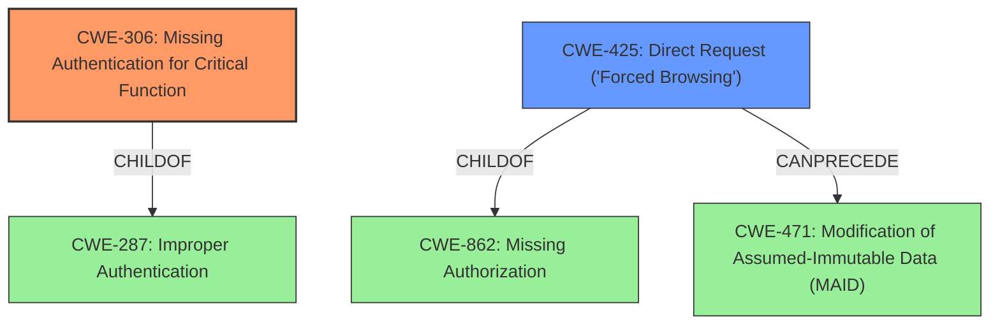

# Analysis Report for CVE-2021-43483

# Vulnerability Analysis Report: CVE-2021-43483

## Description


## Analysis (with Relationship Data)

# Summary
| CWE ID | CWE Name | Confidence | CWE Abstraction Level | CWE Vulnerability Mapping Label | CWE-Vulnerability Mapping Notes |
|---|---|---|---|---|---|
| CWE-306 | Missing Authentication for Critical Function | 1.0 | Base | Allowed | Primary CWE |
| CWE-425 | Direct Request ('Forced Browsing') | 0.7 | Base | Allowed | Secondary Candidate |

## Evidence and Confidence

*   **Confidence Score:** 0.9
*   **Evidence Strength:** HIGH

## Relationship Analysis
The primary relationship influencing the selection was the ChildOf relationship between CWE-306 and CWE-287 (Improper Authentication). CWE-306 provides a more specific classification than its parent, which is why it was selected as the primary CWE. CWE-425 is a peer of CWE-288 (Authentication Bypass Using an Alternate Path or Channel) and a child of CWE-862 (Missing Authorization). The CanPrecede relationship between CWE-425 and CWE-471 suggests a potential chain where direct requests can lead to modification of immutable data. I chose CWE-306 since it's a base level and directly related to the **missing authentication** described in the vulnerability.



## Vulnerability Chain
The vulnerability chain starts with the **missing authentication** for critical functions, allowing direct requests to sensitive URLs. This leads to unauthorized access to configuration data, which can then be modified by attackers.

*   **Root Cause:** **Missing Authentication** (CWE-306)
*   **Weakness:** Direct Request ('Forced Browsing') (CWE-425)
*   **Impact:** Unauthorized Information Disclosure and Modification

## Summary of Analysis
The initial assessment, based on the vulnerability description and CVE Reference Links Content Summary, pointed towards an access control issue due to **missing authentication**. The Retriever Results confirmed this, with CWE-306 being the top candidate.

The vulnerability description states: "An **Access Control vulnerability** exists in CLARO KAON CG3000 1.00.67 in the router configuration, which could allow a malicious user to read or update the configuration without authentication."

The CVE Reference Links Content Summary states: "The KAON CG3000 router, specifically the software version 1.00.67, lacks proper access control for reading and updating device configurations" and "The router allows access to its configuration, specifically the WiFi settings, through HTTP endpoints without requiring any authentication."

CWE-306 (Missing Authentication for Critical Function) is the most appropriate because the vulnerability explicitly describes a scenario where authentication is absent for sensitive functionalities, allowing unauthorized access. CWE-425 (Direct Request ('Forced Browsing')) is a secondary candidate because the vulnerability also allows direct access to restricted URLs without proper authorization. The relationships between CWEs, particularly the ChildOf and CanPrecede relationships, helped refine the selection and understand the potential vulnerability chain.

The selected CWEs are at the optimal level of specificity, as they directly address the **root cause** and the immediate weakness exploited in the vulnerability.

Relevant CWE Information:

## CWE-306: Missing Authentication for Critical Function
The product does not perform any authentication for functionality that requires a provable user identity or consumes a significant amount of resources. The vulnerability description explicitly states that the router configuration can be read or updated **without authentication**. This directly matches the CWE description.

## CWE-425: Direct Request ('Forced Browsing')
The web application does not adequately enforce appropriate authorization on all restricted URLs, scripts, or files. The CVE Reference Links Content Summary mentions the use of direct, predictable URLs to access configuration data, indicating a lack of access control implementation. While this is a contributing factor, the primary issue is the **missing authentication**, making CWE-306 the primary CWE.


## CWE Relationship Analysis

Current CWEs represent these abstraction levels: .


### Vulnerability Chain Analysis

**Chain starting from CWE-288:**
- 288 (Authentication Bypass Using an Alternate Path or Channel) - ROOT


**Chain starting from CWE-306:**
- 306 (Missing Authentication for Critical Function) - ROOT


### CWE Relationship Diagram

```mermaid
graph TD
    classDef primary fill:#f96,stroke:#333,stroke-width:2px
    classDef secondary fill:#69f,stroke:#333
    classDef tertiary fill:#9e9,stroke:#333
```


*Report generated on 2025-04-02 15:49:27*
