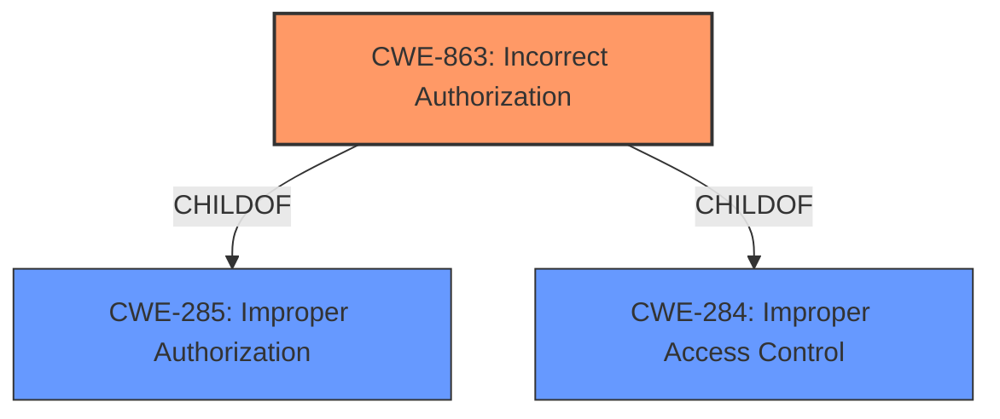

# Analysis Report for CVE-2021-43553

# Vulnerability Analysis Report: CVE-2021-43553

## Description


## Analysis (with Relationship Data)

# Summary
| CWE ID | CWE Name | Confidence | CWE Abstraction Level | CWE Vulnerability Mapping Label | CWE-Vulnerability Mapping Notes |
|---|---|---|---|---|---|
| CWE-863 | Incorrect Authorization | 0.9 | Class | Allowed-with-Review | Primary CWE |

## Evidence and Confidence

*   **Confidence Score:** 0.9
*   **Evidence Strength:** HIGH

## Relationship Analysis
The primary CWE, CWE-863 (Incorrect Authorization), is a Class-level CWE, which suggests a potential need for a more specific Base or Variant level CWE if one exists. The retriever results did not return a more specific CWE, and the description aligns well with the general concept of incorrect authorization. CWE-863 is a child of CWE-285 (Improper Authorization) and CWE-284 (Improper Access Control).



## Vulnerability Chain
The vulnerability chain starts with the **incorrect authorization** (CWE-863), leading to the **disclosure of information** to an unauthorized user. The chain is: **Incorrect Authorization** -> **Information Disclosure**.

## Summary of Analysis
The primary assessment is based on the provided evidence, which indicates an **incorrect authorization** mechanism that leads to information disclosure. The "CVE Reference Links Content Summary" explicitly states "**Root cause of vulnerability: Incorrect Authorization**" and "**Weaknesses/vulnerabilities present:** PI Vision could **disclose information** to a user with **insufficient privileges** for an AF attribute that is the child of another attribute and is configured as a Limits property."

CWE-863 (Incorrect Authorization) is a Class-level CWE. According to the MITRE mapping guidance, it is "Allowed-with-Review" and suggests examining child entries for a better fit. While other CWEs like CWE-201 (Insertion of Sensitive Information Into Sent Data), CWE-209 (Generation of Error Message Containing Sensitive Information), CWE-202 (Exposure of Sensitive Information Through Data Queries), and CWE-538 (Insertion of Sensitive Information into Externally-Accessible File or Directory) relate to information exposure, they don't capture the root cause of the vulnerability, which is the authorization bypass. The description states a user with "insufficient privileges" can access information, aligning with the core concept of CWE-863. Thus, CWE-863 is the most appropriate despite being a Class.


## CWE Relationship Analysis

Current CWEs represent these abstraction levels: .


### Vulnerability Chain Analysis

**Chain starting from CWE-284:**
- 284 (Improper Access Control) - ROOT


**Chain starting from CWE-201:**
- 201 (Insertion of Sensitive Information Into Sent Data) - ROOT


### CWE Relationship Diagram

```mermaid
graph TD
    classDef primary fill:#f96,stroke:#333,stroke-width:2px
    classDef secondary fill:#69f,stroke:#333
    classDef tertiary fill:#9e9,stroke:#333
```


*Report generated on 2025-04-02 13:47:05*
