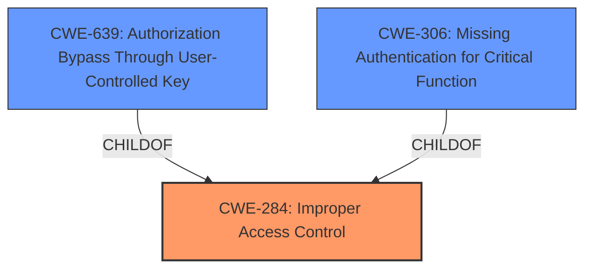

# Analysis for CVE-2021-43563

# Summary
| CWE ID | CWE Name | Confidence | CWE Abstraction Level | CWE Vulnerability Mapping Label | CWE-Vulnerability Mapping Notes |
|---|---|---|---|---|---|
| CWE-284 | Improper Access Control | 0.9 | Pillar | Allowed-with-Review | The product does not restrict or incorrectly restricts access to a resource from an unauthorized actor. |
| CWE-639 | Authorization Bypass Through User-Controlled Key | 0.7 | Base | Allowed | The system's authorization functionality does not prevent one user from gaining access to another user's data or record by modifying the key value identifying the data. |
| CWE-306 | Missing Authentication for Critical Function | 0.6 | Base | Allowed | The product does not perform any authentication for functionality that requires a provable user identity or consumes a significant amount of resources. |

- The Primary CWE should be first and noted as the Primary CWEs
- The secondary candidate CWEs should be next and noted as secondary candidates.
- The confidence is a confidence score 0 to 1 to rate your confidence in your assessment for that CWE.
- The CWE Abstraction Level as one of these values: Base, Variant, Pillar, Class, Compound
- The Mapping Notes Usage as one of these values: Allowed, Allowed-with-Review, Prohibited, Discouraged

## Evidence and Confidence

*   **Confidence Score:** 0.7
*   **Evidence Strength:** HIGH

## Relationship Analysis
The primary CWE is CWE-284, which is a high-level category (Pillar) for improper access control issues. CWE-639 and CWE-306 are more specific (Base) and related to the **broken access control**, but CWE-284 is still the best fit overall based on the description.

## Vulnerability Chain
The vulnerability chain starts with **broken access control** in the media browser, leading to unauthenticated requests to the `pixx.io` API, which results in the ability to download media files from the DAM system.

## Summary of Analysis
The initial analysis identified **broken access control** as the primary weakness. The vulnerability description and the reference links content summary both support this assessment. The retriever results also suggest CWE-284, CWE-639, and CWE-306 as potential matches.

CWE-284 (Improper Access Control) is a high-level category, but it accurately reflects the general nature of the vulnerability. The more specific CWEs, like CWE-639 (Authorization Bypass Through User-Controlled Key) and CWE-306 (Missing Authentication for Critical Function), capture certain aspects of the vulnerability, but CWE-284 is the most encompassing.

The evidence is strong, with clear statements in the vulnerability description and reference links content summary confirming the **broken access control** issue. The retriever scores provide supporting evidence, although they are not the sole basis for the classification.

Relevant CWE Information:

# Enhanced Context (25 CWEs)

## CWE-74: Improper Neutralization of Special Elements in Output Used by a Downstream Component ('Injection')
**Abstraction Level**: Class
**Similarity Score**: 0.78
**Source**: dense

**Description**:
The product constructs all or part of a command, data structure, or record using externally-influenced input from an upstream component, but it does not neutralize or incorrectly neutralizes special elements that could modify how it is parsed or interpreted when it is sent to a downstream component.

**Mapping Guidance**:
- Usage: Discouraged
- Rationale: CWE-74 is high-level and often misused when lower-level weaknesses are more appropriate.

*This CWE was considered but not selected because the vulnerability is about **broken access control** rather than injection.*

## CWE-807: Reliance on Untrusted Inputs in a Security Decision
**Abstraction Level**: Base
**Similarity Score**: 0.78
**Source**: dense

**Description**:
The product uses a protection mechanism that relies on the existence or values of an input, but the input can be modified by an untrusted actor in a way that bypasses the protection mechanism.

**Mapping Guidance**:
- Usage: Allowed
- Rationale: This CWE entry is at the Base level of abstraction, which is a preferred level of abstraction for mapping to the root causes of vulnerabilities.

*This CWE was considered but not selected because the core issue is the lack of access control rather than reliance on untrusted inputs.*

## CWE-184: Incomplete List of Disallowed Inputs
**Abstraction Level**: Base
**Similarity Score**: 0.78
**Source**: dense

**Description**:
The product implements a protection mechanism that relies on a list of inputs (or properties of inputs) that are not allowed by policy or otherwise require other action to neutralize before additional processing takes place, but the list is incomplete.

**Mapping Guidance**:
- Usage: Allowed
- Rationale: This CWE entry is at the Base level of abstraction, which is a preferred level of abstraction for mapping to the root causes of vulnerabilities.

*This CWE was considered but not selected because the issue isn't about an incomplete list of disallowed inputs, it is more directly about **broken access control**.*

## CWE-41: Improper Resolution of Path Equivalence
**Abstraction Level**: Base
**Similarity Score**: 0.78
**Source**: dense

**Description**:
The product is vulnerable to file system contents disclosure through path equivalence. Path equivalence involves the use of special characters in file and directory names. The associated manipulations are intended to generate multiple names for the same object.

**Mapping Guidance**:
- Usage: Allowed
- Rationale: This CWE entry is at the Base level of abstraction, which is a preferred level of abstraction for mapping to the root causes of vulnerabilities.

*This CWE was considered but not selected because the vulnerability isn't related to path equivalence.*

## CWE-639: Authorization Bypass Through User-Controlled Key
**Abstraction Level**: Base
**Similarity Score**: 0.77
**Source**: dense

**Description**:
The system's authorization functionality does not prevent one user from gaining access to another user's data or record by modifying the key value identifying the data.

**Mapping Guidance**:
- Usage: Allowed
- Rationale: This CWE entry is at the Base level of abstraction, which is a preferred level of abstraction for mapping to the root causes of vulnerabilities.

*This CWE was considered and selected as a secondary CWE because it is related to **broken access control**.*

## CWE-23: Relative Path Traversal
**Abstraction Level**: Base
**Similarity Score**: 0.77
**Source**: dense

**Description**:
The product uses external input to construct a pathname that should be within a restricted directory, but it does not properly neutralize sequences such as ".." that can resolve to a location that is outside of that directory.

**Mapping Guidance**:
- Usage: Allowed
- Rationale: This CWE entry is at the Base level of abstraction, which is a preferred level of abstraction for mapping to the root causes of vulnerabilities.

*This CWE was considered but not selected because the vulnerability isn't related to path traversal.*

## CWE-1390: Weak Authentication
**Abstraction Level**: Class
**Similarity Score**: 0.77
**Source**: dense

**Description**:
The product uses an authentication mechanism to restrict access to specific users or identities, but the mechanism does not sufficiently prove that the claimed identity is correct.

**Mapping Guidance**:
- Usage: Allowed-with-Review
- Rationale: This CWE entry is a Class and might have Base-level children that would be more appropriate

*This CWE was considered but not selected because it is related to weak authentication which is not the primary **rootcause** of the vulnerability.*

## CWE-472: External Control of Assumed-Immutable Web Parameter
**Abstraction Level**: Base
**Similarity Score**: 0.77
**Source**: dense

**Description**:
The web application does not sufficiently verify inputs that are assumed to be immutable but are actually externally controllable, such as hidden form fields.

**Mapping Guidance**:
- Usage: Allowed
- Rationale: This CWE entry is at the Base level of abstraction, which is a preferred level of abstraction for mapping to the root causes of vulnerabilities.

*This CWE was considered but not selected because the vulnerability isn't about external control of assumed immutable web parameters.*

## CWE-668: Exposure of Resource to Wrong Sphere
**Abstraction Level**: Class
**Similarity Score**: 0.77
**Source**: dense

**Description**:
The product exposes a resource to the wrong control sphere, providing unintended actors with